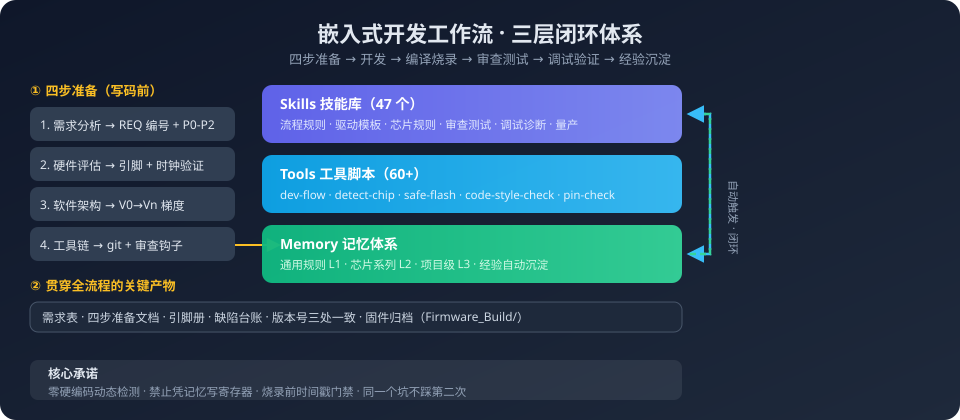

# Embedded Development Workflow（嵌入式开发工作流）

> **开源共建** · 把嵌入式开发经验沉淀成可复用、可自动执行的工作流


<div align="center">


</div>

<div align="center">
  
</div>

> 一套**开源共建**的嵌入式开发工作流：**Skill 技能库 + 工具脚本 + 流程规范**，把散落在个人脑子里的经验变成整个社区都能复用、能自动执行的资产。
> 目标：新人/新项目/换机器也能快速复制整套开发方法论 —— 四步准备 → 驱动开发 → 编译烧录 → 审查测试 → 调试验证 → 经验沉淀闭环。
> 第一适配平台：**TRAE SOLO**（Windows 个人版）—— `skills/` 复制到 `.trae-cn/skills/` 即可被自动发现，`memory` 机制联动 `knowledge-index`。

## 这是什么

嵌入式开发中，大量经验沉淀在个人脑子里：流程怎么走、踩过哪些坑、寄存器怎么确认、烧录前查什么。本仓库把这套隐性知识显性化：

| 组成部分 | 内容 | 位置 |
| --- | --- | --- |
| **Skills 技能库** | 77 个可执行技能（SKILL.md），覆盖开发全流程：流程规则 / 驱动模板 / 芯片规则 / 审查 / 测试 / 调试 / 量产 | [`skills/`](skills/) |
| **工具脚本** | 60+ PowerShell + Python 脚本，自动编译烧录、引脚检查、芯片检测、静态审查、版本登记 | [`tools/`](tools/) |
| **流程规范** | 开发工作流速查手册：按「工作流阶段 × 人机分工」组织，配合技能使用 | [`docs/`](docs/) |

## 快速浏览（目录）

### Skills（77 个，按阶段分组）

- **流程与规则**：embedded-dev-rules（红线+工作流）、chip-rules（芯片系列规则）、requirement-extraction（需求整理）、writing-plans（计划编写）、software-design-doc（软件设计文档）、code-migration（代码移植）
- **开发与驱动**：peripheral-driver-template（UART/SPI/I2C/ADC）、ble-nus-template（BLE 透传）、wifi-app-template（WiFi/MQTT）、zephyr-lvgl-guide（Zephyr+LVGL）、freertos-*（FreeRTOS 基础/驱动集成/多核）
- **芯片与硬件**：board-config（板级配置）、pin-check（引脚冲突检测）、schematic-reading（原理图阅读）、hardware-detection（硬件检测）、datasheet-lookup（数据手册查阅）
- **编译与烧录**：esp-idf-build（ESP-IDF 编译烧录）、keil-auto-flash（Keil 自动烧录）、keil-clean、memory-analysis（内存分析）
- **审查与测试**：embedded-code-review（代码审查清单）、embedded-unit-test（Unity+CMock）、test-driven-development、test-report（测试报告）
- **调试与诊断**：hardfault-diagnosis（HardFault 定位）、esp32-panic-diagnosis（Panic 解析）、live-debug-workflow（在线调试）、log-analysis（日志分析）、serial-debug（串口调试）、protocol-analysis（协议抓包分析）、wireless-sniffer（无线抓包）
- **电源与电路**：power-analysis（低功耗）、laplace-method、phasor-method、three-factor-method、thevenin-norton、superposition、opamp-analysis、complex-power
- **工程管理**：git-workflow、mass-production（量产）、rf-verification（射频认证）、knowledge-index（知识索引）、project-cleanup、release-notes

### Tools（脚本，`tools/` 目录）

| 命令 | 用途 |
| --- | --- |
| `dev-flow` | 主流程：编译→静态门禁→时间戳核对→烧录→归档（防烧旧版） |
| `detect-chip` | 芯片型号四级确认（ESP32/STM32/GD32/STC8） |
| `safe-flash` | 安全烧录（时间戳门禁） |
| `code-style-check` | 代码风格静态检查（overflow/defensive 等） |
| `preflight` | 开工预检（缺包自动引导） |
| `pin-check` | GPIO 引脚分配与冲突检测 |
| `build-all` | 批量编译 |
| `version-tools` | 脚本版本登记与变更记录 |
| `esp-idf-env` | ESP-IDF 环境初始化（动态检测路径） |

> 完整清单见 [`tools/README.md`](tools/README.md)

## 使用方式

### 方式一：作为参考方法论

直接阅读 `docs/` 与各 `skills/*/SKILL.md`，把其中的流程、清单、红线规则借鉴到自己的项目。

### 方式二：配合 AI 编程助手使用（本仓库的设计目标）

本技能库为 **TRAE SOLO（Windows 个人版）** 设计（也兼容 Trae / TraeCode 等支持 `SKILL.md` 的助手）：

```powershell
# 1. 复制技能库到 TRAE SOLO 技能目录（自动发现）
Copy-Item -Path .\skills\* -Destination "$env:USERPROFILE\.trae-cn\skills\" -Recurse

# 2. 配置 memory 扫描根（knowledge-index 联动）
#    tools\knowledge-index.ps1 默认扫描 $env:USERPROFILE\.trae-cn\memory\projects

# 3. 验证技能被识别
tools\check-skills.ps1          # 应输出：技能 count > 0，退出码 0
```

助手即可按规则执行：

1. 需求 → `requirement-extraction` 整理为 REQ 编号 + P0-P2 分级
2. 四步准备 → 需求分析 / 硬件评估 / 软件架构 / 工具链，用户确认后才写码
3. 开发 → 驱动走模板，寄存器/库函数查 datasheet（禁止凭记忆）
4. 编译烧录 → 先编译→核对时间戳→再烧录，版本号三处一致
5. 沉淀 → 验证通过的经验回写 `.trae-cn\memory\`，下次自动触发

### 方式三：一键部署（clone 后 1 条命令）

```powershell
# 1. clone 本仓库（任选一个源）
git clone https://github.com/wbw-11/embedded-workflow.git      # GitHub（主源）
# 国内加速镜像：
git clone https://gitee.com/wbow/embedded-workflow.git         # Gitee

# 2. 一键部署（自动装 skills 到 TRAE 技能目录 + tools 加入 PATH + 首次验证）
cd embedded-workflow
powershell -ExecutionPolicy Bypass -File .\install.ps1
```

脚本会自动完成：
1. **部署 skills** → `$env:USERPROFILE\.trae-cn\skills\`（TRAE 自动发现；同名技能默认跳过，`-Force` 覆盖）
2. **tools 加入用户 PATH** → 脚本名即命令名（含 `lib/` 公共库，必须同目录；`-NoPath` 跳过）
3. **首次验证 3 连** → `tool-guide` / `version-tools -Validate` / `check-bom -Quiet` 全部 PASS 才算部署成功

**一键卸载（不留残留，不碰你原有技能）**

```powershell
powershell -ExecutionPolicy Bypass -File .\uninstall.ps1
```

卸载原理：install 时写入部署清单（`~\.trae-cn\embedded-workflow\install.json`），uninstall 只删除清单中记录的本仓库技能 + 移除 PATH + 清理清单，**用户原有的同名技能不受影响**。

### 方式四：便携模式（不安装，零残留，单文件夹即用）

不想装全局？本仓库文件夹本身就是便携工具包，一条命令直接跑：

```powershell
.\run.ps1 tool-guide                # 查看全部可用工具
.\run.ps1 detect-chip               # 跑任意工具，参数原样透传
.\run.ps1 dev-flow -ProjectDir D:\proj
```

- **零安装**：不加 PATH、不复制文件，tools 仅在当前进程临时生效
- **零残留**：删掉本文件夹 = 完全卸载
- 唯一代价：skills 不装进 TRAE 技能目录（需要 TRAE 技能联动时用方式三）

> 部署验证：本仓库每次发布前均在全新目录（模拟他人 clone）实测 `install.ps1 → uninstall.ps1 → run.ps1` 三流程闭环 + `tool-guide / version-tools / check-bom / code-style-check / pin-check` 全部可运行。

**依赖说明**
- 基础：Windows + PowerShell 5.1+ + Git
- 工具链（脚本自动动态检测，缺哪个只影响对应功能）：Keil（ARM/51）、ESP-IDF v5.5、STC 烧录工具——均需自行安装
- 运行 `install.ps1` 部署后，`preflight -ProjectDir <工程路径>` 可一键核查本机工具链是否覆盖你的工程

## 目录结构

```
embedded-workflow/
├── install.ps1       # 一键部署（skills + PATH + 验证）
├── uninstall.ps1     # 一键卸载（精准删除，不碰原有技能）
├── run.ps1           # 便携运行（不安装，零残留）
├── README.md          # 本文件
├── CONTRIBUTING.md    # 参与贡献指南（一起完善这个流程）
├── LICENSE            # MIT
├── docs/              # 流程规范文档（公开版）
├── skills/            # 77 个 Skill 技能库（SKILL.md + rules）
└── tools/             # 工具脚本（ps1 + bat + lib）
```

## 参与贡献（欢迎共建）

本仓库是**开放共建**的项目：你踩过的坑、补充的技能、改进的脚本，都可能帮到下一个嵌入式开发者。

- 报告 bug / 提出改进 → [Issues](https://github.com/wbw-11/embedded-workflow/issues)
- 直接动手改 → [Pull Requests](https://github.com/wbw-11/embedded-workflow/pulls)
- 讨论流程设计 / 经验交流 → 提 Issue 或在 TRAE 社区交流（README 评论区即讨论区）
- 参与规范 → 见 [CONTRIBUTING.md](CONTRIBUTING.md)（含技能/脚本/文档各自的提交要求）

## 设计原则

- **动态检测，不硬编码**：所有脚本按「环境变量 → 注册表 → 候选路径」查找工具链，新机器零配置
- **验证优先**：禁止凭记忆写寄存器/库函数；烧录前必查时间戳防烧旧版；每级验证后脱机复核
- **人机分工**：你负责决策与硬件操作，助手负责检测/写码/编译/审查/烧录执行
- **经验闭环**：踩坑→提炼→分级落盘（通用规则/芯片系列/项目级）→自动触发

## 代码风格（code-style-check 强制执行）

- **缩进**：空格（禁用 Tab；Tab 与空格混用、纯 Tab 都会报错）
- 单行 ≤120 字符；`if/else/for/while` 单行也带 `{}`
- 命名：下划线风格（全局 `g_` / 静态 `s_` / 指针 `p_`）；宏全大写
- 位运算用无符号（`1U`）；const/static 最大化；无魔法数（宏/枚举代替）
- 结构体协议定义后必须加 `_Static_assert(sizeof(...))` 检查

> 规则由 `tools/code-style-check.ps1` 自动检查，含 5 类静态检查 + 数据溢出/防御性编程检测（P0/P1 分级）。

## License

[MIT](LICENSE)