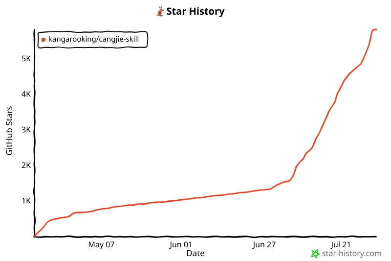

<p align="center">
  <a href="./README.zh-CN.md">简体中文</a> ·
  <a href="./README.md">English</a> ·
  <a href="./README.ja.md">日本語</a>
</p>

<div align="center">

# Cangjie Skill

### Distill methodologies from books, long-form videos, and podcasts into callable AI Skills

[](./LICENSE)
[](./CHANGELOG.md)
[](./SKILL.md)
[](https://github.com/openclaw/openclaw)
[](https://code.claude.com/)
[](#deepseek-harness-plugin)

**Finish reading, watching, or listening—and leave with a methodology you can invoke.**

</div>

## Official Website

🌐 [Visit the Cangjie Skill official website](https://cangjie-skill.com/)

The website provides visual Skill Pack browsing, a beginner-friendly usage guide, Skill detail pages, and a contribution submission entry. This GitHub repository remains the sole source for cangjie-skill code, methodology, and templates; the website provides presentation, navigation, and usage guidance.

## What's New in v2.5.0

- **Capability Bundle as the single source of truth**: extraction produces stable capability cards and metadata before any installable output is compiled.
- **Two deterministic delivery modes**: compile one router-style Skill (`single`) or a compact pack with a router plus promoted standalone Skills (`pack`).
- **A unified local toolchain**: `scripts/cangjie.py` now covers diagnostics, compilation, output replanning, incremental updates, repair, rollback, evaluation, and benchmarking.
- **Safer evolution**: content-addressed preprocessing, source diffs, impact analysis, transactional patches, edit detection, snapshots, and rollback are included.
- **Registry v2 and website support**: output mode and capability counts are visible without breaking existing Registry v1 entries.

See the [v2.5.0 release notes](./docs/releases/v2.5.0.md) and [changelog](./CHANGELOG.md) for the complete scope and migration notes.

## DeepSeek Harness Plugin

cangjie-skill also provides a standalone installation package for DeepSeek Harness. The adapter layer is bundled in the Release package, so no platform-specific wrapper files are added to this repository.

After installing DeepSeek Harness, download the v2.5.0 package and checksum, verify it, then install from the local tarball:

```bash
mkdir -p ~/.dsh/packages
curl -fL "https://github.com/kangarooking/cangjie-skill/releases/download/v2.5.0/dsh-cangjie-skill-2.5.0.tgz" \
  -o ~/.dsh/packages/dsh-cangjie-skill-2.5.0.tgz
curl -fL "https://github.com/kangarooking/cangjie-skill/releases/download/v2.5.0/dsh-cangjie-skill-2.5.0.tgz.sha256" \
  -o ~/.dsh/packages/dsh-cangjie-skill-2.5.0.tgz.sha256
(cd ~/.dsh/packages && shasum -a 256 -c dsh-cangjie-skill-2.5.0.tgz.sha256)
dsh plugin --profile web add ~/.dsh/packages/dsh-cangjie-skill-2.5.0.tgz
dsh web
```

[Download the DeepSeek Harness plugin (for Cangjie Skill v2.5.0)](https://github.com/kangarooking/cangjie-skill/releases/download/v2.5.0/dsh-cangjie-skill-2.5.0.tgz) · [SHA256 checksum](https://github.com/kangarooking/cangjie-skill/releases/download/v2.5.0/dsh-cangjie-skill-2.5.0.tgz.sha256)

After starting a new task, you can say:

```text
Use cangjie-skill to distill this book into a set of executable Agent Skills: <file path>
```

## Why This Exists

There's a recent viral idea: distilling colleagues into AI skills. Even after someone leaves, their experience, tone, and work style can be partially replicated by AI. [nuwa-skill](https://github.com/alchaincyf/nuwa-skill) does exactly this — creating "human skills" like an Elon Musk skill or a Warren Buffett skill. The companion [darwin-skill](https://github.com/alchaincyf/darwin-skill) handles automatic skill evolution.

Distilling people is valuable — nuwa-skill has already proven this. Distilling the content people have **expressed systematically** is a complementary dimension: a book, a long-form interview, a podcast episode, or a long Bilibili or YouTube video can contain methodologies that took the creator years to refine. Rather than imitating someone's expression style, extracting those methodologies and turning them into tools that solve real problems is equally valuable.

There's also a real pain point: you may read many books, save many videos, and listen to many podcasts, yet still struggle to apply what you learned. Content-rich long videos are published every day, are often time-sensitive, and can be difficult to absorb in one viewing; they may not be represented in an AI model's training data at all. Once this content is distilled into skills, an AI agent can invoke the knowledge in real scenarios instead of letting it gather dust in notes, bookmarks, or watch-later lists.

So cangjie-skill has one clear goal: **distill every piece of high-value content worth distilling**. It works not only with books, but also with videos that have subtitles or transcripts, podcasts, interviews, talks, courses, long-form articles, and document collections. Whenever content contains extractable, verifiable, and transferable methodologies, cangjie-skill can turn them into independently callable, composable, and pressure-testable AI skill packs.

For video content, we recommend using the [video-downloader](https://github.com/kangarooking/kangarooking-skills/tree/main/video-downloader) skill alongside cangjie-skill. Use it first to download the video, extract subtitles or audio transcripts, and collect key materials; then pass the resulting text to cangjie-skill for methodology extraction, skill construction, and pressure testing.

## What Problems It Solves

- Reading many books, watching many videos, or listening to many podcasts without applying them — knowledge stays at the "read/watched/listened/saved" level and cannot be invoked in real decisions
- Summaries, notes, and organized transcripts are compression, not structured reuse — after reading or watching, you still do not know "what to use when"
- Only a small fraction of high-value content deserves to become a tool — strict filtering is needed, not wholesale inclusion
- Existing methods for reading, watching, and learning are designed for people, not agents — distillation must be execution-oriented rather than consumption-oriented

## How It Works

cangjie-skill uses the **RIA-TV++** pipeline to transform source texts—including books, video transcripts, podcast transcripts, and interview notes—into a reusable Capability Bundle, then compiles that source into installable skills. The process has seven stages:

1. **Whole-Content Comprehension (Adler Analysis)** — Structural, interpretive, critical, and applicability analysis using Mortimer Adler's method, producing `BOOK_OVERVIEW.md`
2. **Parallel Extraction** — Five specialized extractors (frameworks, principles, cases, counter-examples, glossary) run simultaneously to pull candidate units from the source text
3. **Triple Verification + Promotion Gate** — Each candidate must pass the evidence checks, then earn an independent entrypoint only when its use cases justify the added routing cost
4. **RIA++ Capability Construction** — Verified content is structured into R / I / A1 / A2 / E / B capability cards inside `.cangjie/capabilities/`
5. **Zettelkasten Linking** — Dependencies, contrasts, and compositions are encoded in the Bundle's capability graph and shared glossary
6. **Pressure Testing** — Test prompts including bait questions (and cross-skill confusion tests) are designed for each skill; failures go back for full reconstruction
7. **Deterministic Compilation and Delivery** — The same Bundle compiles to `single` or compact `pack`, alongside a reader-facing `DIGEST.md`, validation results, and installable artifacts

The name RIA-TV++ breaks down as:
- **RIA**: From Zhao Zhou's bookmark method (Reading / Interpretation / Appropriation)
- **TV**: Triple Verification
- **++**: Agent-oriented extensions — E (Execution) + B (Boundary)

## Effect Examples

### Example 1: From a Book or Long-Form Video to a Skill Toolkit

**User Need**

"I want to turn the core methodologies from a book or a long Bilibili/YouTube video into reusable AI skills, not just a summary."

**How cangjie-skill reasons**

- Check whether the source material has reusable methodological units
- Distinguish what deserves to be a standalone skill vs. background material
- Output a structured skill repository, not a single summary document

**Example Output**

> The result will not be one summary document. It will be a multi-skill repository with `BOOK_OVERVIEW.md`, `INDEX.md`, a reader-facing `DIGEST.md`, a `GLOSSARY.md`, multiple `*/SKILL.md` files, and `test-prompts.json` for trigger testing.

### Example 2: Structured Reuse, Not Compression

**User Need**

"I don't want a long explanatory article. I want a skill pack my agent can reuse."

**How cangjie-skill reasons**

- Target is structured reuse, not narrative compression
- Prioritize triggerable, composable, testable skill units
- Reject material that doesn't deserve standalone skill status

**Example Output**

> The system produces multiple skill modules with trigger conditions, boundaries, execution patterns, and related-skill links — rather than flattening the source into one generalized note.

## Generated Skill Packs

| Repository | Source | Skills |
|------------|--------|--------|
| [buffett-letters-skill](https://github.com/kangarooking/buffett-letters-skill) | Buffett's shareholder letters (1957-2023) | 20 |
| [cognitive-dividend-skill](https://github.com/kangarooking/cognitive-dividend-skill) | Cognitive Dividend | 15 |
| [duan-yongping-skill](https://github.com/kangarooking/duan-yongping-skill) | Duan Yongping's Q&A (business + investment logic) | 15 |
| [viral-copywriting-skill](https://github.com/kangarooking/viral-copywriting-skill) | Bao Kuan Wen An | 14 |
| [copywriters-handbook-skill](https://github.com/kangarooking/copywriters-handbook-skill) | The Copywriter's Handbook | 12 |
| [contagious-skill](https://github.com/kangarooking/contagious-skill) | Contagious | 15 |
| [influence-skill](https://github.com/kangarooking/influence-skill) | Influence | 12 |
| [1000-true-fans-skill](https://github.com/kangarooking/1000-true-fans-skill) | 1000 True Fans | 13 |
| [system-prompt-skills](https://github.com/kangarooking/system-prompt-skills) | 165 AI product system prompts | 15 |
| [X-growth-skills](https://github.com/kangarooking/X-growth-skills) | Practical X (Twitter) account launch, content growth, algorithm, engagement, and monetization resources | 15 |
| [sunyuchen-skill](https://github.com/kangarooking/sunyuchen-skill) | A single narrative writing sample labeled “sunyuchen” | 1 (7 capabilities) |
| [poor-charlies-almanack-skill](https://github.com/kangarooking/poor-charlies-almanack-skill) | Poor Charlie's Almanack | 12 |
| [no-rules-rules-skill](https://github.com/kangarooking/no-rules-rules-skill) | No Rules Rules | 10 |
| [huangdi-neijing-skill](https://github.com/kangarooking/huangdi-neijing-skill) | *Huangdi Neijing* (*Suwen* + *Lingshu*) | 22 |
| [first-principles-skill](https://github.com/kangarooking/first-principles-skill) | First Principles | 10 |
| [mao-selected-works-skill](https://github.com/kangarooking/mao-selected-works-skill) | Selected Works of Mao Zedong, Vol. 1-5 | 25 |
| [qbdx-hub/buffett-letters-skill](https://github.com/qbdx-hub/buffett-letters-skill) | Buffett Shareholder Letters (1957-2023) | 20 |
| [qbdx-hub/wo-yu-di-tan-skill](https://github.com/qbdx-hub/wo-yu-di-tan-skill) | Wo Yu Di Tan | 6 |
| [qbdx-hub/mingchao-those-things-skill](https://github.com/qbdx-hub/mingchao-those-things-skill) | Mingchao Those Things | 7 |
| [qbdx-hub/sunzi-bingfa-skill](https://github.com/qbdx-hub/sunzi-bingfa-skill) | Sunzi Bingfa | 8 |
| [qbdx-hub/zhouyi-skill](https://github.com/qbdx-hub/zhouyi-skill) | Zhouyi | 8 |
| [qbdx-hub/high-math-vol1-ch1-skill](https://github.com/qbdx-hub/high-math-vol1-ch1-skill) | High Math Vol. 1 Chapter 1 | 8 |

## Video Distillation

These repositories are built from subtitles or transcripts of long-form videos, courses, or video collections. They demonstrate cangjie-skill's ability to distill methodologies from non-book content.

| Repository | Source | Skills |
|------------|--------|--------|
| [ai-for-everyone-skill](https://github.com/kangarooking/ai-for-everyone-skill) | Andrew Ng's *AI for Everyone* video course | 25 |
| [loop-engineering-skill](https://github.com/kangarooking/loop-engineering-skill) | Loop Engineering long-form video collection | 8 |

More high-value books are planned for distillation. Future candidates include, but are not limited to, *The Prince*.

Additional external source (included with the author's permission):

- Source repository: [ace3000chao/book2startup](https://github.com/ace3000chao/book2startup)
- Included books: *The Lean Startup*, *The Art of War*, *Zhuangzi*, and *I Ching*
- Source repository: [shenqistart/book2skill](https://github.com/shenqistart/book2skill)
- Included books: *Chanlun* and *The Classic of Tea*

## Repository Structure

```text
cangjie-skill/
├── README.md              ← You are here (default)
├── README.zh-CN.md        ← Simplified Chinese version
├── README.ja.md           ← Japanese version
├── LICENSE                ← MIT License
├── SKILL.md               ← Meta-skill definition (full execution spec for cangjie-skill)
├── methodology/           ← RIA-TV++ stage-by-stage methodology docs
├── extractors/            ← Prompt definitions for the 5 parallel extractors
└── templates/             ← SKILL.md / INDEX.md / BOOK_OVERVIEW.md templates
```

## Ecosystem

cangjie-skill is part of a larger skill ecosystem:

- [nuwa-skill](https://github.com/alchaincyf/nuwa-skill) — Distills people (thinking styles, expression DNA)
- **cangjie-skill** (this repo) — Distills books (methodologies, frameworks, principles)
- [darwin-skill](https://github.com/alchaincyf/darwin-skill) — Evolves any skill

They interlock: nuwa distills people, cangjie distills books, darwin keeps them evolving.

## More Skills

- [Buffett Letters Skill](https://github.com/kangarooking/buffett-letters-skill) — 20 investment reasoning skills from Buffett's 60+ years of shareholder letters
- [Poor Charlie's Almanack Skill](https://github.com/kangarooking/poor-charlies-almanack-skill) — 12 decision-making and judgment skills from Charlie Munger's core thinking methods
- [No Rules Rules Skill](https://github.com/kangarooking/no-rules-rules-skill) — 10 organizational design skills from Netflix's culture of freedom and responsibility
- [Cognitive Dividend Skill](https://github.com/kangarooking/cognitive-dividend-skill) — 15 cognitive tool skills for thinking upgrades from Cognitive Dividend
- [Duan Yongping Skill](https://github.com/kangarooking/duan-yongping-skill) — 15 business and investment skills from Duan Yongping's Q&A collection
- [Viral Copywriting Skill](https://github.com/kangarooking/viral-copywriting-skill) — 14 sales copywriting and diagnosis skills from *Bao Kuan Wen An*
- [Copywriters Handbook Skill](https://github.com/kangarooking/copywriters-handbook-skill) — 12 sales copywriting, headline, and benefit translation skills from *The Copywriter's Handbook*
- [Contagious Skill](https://github.com/kangarooking/contagious-skill) — 15 STEPPS propagation strategy and word-of-mouth diagnosis skills from *Contagious*
- [Influence Skill](https://github.com/kangarooking/influence-skill) — 12 persuasion psychology, compliance mechanism, and defensive judgment skills from *Influence*
- [1000 True Fans Skill](https://github.com/kangarooking/1000-true-fans-skill) — 13 personal branding, true fan development, and trust-based monetization skills from *1000 True Fans*
- [System Prompt Skills](https://github.com/kangarooking/system-prompt-skills) — 15 system prompt design skills distilled from 165 AI product system prompts
- [X Growth Skills](https://github.com/kangarooking/X-growth-skills) — 15 skills for X account launch, content, algorithms, engagement, review, and monetization
- [sunyuchen-skill](https://github.com/kangarooking/sunyuchen-skill) — A restrained narrative writing skill covering cold opens, operational detail, short dialogue, emotional restraint, and object callbacks
- [Huangdi Neijing Skill](https://github.com/kangarooking/huangdi-neijing-skill) — 22 methodology skills from *Huangdi Neijing*, including 12 from *Suwen* and 10 from *Lingshu*
- [First Principles Skill](https://github.com/kangarooking/first-principles-skill) — 10 skills on axiomatic reasoning, boundary-breaking innovation, and organizational refresh from *First Principles*
- [Mao Selected Works Skill](https://github.com/kangarooking/mao-selected-works-skill) — 25 cognition, strategy, organization, and execution skills from *Selected Works of Mao Zedong*
- [qbdx-hub Buffett Letters Skill](https://github.com/qbdx-hub/buffett-letters-skill) — 20 investment and capital allocation skills from Buffett shareholder letters
- [qbdx-hub Wo Yu Di Tan Skill](https://github.com/qbdx-hub/wo-yu-di-tan-skill) — 6 skills on limits, suffering, writing, and self-anchoring from *Wo Yu Di Tan*
- [qbdx-hub Mingchao Those Things Skill](https://github.com/qbdx-hub/mingchao-those-things-skill) — 7 skills on power structure, institutional failure, and historical explanation from *Mingchao Those Things*
- [qbdx-hub Sunzi Bingfa Skill](https://github.com/qbdx-hub/sunzi-bingfa-skill) — 8 skills on strategic judgment, resource control, and action selection from *Sunzi Bingfa*
- [qbdx-hub Zhouyi Skill](https://github.com/qbdx-hub/zhouyi-skill) — 8 skills on situational diagnosis, timing, and advance-retreat boundaries from *Zhouyi*
- [qbdx-hub High Math Vol. 1 Chapter 1 Skill](https://github.com/qbdx-hub/high-math-vol1-ch1-skill) — 8 learning skills on limits, infinitesimals, and continuity from High Math Vol. 1 Chapter 1

External Source (included with the author's permission):

- [book2startup](https://github.com/ace3000chao/book2startup) — includes skills distilled from *The Lean Startup*, *The Art of War*, *Zhuangzi*, and *I Ching*
- [book2skill](https://github.com/shenqistart/book2skill) — includes AI-Agent skills distilled from *Chanlun* and *The Classic of Tea*

## Contributors

Thank you to the following contributors for expanding the cangjie-skill ecosystem:

- [shenqistart](https://github.com/shenqistart) — contributed the external [book2skill](https://github.com/shenqistart/book2skill) reference and additions across the Chinese, English, and Japanese READMEs
- [qbdx-hub](https://github.com/qbdx-hub) — contributed 6 Cangjie whole-book/chapter distillation example repositories and additions across the Chinese, English, and Japanese READMEs

## About the Author

**袋鼠帝 kangarooking** — AI blogger and indie developer. Creator of the AI Top WeChat Official Account “袋鼠帝 AI 客栈”


Volcengine Navigation KOL, Baidu Qianfan Developer Ambassador, GLM Evangelist, Trae Kunming's First Fellow

| Platform | Link |
|----------|------|
| 𝕏 Twitter | https://x.com/aikangarooking |
| Xiaohongshu | https://xhslink.com/m/5YejKvIDBbL |
| Douyin | https://v.douyin.com/hYpsjphuuKc |
| WeChat Official Account | 袋鼠帝 AI 客栈 |
| WeChat Video Channel | AI 袋鼠帝 |

WeChat Official Account「袋鼠帝 AI 客栈」QR code:


If you also want to distill methodologies from books, long-form videos, podcasts, and courses into callable Agent Skills, join the cangjie-skill WeCom community group:


## ⭐ Star History

If this project has helped you, please star it.

<a href="https://www.star-history.com/?repos=kangarooking%2Fcangjie-skill&type=date&legend=top-left">
 
</a>

## License

MIT License. See [LICENSE](./LICENSE).
