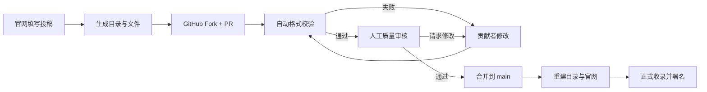
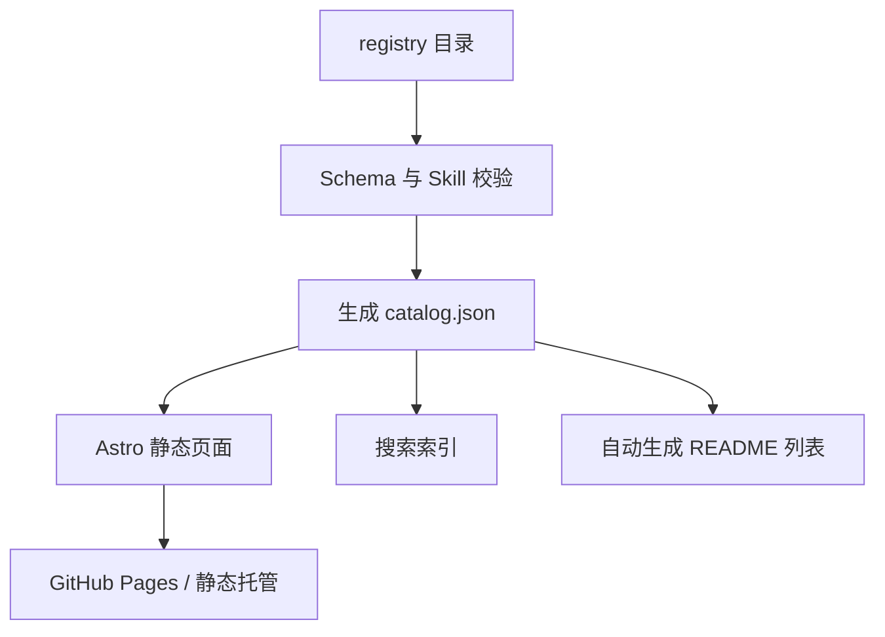

# Cangjie Skill 官方网站产品与设计方案（第一版）

日期：2026-07-13
状态：待确认的产品设计草案，不包含前端实现
项目：Cangjie Skill / 仓颉 Skill

> 当前实施以 [MVP 功能与页面布局规格](./2026-07-13-cangjie-skill-website-mvp-functional-spec.md) 为准；本文保留为后续视觉与完整产品愿景参考。

## 1. 一句话结论

官网不应该只是一个更漂亮的 README，而应该成为一个由 GitHub 驱动的“可验证 Skill 知识库”：用户能在 3 分钟内学会使用，能按真实问题找到合适的 Skill，贡献者能通过一个目录 PR 提交作品，维护者则直接在 GitHub 完成自动检查、人工审核和合并发布。

推荐第一阶段不做独立后台、不做站内账号、不做数据库。GitHub 仓库就是数据库，Pull Request 就是审核后台，Git 历史就是审计日志，GitHub Actions 就是自动质检员，官网只负责学习、发现、生成投稿内容和展示审核结果。

## 2. 当前项目诊断

### 2.1 已经拥有的资产

当前仓库已经具备官网最难得的四类内容资产：

1. 明确的产品主张：把书、长视频、播客、课程等长内容中的方法论蒸馏为可调用的 AI Skills。
2. 一套可解释的方法论：Adler 整体理解、并行提取、三重验证、RIA++ 构造、Zettelkasten 链接、压力测试和最终交付。
3. 一批可以直接展示的结果：当前 README 列出了 22 个 Skill Packs，合计约 300 个原子 Skills。
4. 一套较完整的产物模板：`BOOK_OVERVIEW.md`、`INDEX.md`、`DIGEST.md`、子 Skill 的 `SKILL.md`、`test-prompts.json` 和审计轨迹。

这意味着官网不用从“解释一个概念”开始，而可以直接从“给我一个问题，我帮你找到可用的方法”开始。

### 2.2 当前信息呈现的问题

当前 README 对熟悉 GitHub 和 Agent Skills 的用户很完整，但对新用户存在四个断点：

- 不知道 Skill 和 Prompt、知识库、聊天机器人有什么区别。
- 看见几十个仓库后，不知道自己该选哪一个。
- 找到仓库后，不知道安装到 Claude Code、Codex、Cursor 或 Copilot 的哪个位置。
- 想贡献时，没有统一入口、提交契约、质量等级和审核状态说明。

因此，官网的核心任务不是“讲更多”，而是降低四次决策成本：理解、选择、安装、贡献。

### 2.3 一个需要先解决的规范问题

当前 Cangjie 生成模板把 `source_book`、`source_chapter`、`tags`、`related_skills` 作为 `SKILL.md` 顶层 frontmatter 字段，其中数组使用 YAML flow list。现有 Agent 客户端可能会忽略这些额外字段并正常加载，但按 2026 年当前 Agent Skills 官方规范和 `skills-ref` 校验器，这种写法不是稳定的跨客户端契约。

建议官网上线前把标准拆成两层：

- Agent 执行契约：`SKILL.md` 只使用规范字段，包括 `name`、`description`，以及可选的 `license`、`compatibility`、`metadata`、`allowed-tools`。
- Cangjie 收录契约：展示、分类、作者、来源、质量等级、仓库地址等信息放在独立的 `entry.yaml` 中，不依赖 Agent 是否理解这些字段。

来源、章节、标签和关联 Skill 若需要留在 `SKILL.md` 内，应放入 `metadata`，并使用字符串值，以获得更好的官方校验兼容性。

## 3. 产品定位

### 3.1 推荐定位

> Cangjie Skill 是一个把高价值内容转化为可调用 Agent Skills 的开源方法与公共知识库。

网站同时承担三个角色：

- 学习站：让新手理解、安装并调用 Skills。
- Skill Library：展示官方和社区贡献的 Skill Packs 与原子 Skills。
- 开源贡献门户：让贡献者用 PR 提交，自动校验，公开审核。

### 3.2 不建议的定位

第一阶段不建议把它做成：

- “AI 应用商店”：会让人期待在线运行、付费、评分、账号体系和复杂权限。
- “内容摘要站”：会弱化可调用、可执行、可测试的核心差异。
- “上传网盘”：会带来存储、版权、恶意文件和运营责任。
- “后台 CMS”：在贡献规模尚未验证前，维护成本大于收益。

### 3.3 成功标准

首版上线后，至少能回答以下问题：

- 新用户能否在 3 分钟内完成一次安装和触发测试？
- 用户能否从“我想解决什么问题”出发找到一个 Skill，而不是只按书名浏览？
- 外部贡献者能否在 10 分钟内创建一个格式正确的 PR？
- 维护者能否在 5 分钟内判断一个投稿是格式问题、质量问题还是版权问题？
- 合并 PR 后，官网和 README 是否能自动更新而不重复维护？

## 4. 三种产品路线

### 路线 A：README 展示站

把当前 README 做成首页、教程页和卡片列表，投稿仍然完全跳转 GitHub。

优点：开发最快、风险最低。
缺点：只能“看”，没有真正改善发现和投稿体验，未来很快需要重构。

### 路线 B：GitHub 原生 Skill Registry（推荐）

官网从仓库中的结构化目录构建。每个收录项对应一个独立目录；官网提供投稿向导，在浏览器中生成 `entry.yaml` 和 `README.md`，用户最终通过 GitHub fork + PR 提交。GitHub Actions 自动检查，人工审核后合并，网站自动重建。

优点：无独立后台、透明、可审计、贡献者身份保留、可以逐步扩展。
缺点：投稿者仍需要 GitHub 账号；本地文件夹投稿比纯链接投稿多几步。

### 路线 C：完整 Skill 平台

使用 GitHub OAuth、GitHub App、数据库和对象存储，站内完成登录、上传、状态管理、评论和 PR 创建。

优点：体验最完整，可以做收藏、评分、在线试用和贡献者中心。
缺点：开发、运维、安全与合规成本显著增加，现阶段缺少足够数据证明这些能力必要。

### 推荐决策

采用路线 B。架构上保留未来接入 GitHub App 的位置，但首版不建设账号、数据库和上传后台。

## 5. 用户与核心任务

### 5.1 第一次听说 Skill 的普通用户

目标：弄懂“它能帮我做什么”，选择一个 Skill，完成安装和首次调用。

官网需要提供：

- 30 秒概念解释。
- 一个真实的输入、触发和输出演示。
- 按工具切换的安装命令。
- 可复制的测试 Prompt。
- 安装失败的最短排查路径。

### 5.2 已经使用 Agent 的进阶用户

目标：按任务、领域、来源和平台发现高质量 Skills。

官网需要提供：

- 快速搜索与多维筛选。
- Skill Pack 和原子 Skill 两层结构。
- 触发场景、反场景、执行步骤和测试状态。
- GitHub、复制安装命令、查看源材料等快捷动作。

### 5.3 Skill 创作者与内容蒸馏者

目标：提交自己的 Skill 或仓库，获得收录和署名。

官网需要提供：

- 两种提交模式：已有 GitHub 仓库、仅有本地文件夹。
- 投稿模板和实时预检。
- 清楚的质量等级、版权要求和审核过程。
- PR 状态、修改建议和贡献者署名。

### 5.4 维护者

目标：低成本判断投稿是否能收录，并保持品牌质量。

官网和仓库需要提供：

- 自动 schema 校验。
- Agent Skills 官方格式校验。
- 文件、链接、许可证、秘密信息和高风险脚本检查。
- 可重复使用的人工审核清单。
- 合并后自动生成目录、README 和官网数据。

## 6. 网站信息架构

主导航建议保持六项：

1. 首页
2. 学会使用
3. Skill 库
4. 蒸馏方法
5. 提交 Skill
6. GitHub

辅助入口：语言切换、搜索、深色模式、交流群。

建议路由：

```text
/
/learn
/library
/library/packs/[slug]
/library/skills/[slug]
/method
/contribute
/contribute/guide
/quality
/contributors
/about
```

首页不是所有信息的堆叠，而是负责把三类人分流：

- “我想学会使用” → `/learn`
- “我想找一个 Skill” → `/library`
- “我想提交作品” → `/contribute`

## 7. 首页详细设计

### 7.1 顶部导航

左侧是 Cangjie 标志与文字，右侧是主导航、全站搜索、GitHub Star 按钮和“提交 Skill”主按钮。

导航采用半透明浅色背景或墨色背景上的细描边，不做常见的厚重 SaaS 胶囊按钮堆叠。

### 7.2 Hero

主标题建议：

> 把读过、看过、听过的知识，变成 Agent 真正会用的能力。

副标题：

> Cangjie Skill 使用 RIA-TV++，把书、课程、访谈和长内容中的方法论蒸馏为可触发、可执行、可测试的 Agent Skills。

两个主要动作：

- 开始使用
- 浏览 Skill 库

一个次级动作：

- 在 GitHub 查看源码

Hero 右侧不放泛化 AI 插画，建议使用“从长内容到知识节点再到 Agent 行动”的真实动态关系图。节点可使用当前仓库中的真实 Skill 名称，例如 `margin-of-safety`、`economic-moat`、`viral-copywriting`，避免装饰性假数据。

### 7.3 实时成果条

从 registry 自动计算并显示：

- Skill Packs 数量
- 原子 Skills 数量
- 贡献者数量
- 通过测试的比例

当前可作为初始值展示“22 个 Packs / 约 300 个 Skills”，但上线后禁止手工写死。

### 7.4 三步使用演示

用一个真实例子完成闭环：

1. 选择一个 Skill，例如“安全边际”。
2. 一键复制对应平台安装命令。
3. 输入一个真实问题，看 Agent 如何触发并执行。

这部分应带工具切换：Claude Code / Codex / GitHub Copilot / 其他兼容客户端。切换后命令、目录和验证方式同步变化。

### 7.5 精选 Skill Packs

首页只展示 6 个，不展示全部：

- 巴菲特致股东信
- 穷查理宝典
- 认知红利
- 爆款文案
- AI for Everyone
- 毛泽东选集

卡片信息控制在：封面或主题视觉、名称、来源类型、原子 Skill 数、三条代表性能力、质量徽章、查看详情。

### 7.6 方法论横截面

不在首页完整解释七个阶段，只展示一句话流水线：

> 理解全貌 → 提取候选 → 三重验证 → 构造 Skill → 建立关联 → 压力测试 → 安装交付

点击进入 `/method` 查看详细过程、产物示例和质量门槛。

### 7.7 社区贡献区

展示最近收录、贡献者头像和审核规则，主文案：

> 你贡献的不是一条链接，而是一项能被验证、被署名、被长期维护的 Agent 能力。

动作：

- 提交已有 GitHub 仓库
- 提交本地 Skill 文件夹

## 8. “学会使用”页面

这个页面应采用交互式教程，而不是长文档。

### 8.1 第一步：先选你的工具

工具卡片：

- Claude Code
- OpenAI Codex
- GitHub Copilot
- Cursor
- OpenClaw
- 其他 Agent Skills 兼容客户端

只展示经过验证的目录和命令。对于尚未确认完全兼容的平台，明确标注“实验性”，不要为了平台数量而过度承诺。

### 8.2 第二步：选安装范围

- 个人级：所有项目可用。
- 项目级：只在当前项目使用。

页面根据选择生成可复制命令，并解释复制的是完整目录而不是单个 Markdown 文件。

### 8.3 第三步：验证是否生效

每个平台提供：

- 查看已发现 Skills 的方式。
- 一个 `should_trigger` 测试 Prompt。
- 一个 `should_not_trigger` 反例 Prompt。
- 常见错误：目录名不匹配、文件名不是大写 `SKILL.md`、frontmatter 无效、描述过宽、会话未刷新。

### 8.4 第四步：理解触发机制

用一个简短的三层图解释渐进加载：

1. Agent 先只看 `name + description`。
2. 匹配任务后加载 `SKILL.md` 正文。
3. 真正执行时才读取 `scripts/`、`references/`、`assets/`。

这个解释能让用户理解为什么 `description` 不是普通简介，而是 Skill 能否被调用的核心索引。

## 9. Skill 库

### 9.1 不要把 Pack 和 Skill 混在同一个平面

当前项目中的“巴菲特致股东信”是一个 Pack，内部含 20 个原子 Skills；“安全边际”才是一个具体 Skill。官网应明确两层：

- Packs：由一本书、一套课程或一组材料蒸馏出的完整知识包。
- Skills：可单独触发和执行的能力单元。

用户可以从 Pack 进入，也可以直接搜索原子 Skill。

### 9.2 筛选维度

首版建议保留真正有区分度的筛选：

- 内容来源：书籍、视频、课程、播客、访谈、资料集、实战经验。
- 领域：投资、商业、写作、营销、学习、组织、决策、技术等。
- 类型：Pack / 原子 Skill。
- 维护方式：官方维护 / 社区维护。
- 质量等级：官方蒸馏 / 社区认证 / 社区收录。
- 可用平台：由兼容性与实测结果生成。

不要在首版引入星级评分。样本少时评分没有信息量，也容易把开源贡献变成竞赛。

### 9.3 搜索排序

搜索同时匹配：

- 名称和别名。
- 用户会说的话，也就是触发语言。
- 领域和来源。
- 解决的问题。

默认排序不只看 GitHub Stars，推荐综合：

- 触发场景匹配度。
- 质量等级。
- 测试通过情况。
- 最近维护时间。
- GitHub 社交信号。

### 9.4 Pack 详情页

信息顺序：

1. 一句话说明这个 Pack 帮用户解决什么。
2. 来源、作者、年份、维护者、许可证和质量等级。
3. 代表性使用场景。
4. Pack 内 Skill 地图。
5. 推荐学习或调用顺序。
6. 安装整个 Pack / 选择安装单个 Skill。
7. DIGEST、BOOK_OVERVIEW、GLOSSARY 和审计轨迹。
8. GitHub、问题反馈和贡献者。

### 9.5 原子 Skill 详情页

信息顺序：

1. 什么时候用。
2. 什么时候不要用。
3. 用户可能会说什么。
4. Agent 会按什么步骤执行。
5. 一个过去案例和一个未来案例。
6. 触发测试、反例测试与最近结果。
7. 关联 Skills：依赖、对比、组合。
8. 安装与查看源码。

这会比直接渲染整份 `SKILL.md` 更适合人类阅读，同时保留“查看原始文件”入口。

## 10. GitHub 原生投稿与审核系统

### 10.1 核心原则

用户提交的不是全局 README 的一行，而是一个独立、可校验、可回滚的收录目录。全局 README、网站卡片、搜索索引和贡献者页面全部由这些目录自动生成。

这样可以避免：

- 多个人同时修改同一张 README 表格导致冲突。
- README、官网和数据文件出现三套不一致信息。
- 维护者手工复制投稿信息。
- 删除或撤销一个收录项时难以追踪。

### 10.2 推荐仓库结构

```text
cangjie-skill/
├── registry/
│   ├── buffett-letters-skill/
│   │   ├── entry.yaml
│   │   └── README.md
│   ├── community-scene-skill/
│   │   ├── entry.yaml
│   │   ├── README.md
│   │   └── skill/
│   │       ├── SKILL.md
│   │       ├── scripts/
│   │       ├── references/
│   │       └── assets/
│   └── another-pack/
│       ├── entry.yaml
│       ├── README.md
│       └── skills/
│           ├── skill-a/SKILL.md
│           └── skill-b/SKILL.md
├── website/
├── schemas/
│   └── registry-entry.schema.json
├── scripts/
│   ├── validate-registry.*
│   ├── build-catalog.*
│   └── sync-readme.*
└── .github/
    ├── workflows/
    │   ├── validate-submission.yml
    │   └── deploy-website.yml
    ├── PULL_REQUEST_TEMPLATE.md
    └── CODEOWNERS
```

### 10.3 两种收录模式，共用一个目录模型

#### 模式 A：外部 GitHub 仓库

贡献者已开源。`entry.yaml` 的 `artifact.type` 为 `external`，保存仓库 URL、默认分支和可选的 Skill 路径。Cangjie 仓库不复制对方代码，只保存结构化索引与介绍页。

适合：独立维护、有自己的 release 和 issue 的成熟项目。

#### 模式 B：托管在 Cangjie 仓库中

贡献者没有独立仓库。`entry.yaml` 的 `artifact.type` 为 `bundled`，实际文件放在同一目录的 `skill/` 或 `skills/` 下。

适合：单个场景 Skill、小型 Pack、首次开源的创作者。

两种模式在官网上的详情页结构一致，区别只体现在“源码位置”和“维护方式”。

### 10.4 `entry.yaml` 建议契约

```yaml
schema_version: 1
slug: margin-of-safety
title: 安全边际
summary: 在估值不确定时，用价值与价格之间的缓冲降低判断错误的代价。
kind: skill
language: zh-CN

source:
  type: book
  title: 巴菲特致股东的信
  creator: Warren Buffett

artifact:
  type: external
  repository: https://github.com/kangarooking/buffett-letters-skill
  path: margin-of-safety

authors:
  - github: kangarooking

taxonomy:
  domains: [investment, decision-making]
  use_cases: [valuation, risk-control]

quality:
  tier: official-distilled
  methodology: RIA-TV++
  tests: available

license: MIT
```

这里的字段是官网 Registry 的数据，不等于 `SKILL.md` frontmatter。两者必须分离，避免为了做官网而破坏 Agent Skills 的可移植性。

### 10.5 投稿向导

页面分为五步：

1. 选择“已有 GitHub 仓库”或“上传本地文件夹”。
2. 填写名称、解决的问题、典型触发语、反场景、作者、许可证和来源。
3. 对于外部仓库，输入 URL 并检查公开可访问性；对于本地文件夹，只在浏览器本地读取和预览，不上传到 Cangjie 服务器。
4. 生成 `entry.yaml`、`README.md`、目标目录名和 PR 检查清单。
5. 跳转 GitHub 创建新文件或进入个人 fork 上传目录，然后创建 PR。

GitHub 官方支持在无写权限仓库中创建或编辑文件时自动 fork，并引导用户发起 Pull Request；多文件目录投稿则先进入或创建个人 fork，再上传并向上游发 PR。因此首版无需保存 GitHub Token，也不需要自己实现账号体系。

### 10.6 对“本地文件夹提交”的现实处理

纯静态网站无法安全地替用户把文件写入 GitHub，也不应该在前端内嵌长期有效的仓库 Token。

首版建议：

- 浏览器本地读取目录，显示缺失文件和预检结果。
- 自动生成 `entry.yaml` 与 `README.md`，让用户下载投稿包。
- 若用户尚无 fork，先创建个人 fork；随后进入个人 fork 的 `registry/` 目录，通过 Add file → Upload files 拖入整个目录。
- 用户选择新分支并创建 PR。

GitHub Web 当前支持拖入文件夹，但单文件上限 25 MiB、单次最多 100 个文件。超出限制时，页面切换为 Git / GitHub Desktop 指南。

### 10.7 PR 状态机



推荐标签：

- `submission:new`
- `submission:external`
- `submission:bundled`
- `checks:failed`
- `review:needed`
- `review:changes-requested`
- `ready-to-merge`

## 11. 自动审核与人工审核

### 11.1 自动审核负责客观事实

自动检查建议分为六组：

1. Registry 结构：目录名、slug、必填字段、唯一性、URL 格式。
2. Agent Skills 规范：`SKILL.md` 存在、frontmatter 合法、name 与父目录一致、description 长度和字段类型。
3. Cangjie 质量结构：触发场景、反场景、执行步骤、测试文件和来源信息是否存在。
4. 安全：秘密信息扫描、符号链接、超大文件、危险二进制文件和异常路径。
5. 外部链接：仓库可访问、默认分支存在、声明路径中能找到至少一个 `SKILL.md`、许可证可识别。
6. 构建：目录页、详情页、搜索索引和自动 README 能否生成。

自动检查不得执行投稿中的脚本。对 fork PR 使用权限受限的 `pull_request` 工作流；需要打标签或评论时单独使用受控工作流，不能在高权限上下文中 checkout 后执行投稿代码。

### 11.2 人工审核负责判断价值

人工审核不重复检查 YAML，而判断以下问题：

- 这个 Skill 是否对应一个清晰、重复出现的真实场景？
- 没有这个 Skill 时，通用 Agent 是否已经能同样好地完成？
- `description` 是否足够精确，能触发又不会泛滥触发？
- 执行步骤是否可操作、可判断完成，而不是口号？
- 是否写清不要使用的情况和失败模式？
- 来源、作者、许可证和引用是否可信？
- 测试是否包含正例、诱饵和边界，而不是只证明“它能工作”？

### 11.3 建议质量等级

#### 官方蒸馏

由 Cangjie 项目维护，完成 RIA-TV++ 全流程，有来源、验证、压力测试和审计轨迹。

#### 社区认证

由社区维护，符合 Agent Skills 标准，通过自动检查和人工审核，有明确测试与许可证，但不一定由 Cangjie 全流程生成。

#### 社区收录

格式合格、来源清楚、基本可用，但尚未完成完整压力测试。页面必须明确展示这一状态，避免用户误认为已获官方质量背书。

不建议把所有合并项都标成“Cangjie 认证”。“收录”与“认证”必须是两个概念。

## 12. 视觉设计方向

### 方向一：现代知识档案馆（推荐）

关键词：墨色、暖白、矿物金、朱砂、编辑设计、知识索引、精密网格。

整体像一家当代研究机构或高级出版品牌，而不是古风网站。中文标题有适度书卷感，界面正文保持现代无衬线高可读性。卡片像档案卡，但通过细线、编号、分类章和数据排版体现秩序，不使用卷轴、毛笔、竹简等直白古风素材。

优势：能同时承载“仓颉”的文化感和“Agent Skills”的技术感，适合内容型长页面，也容易形成独特品牌。
风险：如果金色、印章和纹理使用过多，会变成文创商城。

### 方向二：Agent Knowledge OS

关键词：深海军蓝、冷白、青蓝节点、图谱、终端、实时状态。

首页强调从知识节点到 Agent 行动的动态关系图，Skill 卡片更像开发者工具和 API Registry。

优势：技术感强，开发者一眼能理解这是可执行能力系统。
风险：容易与大量 AI SaaS 官网同质化，也会弱化内容蒸馏和中文品牌个性。

### 方向三：未来出版物

关键词：高对比黑白、大字号、非对称编辑布局、亮橙或荧光绿、实验性排版。

把官网做成一本不断生长的数字杂志，每个 Pack 像一期专题。

优势：传播截图很有记忆点，适合公众号和社交媒体。
风险：复杂筛选、安装教程和长文档可能牺牲可用性。

### 推荐融合方式

以方向一作为品牌与内容底座，吸收方向二的知识图谱和状态可视化。不要把三套风格平均混合。

### 12.1 推荐色彩

- 背景暖白：`#F3F0E8`
- 主墨色：`#151713`
- 次级墨灰：`#565A50`
- 矿物金：`#B69042`
- 朱砂强调：`#C9472D`
- 成功绿：`#2F7656`
- 边框米灰：`#D9D3C5`

深色模式使用墨黑而不是纯黑，卡片采用略暖的深灰，金色只用于关键状态和高质量徽章。

### 12.2 字体策略

- 中文标题：优先使用有现代感的宋体或衬线体作为展示字体。
- 中文正文与 UI：高可读无衬线。
- 英文、数字、代码：中性 Grotesk + 等宽字体。

网页字体需要控制体积并设置系统字体回退，避免中文首屏因字体文件过大而变慢。

### 12.3 图形语言

- 使用真实 Skill 关系生成的节点图，而不是装饰性星空。
- 用“编号、索引条、引用线、验证章”建立档案感。
- 图标使用统一图标库，不用 emoji 作为正式功能图标。
- 图片优先使用真实书籍、课程或仓库资产，并处理版权和封面使用边界。

### 12.4 动效

动效用于解释状态变化：

- Hero 中长内容逐步压缩为多个 Skill 节点。
- 鼠标经过 Skill 卡片时显示触发语言和相邻节点。
- 安装命令复制后有明确反馈。
- 投稿步骤和 CI 检查显示实时状态。

避免持续漂浮、粒子背景和大面积视差。它们会增加噪音并降低文档阅读效率。

## 13. 技术架构建议

### 13.1 推荐技术栈

- 框架：Astro。
- 内容：Markdown/MDX + YAML Registry。
- 交互岛：React、Preact 或 Svelte，仅用于搜索、筛选、安装命令和投稿向导。
- 样式：CSS Design Tokens + Tailwind 或轻量组件层。
- 搜索：构建时生成索引，使用 Pagefind 或 Fuse.js；首版不需要搜索服务。
- Schema：JSON Schema + YAML 解析。
- Skill 规范校验：官方 `skills-ref` 加项目自定义规则。
- CI：GitHub Actions。
- 部署：首版 GitHub Pages；若中国大陆访问质量成为核心指标，再把同一静态产物部署到国内对象存储/CDN。

选择 Astro 的原因：

- 内容页和 SEO 友好。
- 默认输出静态页面，无服务器成本。
- 允许局部交互，不必把整个网站做成 SPA。
- 适合从 Git 仓库内容构建详情页。

### 13.2 数据流



Registry 是唯一事实来源。网站不直接解析 README 表格，README 也不再手工维护收录列表。

### 13.3 不需要的首版组件

- 数据库。
- 后台管理页面。
- GitHub OAuth。
- 用户画像和推荐算法。
- 在线执行陌生 Skill。
- 评分、评论、收藏和排行榜。
- 上传原始书籍、视频或受版权保护的全文。

## 14. 安全、版权与治理

### 14.1 安全边界

- 自动校验只能把提交内容当作数据，不能执行投稿中的脚本。
- PR 工作流使用最小权限和只读 Token。
- 禁止 secrets、私钥、cookie、访问令牌和个人敏感信息。
- 禁止符号链接逃逸、超大二进制、构建产物和依赖目录。
- 外部仓库只做结构与元数据检查，不自动安装或运行。

### 14.2 版权边界

投稿者必须确认：

- 有权提交 Skill 本身及附带素材。
- 原文引用控制在合理范围，并标注来源。
- 不上传原书、完整课程、受版权保护字幕全集等材料。
- 仓库或目录拥有明确许可证。
- 外部仓库链接不等于 Cangjie 对内容版权做保证。

### 14.3 治理文件

首版建议补齐：

- `CONTRIBUTING.md`
- `CODE_OF_CONDUCT.md`
- `SECURITY.md`
- `PULL_REQUEST_TEMPLATE.md`
- Registry schema 与示例目录
- 收录、认证、下架和争议处理规则

## 15. SEO 与传播

每个 Pack 和 Skill 都应该拥有独立、可索引的 URL，并生成：

- 独立 title 与 description。
- Open Graph 分享图。
- JSON-LD 中的软件或创意作品信息。
- canonical URL。
- sitemap。

适合内容传播的页面模板：

- “这本书被蒸馏成了哪些 Skills？”
- “当你遇到什么问题时应该调用这个 Skill？”
- “一个 Skill 如何通过正例、诱饵和边界测试？”

分享图不只展示封面，应突出“解决的问题 + Skill 数量 + 质量等级”，让社交媒体用户在不读正文时也理解价值。

## 16. 国际化与可访问性

仓库已有中文、英文、日文 README，官网架构应从第一天支持多语言字段，但首版可以只完整发布中文。

建议：

- Registry 的 slug 保持语言无关。
- 标题、摘要、详情正文使用 locale 文件或多语言 Markdown。
- 缺少翻译时回退到中文并明确标识，而不是隐藏页面。
- 所有交互支持键盘操作、焦点样式和减少动态效果。
- 颜色不是唯一状态信号；质量徽章同时提供文字。
- 正文对比度、字号和行宽优先于视觉实验。

## 17. 分阶段实施

### Phase 0：规范整理（2—3 天）

- 定义 Registry schema。
- 明确 Pack、Skill、外部链接、仓库托管四个概念。
- 确定质量等级与人工审核清单。
- 统一 `SKILL.md` 标准字段策略。
- 把当前 22 个 Pack 迁移为 Registry 条目。

交付标准：所有现有条目可被脚本读取，统计数字能自动生成。

### Phase 1：官网 MVP（5—8 天）

- 首页。
- 学会使用。
- Skill 库与搜索筛选。
- Pack / Skill 详情页。
- 方法论页。
- 投稿说明页。
- GitHub Pages 部署、SEO、基础统计。

交付标准：用户可以完成“发现 → 安装 → 验证”的闭环。

### Phase 2：GitHub 投稿闭环（4—6 天）

- 投稿向导。
- 两种模式的文件生成。
- 浏览器本地目录预检。
- PR 模板、CODEOWNERS、自动标签。
- Registry、Skill 规范、安全和构建检查。
- 合并后自动更新官网与 README。

交付标准：一个外部贡献者不需要维护者代写文件即可完成合格 PR。

### Phase 3：质量与社区（按真实需求）

- 自动生成 PR 预览。
- 贡献者页面。
- 质量报告和测试历史。
- 更完整的平台兼容性矩阵。
- GitHub App 一键创建 PR，仅在投稿量证明有必要时开发。

## 18. MVP 验收清单

### 使用体验

- 新用户可在 3 分钟内看懂 Skill、选择平台、复制命令并完成验证。
- 移动端、桌面端均可完成搜索、安装和投稿阅读。
- 每个可复制动作都有反馈。
- 安装说明不使用未经验证的平台命令。

### 内容与发现

- 当前所有 Pack 均有独立详情页。
- Pack 与原子 Skill 不混淆。
- 搜索能匹配中文标题、英文 slug、触发语言和领域。
- 所有计数来自 Registry 自动生成。

### 投稿与审核

- 外部链接和托管目录共用一套 entry schema。
- PR 自动检查失败时给出可操作的错误信息。
- 合并后无需人工修改 README 和网站数据。
- 投稿代码不会在高权限 CI 中被执行。
- 每个收录项都有作者、来源、许可证和质量等级。

### 品牌与视觉

- 视觉不是通用 AI 渐变 SaaS 风格。
- 真实 Skill 名称和数据出现在视觉表达中。
- 中文长文阅读体验稳定。
- 动效可关闭，不影响核心操作。

## 19. 主要风险与应对

### 风险一：把“收录”误解为“官方认证”

应对：建立三层质量徽章，详情页明确维护者、测试和审核范围。

### 风险二：提交规则太重，社区不愿贡献

应对：外部链接投稿只要求一个目录和结构化元数据；完整 RIA-TV++ 仅用于“官方蒸馏”认证，不把所有社区 Skill 强行变成拆书产物。

### 风险三：提交规则太松，品牌质量下降

应对：格式自动化、价值人工化；把反场景、许可证和最小测试作为合并底线。

### 风险四：GitHub 对普通用户门槛较高

应对：官网生成全部内容，用户只完成 GitHub 的 fork、粘贴或上传、创建 PR；用截图和动图把步骤压缩到一条路径。

### 风险五：外部仓库后来失效或变质

应对：定时只读检查链接、许可证和 Skill 路径；失效条目标记为“维护异常”，人工确认后下架，不自动删除。

## 20. 最终推荐

我建议把官网定义为：

> 一个以 GitHub 为治理基础、以可验证 Agent Skills 为内容单位、以“学会使用—发现能力—参与贡献”为核心闭环的开放知识基础设施。

最重要的不是先做一个漂亮首页，而是先确定 Registry 目录和质量规则。只要 Registry 是稳定的，首页、搜索、README、贡献者榜单、API、CLI 甚至未来的 GitHub App 都可以从同一份数据自然生长出来。

## 21. 参考依据

- Agent Skills 官方规范：https://agentskills.io/specification
- Agent Skills 创建最佳实践：https://agentskills.io/skill-creation/best-practices
- Agent Skills 评测方法：https://agentskills.io/skill-creation/evaluating-skills
- Anthropic Skills 示例仓库：https://github.com/anthropics/skills
- GitHub 创建新文件与自动 fork/PR：https://docs.github.com/en/repositories/working-with-files/managing-files/creating-new-files
- GitHub 编辑其他仓库并自动 fork/PR：https://docs.github.com/en/repositories/working-with-files/managing-files/editing-files
- GitHub PR 模板：https://docs.github.com/en/communities/using-templates-to-encourage-useful-issues-and-pull-requests/about-issue-and-pull-request-templates
- GitHub Pages 发布：https://docs.github.com/en/pages/getting-started-with-github-pages/configuring-a-publishing-source-for-your-github-pages-site
- GitHub Actions `pull_request_target` 安全说明：https://docs.github.com/en/actions/reference/security/securely-using-pull_request_target
