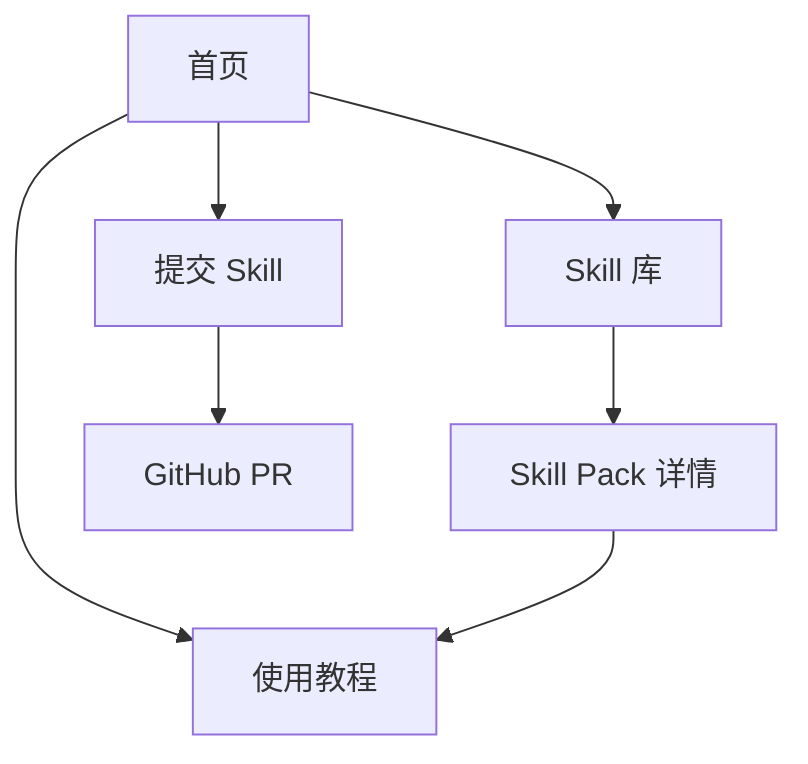
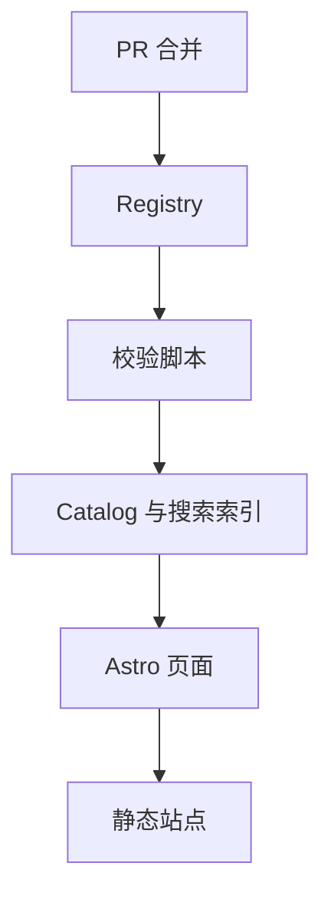

# Cangjie Skill 官网 MVP 功能与页面布局规格

日期：2026-07-13
状态：待确认的功能设计稿
原则：功能优先、静态优先、GitHub 原生、暂缓视觉精修

## 1. 产品范围

首版官网只完成两个闭环：

1. 用户找到一个适合自己的 Skill Pack，学会安装并完成一次调用。
2. 贡献者提交一个外部 GitHub 仓库或本地 Skill 文件夹，并进入 GitHub PR 审核流程。

首版不做：

- 登录、站内账号和独立后台。
- 收藏、评分、评论和排行榜。
- 在线运行陌生 Skill。
- 多语言、深色模式和复杂动效。
- 独立的贡献者中心。
- 每个原子 Skill 的独立详情页。
- 数据库、搜索服务和推荐算法。

当前约 22 个 Pack 直接进入 Registry。Pack 内约 300 个原子 Skills 在 Pack 详情页中列出，并参与搜索，但首版不为每个原子 Skill 生成单独页面。

## 2. MVP 页面地图

首版只有五个核心页面：



路由：

```text
/
/learn
/skills
/skills/[slug]
/submit
```

GitHub、README、完整 RIA-TV++ 方法论和项目介绍先作为外部链接，不单独建设官网页面。

## 3. 全站公共布局

### 3.1 页头

| 区域 | 内容 | 行为 |
|---|---|---|
| 左侧 | Cangjie Skill / 仓颉 Skill | 点击回首页 |
| 中间 | 使用教程、Skill 库、提交 Skill | 当前页面高亮 |
| 右侧 | GitHub | 新窗口打开仓库 |

移动端把三个导航项收进简单菜单。首版不做悬浮玻璃效果、搜索弹窗或多层下拉菜单。

### 3.2 页脚

只保留：

- GitHub 仓库。
- README / 方法论。
- License。
- 问题反馈。
- 公众号和交流群入口。

## 4. 首页 `/`

首页的任务是分流，不承担完整文档功能。

### 4.1 页面顺序

| 顺序 | 模块 | 必须展示的内容 | 主要动作 |
|---|---|---|---|
| 1 | Hero | 产品一句话、简短解释 | 开始使用、浏览 Skill 库 |
| 2 | 数据概览 | Pack 数、原子 Skill 数、RIA-TV++ | 无 |
| 3 | 三步说明 | 选择、安装、调用 | 查看使用教程 |
| 4 | 精选 Packs | 6 个代表性 Pack | 查看详情、查看全部 |
| 5 | 提交入口 | 两种投稿方式说明 | 提交 Skill |
| 6 | 页脚 | 项目与社区链接 | 外部链接 |

### 4.2 Hero 文案

标题：

> 把读过、看过、听过的知识，变成 Agent 真正会用的能力。

说明：

> Cangjie Skill 把书、课程和长内容中的方法论，蒸馏成可触发、可执行、可测试的 Agent Skills。

按钮：

- 主按钮：开始使用 → `/learn`
- 次按钮：浏览 Skill 库 → `/skills`

### 4.3 数据概览

数据必须从 Registry 构建时计算，禁止写死：

- `pack_count`
- `skill_count`
- `contributor_count`

RIA-TV++ 是方法标签，不作为动态计数。

### 4.4 三步说明

1. 找到适合当前问题的 Pack。
2. 复制到 Agent 的 Skills 目录。
3. 用测试 Prompt 确认它能正确触发。

### 4.5 精选 Packs

首版固定展示 6 个，由 `featured: true` 决定。每项只显示：

- 名称。
- 一句话用途。
- 来源类型。
- 原子 Skill 数量。
- 2—3 个标签。
- 质量等级。
- 查看详情。

不在首页显示完整简介、测试报告或全部子 Skills。

## 5. 使用教程 `/learn`

这个页面只解决“怎么安装、怎么验证”。

### 5.1 页面布局

| 区域 | 内容 |
|---|---|
| 页面标题 | 3 分钟开始使用 Cangjie Skills |
| 工具选择 | 经过验证的平台标签页 |
| 安装范围 | 个人级 / 项目级 |
| 安装命令 | 可复制命令和目标目录 |
| 验证步骤 | 查看 Skill、测试正例、测试反例 |
| 常见问题 | 目录、文件名、frontmatter、会话刷新 |
| 下一步 | 前往 Skill 库 |

### 5.2 平台配置

平台信息不硬编码在页面组件里，使用一个配置文件：

```yaml
platforms:
  - id: claude-code
    name: Claude Code
    status: verified
    user_skill_dir: ~/.claude/skills/
    project_skill_dir: .claude/skills/
  - id: codex
    name: OpenAI Codex
    status: experimental
    user_skill_dir: TBD
    project_skill_dir: TBD
```

实现前必须逐个平台验证目录和发现方式。未验证的平台显示“实验性”，不能给出看似确定的命令。

### 5.3 安装步骤

1. 用户选择平台。
2. 用户选择个人级或项目级。
3. 页面展示目标目录和复制命令。
4. 页面展示一个来自该 Pack 的 `should_trigger` Prompt。
5. 页面展示一个 `should_not_trigger` Prompt，帮助确认触发边界。

### 5.4 错误处理

常见错误按优先级展示：

- 目录名与 `name` 不一致。
- 文件名不是大写 `SKILL.md`。
- YAML frontmatter 无效。
- 只复制了 `SKILL.md`，遗漏所需的 `scripts/` 或 `references/`。
- 安装后没有重新打开会话。
- 当前客户端尚不支持 Agent Skills 标准。

## 6. Skill 库 `/skills`

### 6.1 页面目标

让用户通过“我要解决什么问题”找到 Pack，而不是只按书名浏览。

### 6.2 页面布局

| 区域 | 内容 | 交互 |
|---|---|---|
| 标题区 | 已收录的 Cangjie Skill Packs | 无 |
| 搜索区 | 单个搜索框 | 输入即时过滤 |
| 筛选区 | 来源、领域、质量等级 | 可组合、多选 |
| 结果信息 | 共 N 个结果、清除筛选 | 重置 |
| 结果列表 | Pack 行或简单卡片 | 进入详情 |
| 空状态 | 无匹配结果 | 清除筛选、提交新 Skill |

### 6.3 搜索范围

前端搜索索引包含：

- Pack 中文名、英文名和 slug。
- 一句话用途。
- 来源名称和作者。
- 标签和领域。
- Pack 内原子 Skill 的名称。
- 典型触发语言。

首版使用构建时 JSON + 浏览器本地搜索，不接外部搜索服务。

### 6.4 首版筛选项

- 来源：书籍、视频、课程、播客、访谈、资料集、实战经验。
- 领域：投资、商业、写作、营销、学习、组织、决策、技术、其他。
- 质量：官方蒸馏、社区认证、社区收录。

首版不做平台筛选、更新时间筛选、Star 排序和复杂综合排序。

### 6.5 每个结果项

必须显示：

- Pack 名称。
- 一句话用途。
- 来源。
- 原子 Skill 数量。
- 质量徽章。
- 最多 3 个标签。
- 查看详情。

可选显示 GitHub Stars，但不参与默认排序。

默认排序：`featured` 优先，其余按名称稳定排序。后续有真实使用数据后再设计推荐排序。

## 7. Skill Pack 详情 `/skills/[slug]`

### 7.1 页面布局

| 顺序 | 模块 | 内容 |
|---|---|---|
| 1 | 标题区 | 名称、用途、来源、作者、维护者、许可证、质量等级 |
| 2 | 操作区 | 查看安装方法、打开 GitHub |
| 3 | 适用场景 | 3—5 个真实使用场景 |
| 4 | 原子 Skills | 可搜索的子 Skill 列表 |
| 5 | 推荐使用 | 推荐先安装哪些、测试 Prompt |
| 6 | 项目资料 | DIGEST、INDEX、GLOSSARY、测试报告等可用链接 |
| 7 | 贡献信息 | 维护者、贡献者、更新时间、问题反馈 |

### 7.2 原子 Skill 列表

每个子 Skill 只展示：

- `name`
- 中文标题。
- `description` 的精简版本。
- 触发语言。
- 是否有测试文件。
- 在 GitHub 查看原始 `SKILL.md`。

首版点击子 Skill 不进入独立详情页，可以展开查看摘要或直接跳 GitHub。

### 7.3 两种来源的差异

外部仓库：

- “打开 GitHub”跳到贡献者仓库。
- 网站在构建时读取 Registry 中保存的数据。
- 外部仓库不可访问时显示“来源暂时不可用”，但保留已构建页面。

仓库托管：

- “打开 GitHub”跳到 Cangjie 仓库对应目录。
- 安装命令直接复制本仓库中的 Skill 路径。

## 8. 提交 Skill `/submit`

### 8.1 页面目标

让贡献者生成一个合格的 Registry 目录并完成 GitHub PR，而不是在网站后台保存投稿。

### 8.2 页面步骤

| 步骤 | 页面内容 | 输出 |
|---|---|---|
| 1 | 选择提交方式 | 外部 GitHub / 本地文件夹 |
| 2 | 填写基本信息 | Registry entry 草稿 |
| 3 | 自动预检 | 错误、警告、通过项 |
| 4 | 预览提交内容 | `entry.yaml` 与目录结构 |
| 5 | 前往 GitHub | 创建文件或上传目录并发 PR |

页面顶部始终显示当前进度。错误未解决前不允许进入最后一步；警告可以继续，但会带入 PR 检查清单。

### 8.3 公共字段

- 名称。
- slug。
- 一句话用途。
- 类型：Pack / 单个 Skill。
- 来源类型、来源名称、原作者。
- 投稿者 GitHub 用户名。
- 许可证。
- 领域标签，最多 5 个。
- 典型使用场景，至少 2 个。
- 版权确认复选框。

贡献者不能自己选择“官方蒸馏”或“社区认证”。投稿时统一为 `pending`，质量等级由维护者审核后设置。

### 8.4 外部 GitHub 模式

额外字段：

- 仓库 URL。
- 默认分支，可自动发现。
- Skill 路径。

自动预检：

- URL 是否为公开 GitHub 仓库。
- 声明路径是否存在。
- 是否找到至少一个 `SKILL.md`。
- 是否能识别许可证。
- `SKILL.md` 基本 frontmatter 是否有效。

输出只有一个必须提交的文件：

```text
registry/<slug>/entry.yaml
```

网站生成内容并引导用户在 GitHub 创建新文件。无写权限时，GitHub 完成 fork 和 PR 流程。

### 8.5 本地文件夹模式

浏览器通过目录选择读取文件，仅在本地完成预检，不上传到官网服务器。

自动预检：

- 是否存在 `SKILL.md`。
- 目录名和 `name` 是否一致。
- frontmatter 是否可解析。
- 是否包含秘密信息和异常大文件。
- 是否存在不安全符号链接或不允许的二进制文件。
- 文件数是否适合 GitHub Web 上传。

输出：

```text
registry/<slug>/
├── entry.yaml
└── skill/
    ├── SKILL.md
    └── optional-resources/
```

网站提供“下载投稿包”，然后引导用户：fork 仓库 → 上传目录 → 创建 PR。

### 8.6 提交失败与恢复

- 表单内容保存在浏览器本地，刷新后可恢复。
- GitHub 跳转失败时仍可下载 `entry.yaml` 或投稿包。
- 文件夹不支持时显示 Git / GitHub Desktop 的替代流程。
- 验证错误必须指出文件、字段和修复建议，不能只显示“提交失败”。

## 9. Registry 数据结构

### 9.1 最小目录

```text
registry/<slug>/
├── entry.yaml
└── skill/          # 仅仓库托管模式存在
```

不再强制每个条目额外提交 `README.md`。详情页由 `entry.yaml` 和 Skill 内容生成，减少 PR 文件数量。

### 9.2 最小 `entry.yaml`

```yaml
schema_version: 1
slug: buffett-letters-skill
title: 巴菲特致股东的信
summary: 用于投资判断、企业分析和资本配置的 20 个方法论 Skills。
kind: pack
language: zh-CN

source:
  type: book
  title: 巴菲特致股东的信
  creator: Warren Buffett

artifact:
  type: external
  repository: https://github.com/kangarooking/buffett-letters-skill
  path: .

submitter:
  github: kangarooking

tags:
  - investment
  - decision-making

use_cases:
  - 评估企业长期竞争优势
  - 在不确定估值中设置安全边际

license: MIT
quality: pending
featured: false
```

`quality` 与 `featured` 在合并前由维护者确认。

### 9.3 构建产物

构建脚本读取 Registry，生成但不要求手工编辑：

```text
generated/catalog.json
generated/search-index.json
generated/stats.json
```

这些文件可以作为构建缓存，也可以只存在于 CI 产物中。Registry 始终是唯一事实来源。

## 10. 审核流程


### 10.1 自动检查

- 目录与 slug 一致。
- `entry.yaml` 符合 JSON Schema。
- 外部链接和声明路径存在。
- 托管 Skill 通过 Agent Skills 格式校验。
- 无秘密信息、超大文件和危险路径。
- 新条目不与现有 slug 重复。
- 全站能够成功构建。

PR 自动检查只读取投稿内容，不能执行投稿中的脚本。

### 10.2 人工检查

- 是否解决明确且重复出现的问题。
- `description` 是否能准确触发。
- 执行步骤是否可操作。
- 是否有明确反场景和边界。
- 来源和许可证是否可信。
- 测试是否包含正例、反例和边界。

### 10.3 质量等级

- `official-distilled`：Cangjie 官方按 RIA-TV++ 完整蒸馏。
- `community-certified`：社区维护，完成格式、质量和测试审核。
- `community-listed`：满足基本收录标准，尚未完成完整压力测试。

## 11. 技术方案

### 11.1 推荐实现

- Astro：静态页面和内容路由。
- YAML + JSON Schema：Registry。
- 构建时脚本：生成目录、统计和搜索索引。
- 少量浏览器 JavaScript：搜索、筛选、复制、投稿表单和本地目录预检。
- GitHub Actions：PR 校验和站点部署。
- GitHub Pages：首版托管。

### 11.2 数据流



没有运行时数据库。用户访问的是构建完成的静态页面，投稿表单只在浏览器本地生成文件。

## 12. 基础视觉约束

在功能阶段只使用：

- 白色或暖白背景。
- 黑色正文。
- 一个主色用于按钮和链接。
- 系统字体。
- 统一的 8px 间距体系。
- 统一的按钮、输入框、标签和状态提示。
- 桌面最大内容宽度 1200px。
- 移动端单列布局。

首版不制作品牌插画、复杂图谱、封面系统和动效。页面信息层级正确后再统一升级视觉。

## 13. 验收标准

### 13.1 用户使用闭环

- 首页两个主按钮路径正确。
- 用户能搜索并筛选当前全部 Packs。
- 搜索子 Skill 名称能返回所属 Pack。
- 每个 Pack 都有可访问详情页。
- 用户能从详情页进入正确的安装说明和 GitHub 仓库。

### 13.2 投稿闭环

- 外部 GitHub 模式能生成合法 `entry.yaml`。
- 本地文件夹模式不会把文件上传到官网服务器。
- 无效 Skill 能得到具体错误信息。
- 用户能下载投稿包并进入 GitHub PR 流程。
- 合并新 Registry 条目后，下一次部署自动出现新页面。

### 13.3 安全与稳定性

- PR 校验不执行投稿脚本。
- 外部仓库失效不会导致整个网站构建失败。
- Registry 单个条目错误时能定位到具体文件。
- 无 JavaScript 时仍能浏览首页、列表和详情页。
- 移动端能完成浏览和阅读；本地文件夹投稿可提示改用桌面端。

## 14. 推荐开发顺序

1. 定义 `entry.yaml` Schema。
2. 把当前 22 个 Pack 迁入 Registry。
3. 编写校验与 Catalog 生成脚本。
4. 完成首页、列表、详情和教程页。
5. 完成外部 GitHub 投稿。
6. 完成本地文件夹预检和投稿包下载。
7. 接入 PR 校验和 GitHub Pages 部署。
8. 功能验收后再进入统一视觉设计。

## 15. 最终 MVP 决策

首版最重要的产品单位是 Skill Pack，不是每一个原子 Skill。原子 Skills 仍然会被索引、搜索和展示，但不单独建页。这能显著降低内容迁移、路由、SEO 和维护复杂度，又不影响用户发现具体能力。

首版最重要的后台是 GitHub PR，不是自建管理系统。只有当投稿量、非 GitHub 用户比例或维护者协作成本证明现有流程不足时，再考虑 GitHub App 或独立后台。
