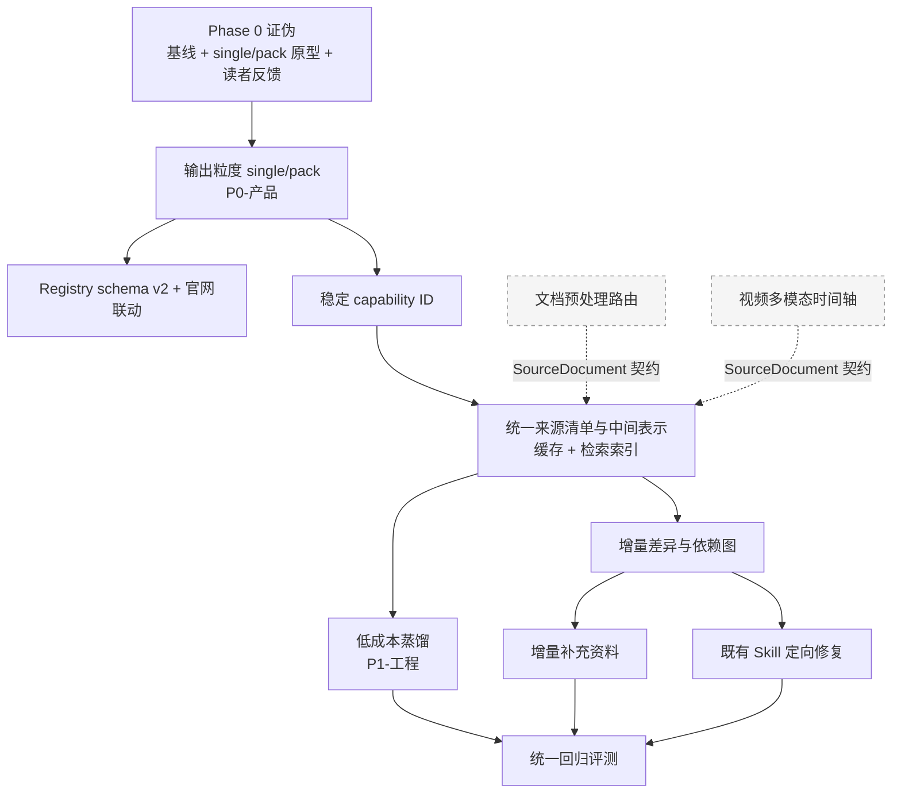
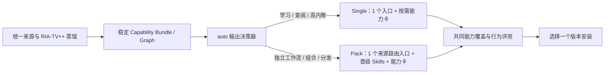
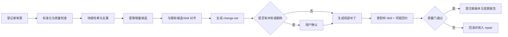
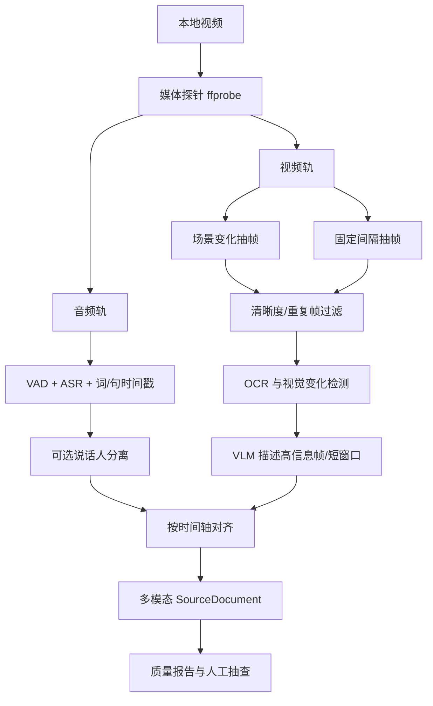

# 仓颉 Skill 优化详细方案

> 版本：Draft v1.3
> 日期：2026-08-24
> 范围：仓颉 Skill 核心蒸馏流水线、单 Skill / Skill Pack 双输出模式、增量迭代、定向修复、数据预处理、视频多模态与 Token 成本
> 本文性质：实施前设计方案，不代表相关功能已经开发完成
>
> **v1.3.1 修订（2026-08-25）**：统一阈值预注册口径（§0/§10.5/§16.14 与 §5.3 对齐）；§0.11 改为按 §10.6 分级处置；Phase 1 补“改写阶段 2—5 产出 Capability Bundle”交付物；新增生成文件本地手改检测；Phase 0 增加宿主锁定与 compact pack 原型产出方式说明；修正 `routing_trace` 示例归属；重要度需附依据；`host_fingerprint` 格式标 TBD。
>
> **v1.3 主要修订**：明确 compact pack 为“1 个来源路由入口 + 少量晋级 Skill”，保证所有未晋级能力仍可运行时访问；修正路线 C 下的缓存与可观测指标；把 `SourceDocument` / `Chunk` 契约留在核心、仅把预处理适配器移出；补齐 Registry v1/v2 兼容策略、Capability 生命周期、Phase 0 交叉试用协议、Phase 2A/2B 排期、干净 worktree 基线冻结、并发与崩溃恢复要求，并加入 4 份 ADR。

## 0. 一页结论

仓颉 Skill 现有 RIA-TV++ 的方法论骨架是成立的：先理解全局，再并行抽取、三重验证、构造可执行能力、建立关联、压力测试、交付。当前方案的工程底座总体可行，但还缺少一个重要的产品决策层：**一本内容最终应编译成一个统一 Skill，还是一组原子 Skill**。读者反馈“蒸馏出来的 Skill 太多”不是单纯的命名或安装问题，而是输出粒度没有根据用户目的自动收敛。

因此，本版新增明确结论：**保留两种输出产物，默认采用 `auto` 选择器，并遵循 single-first（不确定时先单 Skill、使用证据足够后再拆分）的原则。** 单 Skill 模式不是普通摘要，而是一个小型路由入口，内部继续保存仓颉验证过的 RIA 能力卡、反例、边界和证据；Skill Pack 只服务于真正需要独立触发、组合、测试和复用的工作流。

同时必须纠正 v1.1 的一个定位错误：**单 Skill 的主要收益是产品与认知收益，不是 Token 收益。** 对当前 19 个 Skill 的 `name + description` 做快照计数，结果约为 3,897 个 `cl100k_base` tokens、2,682 个 `o200k_base` tokens，说明结果明显依赖 tokenizer。压成 single 后发现目录会更小，但不能拿宿主的最大上下文窗口当成本分母；而且 single 命中后要加载“主入口 + 能力卡”，单次任务的模型载荷可能高于 pack 命中单个原子 Skill。因此输出粒度和 Token 优化是两个独立问题，必须分开立项、分开验收，所有报告都要同时记录 `tokenizer_id`、输入文件集合和计数口径。

因此，推荐的最优路线是：

1. **保留现有七阶段及其人类可读产物**，不推倒重写。
2. 新增一个兼容现有目录的 `.cangjie/` 侧车层：Phase 1 只落最小 `capabilities/` 编译事实源；来源、标准化内容、块级哈希、依赖图、缓存、变更集、评测与用量数据属于 Phase 2A—2B，不进入 Phase 0。
3. 把两个维度明确拆开：
   - 生命周期操作：`create`、`update`、`repair`；
   - 输出策略：`auto`（默认决策）、`single`（一个统一入口）、`pack`（一个来源路由入口 + 少量晋级 Skill 的 compact pack）。
4. 新增单 Skill 模板：主 `SKILL.md` 负责触发、总原则和路由，详细章节、能力卡、证据、术语、决策速查表进入 `references/` 按需读取。
5. 保留 Skill Pack，但将新生成的 compact pack 固定为“**1 个来源路由入口 + 少量晋级 Skill + 内部能力卡**”，并新增“独立 Skill 晋级门”和默认软预算；一个知识点通过内容验证，不等于它必须成为一个独立 Skill，未晋级能力必须仍可经来源路由入口访问。
6. 把当前“5 个 extractor 各自反复读长文本”**按 extractor 类型分化**：framework / principle 需要全局视野，保持全量扫描；case / counter-example / glossary 是局部命中型，改为按索引取相关块、必要时回原文核验。一刀切改成检索式会损害阶段 1 的覆盖率目标（见缺口 B）。
7. 把压力测试从单次主流程自测升级为两层评测：
   - 触发评测：该不该调用、会不会和兄弟 Skill 抢调用；
   - 输出评测：用了 Skill 后是否比旧版本/不用 Skill 更好，代价是多少。
8. **（移出主线，独立仓库）** 文档预处理采用**可插拔路由**，而不是押注单一解析器：
   - 原生文本和结构良好的 Office/HTML 走轻量路径；
   - Docling 作为跨格式统一表示与本地基础实现；
   - 中文复杂 PDF、扫描件、公式和跨页表格以 MinerU 作为高精度候选，通过样本基准决定默认路由；
   - 任何解析器都必须输出统一的 `SourceDocument` 中间表示和质量报告。
9. **（移出主线，独立仓库）** 视频采用“音频转写 + 双路抽帧 + OCR/VLM + 时间轴对齐”，不能只看口播；视频号只做来源适配层，不把非公开下载或绕过平台限制写进核心能力。
10. 优先级重排为两条独立线：**P0-产品 = 输出粒度（single/pack）**，验收看能力覆盖、路由命中和真实读者反馈；**P1-工程 = Token 与增量**，验收看可静态计算的代理指标。文档与视频预处理拆为独立仓库/独立 Skill，不进主线排期。
11. 在写任何基础设施之前，先用一次低成本证伪回答“single 是否真的更好”。若答案为否，按 §10.6 的终止条件**分级处置**：可能是 `auto` 默认改推 compact pack、single 降级为纯查阅模式，或整体终止 §4.6 的默认策略改造——不是一刀切作废。

**关于验收阈值的原则性修订**：v1.1 在没有任何基线的情况下写死了 30%、95%、2 个百分点、`F1 >= 0.85`、`<= 10%` 等数字，并把它们设为阻塞式发布门。这是错误的做法，会导致两种坏结果——为了过门槛而回头调门槛，或者为了过门槛而做浅测（现有 19 个 `test-results.md` 全部是“降级自测、100% 通过”，文件内已自述可信度低于盲测，这正是该风险的现实样本）。

因此本版规定：**Phase 0 产出基线之前，本文所有数值阈值一律视为 `TBD-after-baseline`，仅作为待检验假设保留，不得作为发布门。** 基线之前唯一允许阻塞发布的硬条件只有两类：

1. critical 能力与安全边界用例 100% 通过；
2. Agent Skills 格式、相对引用、JSON/YAML schema 校验 100% 通过。

其余一律以“预注册的非劣设计 + 人工复核分歧样本”判断。特别提示：在 50 条规模的任务集上，“下降不超过 2 个百分点”只对应 1 条用例的计数粒度，单凭这个百分比无法建立统计非劣；若要保留门槛，必须先定义配对检验、非劣效界值，并把样本量或重复次数提高到能支撑该精度的水平。

### 0.1 前置决策：执行模型分叉（必须在 Phase 0 之前拍板）

这是 v1.1 遗漏的关键矛盾。仓库现状是：整条流水线由纯 Markdown prompt 描述（`SKILL.md` 168 行 + `methodology/` 8 篇 + `extractors/` 5 篇），**没有任何流水线代码**——全仓唯一的 Python 是约 225 行的 `scripts/generate_star_history.py`。蒸馏实际由 Agent 在宿主（Claude Code / Cursor / 其他兼容客户端）内读文档执行。

在这个执行模型下，本文原 §5.1 与 §5「第五级」中的三项设计**不可实现**：

| 原设计 | 为什么在当前模型下做不到 |
|---|---|
| 每次模型调用记录 `input_tokens` / `cached_input_tokens` / `cache_write_tokens` | 宿主不把 per-call token 用量暴露给 Skill |
| 固定 system/tool 顺序、静态前缀在前以命中 API Prompt Caching | 请求体由宿主拼装，Skill 无法控制前缀顺序 |
| `cache_key` 包含 `model_provider_and_version` 与 `normalized_parameters` | Skill 不知道自己运行在哪个模型和参数下 |

而 §12 又声明“统一入口只负责编排和确定性操作，真正的蒸馏仍由 Agent 按 Skill 指令完成”。这与上述三项直接冲突。必须先在三条路线中选一条：

| 路线 | 做法 | 代价 |
|---|---|---|
| A 自建 harness | 用 Agent SDK / 直接调 API 接管全部模型调用 | 能拿到真实 token 与缓存指标，但仓颉从 Agent Skill 变成程序，安装门槛上升，与“降低使用成本”的产品目标相反 |
| B 纯 Agent Skill | 完全保持现状 | 放弃一切 per-call 计量，Token 优化只能凭感觉做 |
| **C 混合（推荐）** | 确定性预处理与编译做成脚本（可精确计量），蒸馏留在 Agent 内（用代理指标衡量） | 需要接受蒸馏阶段只有代理指标，但保住了开放 Agent Skill 的形态 |

**本版选择路线 C。** 相应地，Token 验收改为以下三个**固定 tokenizer 下可离线复算的文件计数或静态载荷模型**，不再冒充宿主真实调用成本：

1. **发现目录载荷模型**：所有已安装 Skill 的 `name + description` 文件计数；
2. **单任务路由载荷模型**：命中后按路由表预计读取的 `SKILL.md` + references 上下界；
3. **产物文件总量**：整个 Skill Pack / single 包的全部可读内容计数。

蒸馏过程本身的成本改用可观测代理量：各阶段准备给 Agent 的字符数与块数、任务次数、被淘汰候选数、重试次数。这些都能在不接管 API 的前提下记录，但若宿主没有确认真正提交，就只能叫 `prepared_input`，不能叫真实 Prompt 输入。

---

## 1. 已确认的任务清单

2026-08-23 已从飞书多维表格“仓颉 Skill 优化与项目跟进”实时回读，当前共 5 条记录，均为“待评估”。

| 原优先级 | 本版调整 | 任务 | 当前问题 | 目标结果 |
|---|---|---|---|---|
| P0 | **P1-工程** | 在效果不降的前提下降低 Token 消耗 | 长材料被重复读取、上下文堆叠、重复抽取、全量返工 | 分阶段计量、去重、缓存、按需读取，质量不降 |
| P1 | P1-工程 | 支持蒸馏后增量补充资料 | 新书、文章、案例加入后只能重跑 | 识别差异、合并新增知识、处理重复/冲突、保留来源 |
| P1 | P1-工程 | 支持对既有 Skill 定向优化 | 局部效果不理想时倾向全量重蒸馏 | 从失败案例诊断问题，只修改受影响部分并回归验证 |
| P1 | **移出主线** | 新增通用数据预处理 Skill | PDF、扫描件、网页、Office、表格、字幕格式不一 | 统一转为高质量、可追溯、带质量报告的结构化内容 |
| P1 | **移出主线** | 增强视频蒸馏前置预处理与视觉理解 | 只靠语音转写会漏掉界面、图表、代码、动作和步骤 | 带时间戳转写、关键帧、OCR/VLM 描述、音画对齐 |

两处调整的理由：

- **Token 从 P0 降为 P1-工程**：见 §0，输出粒度的收益是产品收益，Token 的收益是工程收益，两者混在一个 P0 里会让 30% 的 Token 门槛把资源吸走，去做收益最小的那部分。且 Token 精确计量受 §0.1 执行模型分叉制约，必须在路线拍板后才能定验收口径。
- **预处理与视频移出主线**：这两项要引入 Docling、MinerU、WhisperX、PySceneDetect、VLM 等重依赖（Docling 模型为 GB 级）。每加一个重依赖，普通读者越装不动，与本方案自身“降低安装与理解成本”的目标直接冲突。它们应作为独立仓库、独立 Skill、独立版本发布，由需要的用户单独安装，主线只依赖其输出的 `SourceDocument` 契约。

本版另加入一条来自读者反馈的 **P0-产品** 设计问题：**默认产物过度碎片化**。它不替代飞书里的 5 条任务，而是决定这些底层能力最终如何交付给用户：

| 优先级 | 新增设计问题 | 当前表现 | 目标结果 |
|---|---|---|---|
| P0-产品 | 单 Skill / Skill Pack 输出选择 | 一本书可能产出十几个甚至更多 Skill，安装、理解、选择和触发成本高 | 同一蒸馏底座支持两种产物；默认自动推荐，用户只需做一次轻确认 |

这 6 条（5 条原任务 + 1 条输出粒度）并不是 6 个平行插件。它们有明确依赖关系，且顺序与 v1.1 不同：



灰色虚线的两项是**移出主线的独立产品线**，它们与主线只通过 `SourceDocument` 契约耦合，可以完全并行开发、独立发版。

依赖关系上有两点必须先立：**输出粒度决定了后面所有东西编译成什么**，所以它排在最前；**稳定 capability ID 是 single 与 pack 可比较的前提**，也是依赖图的节点标识，必须在底座之前定下来。除此之外才是共同底座——否则每做一个需求都会重复造一套来源追踪、缓存和评测逻辑。

---

## 2. 当前仓库基线与关键缺口

### 2.1 已有能力

当前仓库已经具备：

- RIA-TV++ 七阶段方法论；
- 5 类 extractor：框架、原则、案例、反例、术语；
- `PIPELINE_STATE.md` 断点续跑约定；
- `BOOK_OVERVIEW.md`、`verified.md`、`INDEX.md`、`GLOSSARY.md`、`DIGEST.md` 等完整产物约定；
- 原子 Skill 的 R / I / A1 / A2 / E / B 模板；
- `should_trigger`、`should_not_trigger`、`edge_case` 和兄弟 Skill 混淆测试；
- Registry（**22 个 pack，`skill_count` 加总 300**）、官网校验和网站 CI；
- 一个完整的《纳瓦尔宝典》样本包，含 19 个 Skill 及测试文件（每个 `SKILL.md` 119—125 行）。

需要一并记录的工程底座现状，它决定了本方案的可行边界：

- 整条流水线由纯 Markdown prompt 描述（`SKILL.md` 168 行 + `methodology/` 8 篇 + `extractors/` 5 篇 + `templates/` 5 份），**无任何流水线执行代码**；
- 全仓唯一的 Python 是约 225 行的 `scripts/generate_star_history.py`；
- 无根级 `pyproject.toml` / `package.json` / `Makefile` / CLI；
- CI 仅有 3 个 workflow，实质校验只覆盖 registry 与官网，`books/`、`methodology/`、`extractors/` 无任何自动校验。

这些都应该保留，尤其是“边界、反例、用户轻确认、审计轨迹”四项，它们是仓颉 Skill 与普通摘要/RAG 的差异化资产。

### 2.2 已发现的真实缺口

#### 缺口 A：断点续跑不是增量计算

`PIPELINE_STATE.md` 只记录“跑到哪个阶段”，没有记录：

- 哪个来源版本参与了本次运行；
- 哪些块发生了变化；
- 哪个候选/Skill 依赖哪些来源块；
- 哪个阶段的结果可以复用；
- Prompt、模型、参数或模板变化是否使缓存失效。

所以它能“从某阶段继续”，但不能“只重算受影响节点”。

#### 缺口 B：长文本被多视角重复读取

现有阶段 1 要求 5 个 extractor 独立读取整份长文本。它有利于独立视角，但也造成约 5 份长上下文输入；如果长文本又被分块，后续验证、构造和测试还会继续重复携带大段材料。

优化目标不应取消五视角，而应把“独立判断”和“重复传输全文”拆开：所有 extractor 共享同一份可追溯内容地图，但 `framework` / `principle` 用它做全量扫描中的定位与审计，`case` / `counter-example` / `glossary` 才用它做检索召回；五者仍使用独立任务上下文。

**但这里有一个 v1.1 低估的质量风险，必须显式处理。** `methodology/02-stage1-parallel-extract.md` 把并行的三个理由写得很明确，其中“独立性”是为了让阶段 1.5 的 V1 跨域验证真正成立；而该阶段的目标是“不做筛选，宁错杀”——**追求的是覆盖率**。一旦 extractor 只看检索返回的块，它就不再是“扫描全书”，覆盖率必然下降，而覆盖率恰恰是这个阶段唯一的目标。

因此不能对 5 个 extractor 一刀切，而应按其查找对象的分布特性分开处理：

| extractor | 查找对象的分布特性 | 本版策略 |
|---|---|---|
| framework | 思维模型常跨章节隐性分布，需要全局视野 | **保持全量扫描** |
| principle | 原则散落全书，且需判断“是否反复出现” | **保持全量扫描** |
| case | 案例是局部命中型，有明确文本锚点 | 走检索式取块 |
| counter-example | 反例是局部命中型，有明确警告性措辞 | 走检索式取块 |
| glossary | 术语是局部命中型，可先用确定性方法预筛 | 走检索式取块 + 脚本预筛 |

这样保住了最有价值的两类产出的覆盖率，并在理论上去掉 5 条全量扫描路径中的 3 条。由于不同 extractor 的输入长度、重试次数和宿主调度成本并不相同，**不能把“3/5 的路径”直接写成“节省 60% 成本”**；实际字符数、块数、任务次数与时长必须等 Phase 2A 基线后再报告。

并且必须设一道硬门：改造后在基准集上的**候选覆盖率相对全量扫描基线不得下降**，尤其是最终通过三重验证的候选，漏检数必须为 0。若做不到，退回全量扫描，Token 收益从别处找。

#### 缺口 C：测试结果缺少可信基线

《纳瓦尔宝典》19 个 Skill 的 `test-results.md` 都明确标注为主流程降级自测，虽然记录为 100% 通过，但可信度低于独立盲测。当前测试还缺少：

- 同一问题“旧 Skill vs 新 Skill”的盲测对比；
- “使用 Skill vs 不使用 Skill”的增益对比；
- 多次运行与波动统计；
- train/validation 隔离；
- Token、时延和缓存命中率；
- 对文档解析、事实覆盖和来源定位的机械断言。

所以目前无法可靠证明“效果不降”。

#### 缺口 D：产出的 Skill 尚未完全利用渐进式披露

官方 Agent Skills 规范建议：启动时只加载 `name + description`，触发后加载 `SKILL.md`，详细资料再从 `references/` 按需读取；主 `SKILL.md` 建议少于 500 行和 5000 tokens。

当前单个 Skill 大约 119—125 行，未超规范，但 R、A1、长证据、审计信息全部位于主文件中。执行任务时真正高频需要的是 A2、E、B，而详细原文和案例可迁移到 `references/evidence.md`。这会成为 Token 优化的一部分，但必须用评测验证，不能机械删减导致质量下降。

#### 缺口 E：核心仓库与当前本地分支状态不一致

截至 2026-08-24，本地当前分支为 `codex/website-mvp`，HEAD 为 `f8f9e9b`（2026-07-21）；远端 `main` HEAD 为 `a47a604`（2026-08-24）。本地分支落后远端，且存在多项未提交改动和未跟踪目录。这里的 commit 只是一份核对快照，Phase 0 开始时必须重新读取远端状态，不能把本文数字当成永久事实。

**其中最关键的一条：整个 `books/naval-almanack-skill/`（73 个文件、19 个 Skill）目前处于 untracked 状态。** 它是本方案全部 A/B 对比的基线样本。基线不可复现，后续所有对比数字都没有意义。

因此 Phase 0 的第一个动作不是在当前目录直接提交，而是：

1. 读取并记录当时的 `origin/main` commit；
2. 从该 commit 创建**独立干净 worktree / 临时基线分支**，不得复用当前脏工作区；
3. 只把 `books/naval-almanack-skill/` 复制到干净 worktree，生成文件清单与 SHA-256，运行静态校验；
4. 校验通过后再选择“提交并打 tag”或“归档 tarball + SHA-256”中的一种冻结方式；
5. 网站、Registry 试验和当前用户改动继续留在原工作区，不混入基线提交。

本文只新增方案文档，不修改或覆盖现有改动。

#### 缺口 F：候选单元与可发现 Skill 之间缺少“晋级门”

现有流程把阶段 1.5 验证通过的方法论单元，近似一一映射为独立 Skill。《纳瓦尔宝典》样本因此产出 19 个 Skill。这个做法对构建可组合能力库有价值，但对“我只想随时调用这本书”的普通读者并不友好：

- 安装后需要理解 19 个名字及差别；
- `happiness-skill`、`acceptance`、`self-liberation`、`monkey-mind-meditation` 等相邻能力存在潜在路由竞争，需要更多负例维护；
- 所有 Skill 的 `name + description` 都可能进入宿主的发现目录，Skill 数越多，静态目录载荷与用户认知负担通常越高；具体宿主是否完整加载必须以兼容矩阵实测为准；
- “内容上是一个好方法”不等于“用户会把它作为一个独立意图调用”。

根因是当前只有“这个候选是否值得保留”的内容验证，没有第二个问题：**它是否值得成为一个独立、可发现、可安装的 Skill**。新方案必须把“知识保留”和“Skill 数量”解耦：未晋级为独立 Skill 的方法仍应完整保留在统一 Skill 的能力卡或 references 中，而不是被删掉。

#### 缺口 G：执行模型未定，导致 Token 目标不可测量

见 §0.1。当前流水线是纯 prompt 驱动，Skill 无法获知 per-call token 用量，也无法控制请求前缀顺序。在路线 A/B/C 拍板之前，任何以真实调用 token 百分比表述的目标都是不可验证的。本版选择路线 C，并把验收改为“固定 tokenizer 下的文件计数 + 静态路由载荷模型 + 过程代理指标”。

#### 缺口 H：Registry 与官网未纳入方案，但会最先被输出粒度改造打破

这是 v1.1 完全遗漏的一环。实际状态：

- `registry/` 有 **22 个 pack**，`skill_count` 加总为 **300**；
- `schemas/registry-entry.schema.json` 中 `skill_count` 是结构化字段；
- 官网首页按 Skill 数量展示统计，`website/src/lib/install.ts` 据此生成安装提示词；
- `.github/workflows/registry-check.yml` 是全仓唯一有实质校验的 CI，且只覆盖这一层（`books/`、`methodology/`、`extractors/` 无任何 CI）。

一旦默认输出改为 single，会立刻出现四个无解问题：

1. 一个 single 模式的 pack，`skill_count` 填 1 还是填内部能力卡数？
2. 已发布的 22 个 pack 是否重编？由谁承担成本？
3. 官网“300 个 Skill”的规模叙事与“Skill 不该太多”的新哲学正面冲突；
4. §11.1 的 frontmatter 迁移会波及这 300 个已发布产物。

本版新增 §11.5 专门处理这一层。这条不做，方案落地当天官网就会自相矛盾。

---

## 3. 在线调研结论与技术选型

以下资料在 2026-08-23 至 2026-08-24 期间重新在线核对。工具能力和 API 价格会变化，实施时仍需锁定具体版本并重新跑基准。

### 3.1 Agent Skill 结构与评测

| 一手方案 | 可直接借鉴的机制 | 对仓颉 Skill 的结论 |
|---|---|---|
| [Agent Skills Specification](https://agentskills.io/specification) | `name`/`description` 负责发现；`SKILL.md` 触发后加载；`references/`、`scripts/` 按需读取；建议主文件少于 500 行 | 用渐进式披露重构生成模板；详细证据移到 references，核心执行/边界留在 SKILL.md |
| [Optimizing skill descriptions](https://agentskills.io/skill-creation/optimizing-descriptions) | 约 20 条真实触发 query；正负近邻样本；每条多跑 3 次；60/40 train-validation；按验证集选最佳版本 | 当前每个 Skill 仅 6 条单次自测不足；升级为触发精度/召回率和验证集机制 |
| [Evaluating skill output quality](https://agentskills.io/skill-creation/evaluating-skills) | 同一用例 with-skill / without-skill 或 old-skill 对比；记录可获得的成本与时长；机械断言优先；盲评与人工复核 | 定向优化必须以旧版本为基线；路线 C 只记录静态路由载荷与可观测时长，不伪造宿主未暴露的 Token |
| [Agent Skills best practices](https://github.com/agentskills/agentskills/blob/main/docs/skill-creation/best-practices.mdx) | validate loop、plan-validate-execute、重复逻辑沉淀到 scripts | 将解析、去重、变更分析、校验固化成脚本，避免每次让模型临时写代码 |

### 3.2 增量处理、缓存与语义分块

| 一手方案 | 可直接借鉴的机制 | 对仓颉 Skill 的结论 |
|---|---|---|
| [LlamaIndex Ingestion Pipeline](https://developers.llamaindex.ai/python/framework/module_guides/loading/ingestion_pipeline/) | `node + transformation` 缓存；`doc_id -> document_hash`；未变化跳过、变化后 upsert；并行执行 | 建立内容寻址的阶段缓存与来源哈希，但不直接把仓颉 Skill 绑定死在 LlamaIndex |
| [Unstructured Chunking](https://docs.unstructured.io/open-source/core-functionality/chunking) | 基于文档元素而不是纯字符切块；`by_title` 保留章节边界；原始元素元数据可回溯 | 块必须尊重章节/表格/列表/页面，保留页码、坐标、标题路径和原始元素映射 |
| [DoclingDocument](https://docling-project.github.io/docling/concepts/docling_document/) | 统一表示文本、表格、图片、层级、布局和 provenance | 可作为跨格式中间表示的主要参考，但仓颉应定义自己的最小稳定 schema，避免上游升级绑架 |

### 3.3 文档预处理候选

| 方案 | 优势 | 局限 | 建议角色 |
|---|---|---|---|
| [Docling](https://docling-project.github.io/docling/usage/supported_formats/) | 本地运行；多格式；统一结构；OCR、表格、图片、公式；支持 macOS/MPS；还能处理音视频 | 中文复杂扫描件仍需本地样本验证；完整模型依赖较重 | 默认统一转换器与结构化 IR 参考 |
| [MinerU](https://github.com/opendatalab/MinerU) | 面向 PDF/Office/图像；中文、扫描件、公式、多栏、跨页表格能力强；支持 CPU/GPU/MPS | 官方性能数字主要来自自身基准；安装和模型较重；**许可证需在集成前逐条核对与本仓 AGPL-3.0 的兼容性，不接受“自定义开源许可证”这种含糊表述** | 中文复杂 PDF/扫描件高精度路由和 A/B 候选 |
| [Unstructured](https://docs.unstructured.io/open-source/core-functionality/chunking) | 元素级分区和语义 chunking 成熟，原始元素可恢复 | 作为全套解析主引擎未必是本项目最轻路线 | 借鉴 chunking 规则，必要时作为可选后端 |

不存在对所有资料都最优的单一解析器。正确的“最优解”是**有质量探针的路由器**：先低成本解析，质量不足时升级到 OCR/VLM 或另一后端；对目标用户最常见的中文材料建立自己的 golden set，以实测决定默认值。

### 3.4 视频多模态候选

| 一手方案 | 可直接借鉴的机制 | 对仓颉 Skill 的结论 |
|---|---|---|
| [Docling 音视频处理](https://docling-project.github.io/docling/usage/processing_audio_media/) | Whisper 转写；固定间隔或场景变化抽帧；可选说话人分离；输出统一 DoclingDocument | 可快速搭建本地 MVP，并与文档预处理复用同一表示 |
| [WhisperX](https://github.com/m-bain/whisperX) | 批量 ASR、词级时间戳、VAD、强制对齐、说话人分离 | 需要额外模型和依赖；说话人分离可能需要受许可模型/令牌 | 对时间精度和多人内容要求高时作为增强后端 |
| [PySceneDetect](https://www.scenedetect.com/docs/latest/api/detectors.html) | AdaptiveDetector 用相邻帧滚动平均减少快速运动误判 | 只做镜头变化，不理解画面语义 | 作为双路抽帧中的场景检测器，不独立承担视觉理解 |
| [Gemini Video Understanding](https://ai.google.dev/gemini-api/docs/video-understanding) | 原生音视频理解、时间戳问答；官方说明默认约 1 FPS，快速变化可能漏细节 | 云端上传涉及成本、隐私和数据治理；1 FPS 不适合快速 UI 操作 | 可选云端 VLM/对照评测，不作为唯一视频路径 |

视频“最优解”不是每秒都送进大模型。推荐先本地提取音频、场景变化、固定间隔帧和 OCR 差异，只把有信息增量的帧送入视觉模型；低置信度片段再升级为短视频窗口分析。

### 3.5 Token 优化与缓存

| 一手方案 | 可直接借鉴的机制 | 对仓颉 Skill 的结论 |
|---|---|---|
| [OpenAI Prompt Caching](https://developers.openai.com/api/docs/guides/prompt-caching) | 相同前缀才命中；稳定指令/工具/schema 放前面，变量放后面；可在自建请求层监控缓存字段 | 仅路线 A 能控制请求与验收缓存；路线 C 只保持文件内容稳定，不承诺命中 |
| [Anthropic Prompt Caching](https://platform.claude.com/docs/en/build-with-claude/prompt-caching) | 静态内容置前；缓存前缀按 tools/system/messages 构成；默认短 TTL，可选更长 TTL | 仅路线 A 能直接实施；任何路线都不能用 API 短期缓存替代本地内容寻址缓存 |
| Agent Skills 渐进式披露 | 只在触发后加载 SKILL.md，资源继续按需读取 | 减少 Skill 主文件体积和不必要证据加载，比单纯换便宜模型更稳健 |

关键判断：**Prompt 缓存不是持久化增量系统**。它会过期、受模型/前缀/路由影响，只能作为最后一层优化；核心收益必须来自本地内容去重、阶段缓存、按需检索和受影响范围计算。

### 3.6 `book-to-skill` 项目复核与可借鉴点

本次先完整检查了 [`virgiliojr94/book-to-skill`](https://github.com/virgiliojr94/book-to-skill) 的固定评审快照 `3a97a71`（2026-08-19），并在本机对该快照运行测试，结果为 `494 passed, 4 skipped`。截至 2026-08-24，其 `master` 已推进到 `7bcfcd5`，最新正式版仍为 `v1.4.0`。文中的生成规范与性能结论继续链接固定快照，避免上游变化导致证据漂移；`master` 只用于补充观察最新工程改进。

它的核心产物始终是**一个统一 Skill**：约 4,000 tokens 的主 `SKILL.md` 保存核心框架、章节索引和主题索引，章节文件、glossary、patterns、cheatsheet 按需加载。详见其 [生成规范](https://github.com/virgiliojr94/book-to-skill/blob/3a97a7115ab3c82edf47f315b544fbcefdd8559c/SKILL.md) 与 [架构说明](https://github.com/virgiliojr94/book-to-skill/blob/3a97a7115ab3c82edf47f315b544fbcefdd8559c/docs/architecture.md)。

值得借鉴的机制：

| 机制 | 借鉴方式 | 不应照搬的部分 |
|---|---|---|
| 一个入口 + 章节/主题索引 + 按需文件 | 作为仓颉 `single` 模式的导航骨架，解决 Skill 数量和发现面过大 | 不能只做逐章摘要；仓颉应保留 RIA 执行步骤、边界、反例和验证证据 |
| `reference` / `study` 两种深度 | 根据“快速查阅”或“深入学习/应用”调节能力卡和案例密度 | 输出深度不能替代 single/pack 粒度决策；这是两个独立维度 |
| 大于约 50K tokens 后用 grep/offset 定向读取 | 纳入长内容预处理和阶段检索，禁止每章重复读取全文 | 只能作为轻量路径；复杂 PDF、表格和图像仍需结构化 IR |
| 转换前展示页数、章节数、输入/输出 Token 估算 | 在昂贵阶段前给出成本预估和模式建议 | 不硬编码模型价格；实际使用量仍要在 run 账本回读 |
| cheatsheet 是“决策层”而非术语表 | 单 Skill 模式增加决策规则、权衡矩阵、阈值和快速识别信号 | 不能把作者判断改写成无来源的通用常识 |
| 内容类型和使用目的决定章节密度 | 让 `text/technical × reference/study` 影响生成预算 | 不用固定字数硬凑篇幅，内容密度和评测优先 |
| 输入清洗 + 生成产物二次安全扫描 | 在来源进入模型前清除隐藏 Unicode，并对最终 Skill 扫描越权/注入模式 | 扫描器只做告警，不能替代人工审查和最小权限 |
| 按宿主做格式校验、失败回退、多语言章节识别 | 借鉴其 host lens、依赖预检、CJK 估算和解析失败不拖垮整批任务 | 不把多宿主差异写成一个最低公分母模板 |
| 每次运行使用隔离工作目录 | 仓颉采用 per-run workdir、目标包 writer lock、staging 构建和原子发布，避免并发任务串写 | 不能只改目录名；仍需处理中断标记、缓存原子性和失败恢复 |

需要保持判断的地方：

1. 它的 [Token 报告](https://github.com/virgiliojr94/book-to-skill/blob/3a97a7115ab3c82edf47f315b544fbcefdd8559c/docs/performance.md) 主要衡量“回答单个章节问题时，进入上下文的 tokens”，适合证明按需加载价值，但不能直接证明生成质量、触发准确率或对仓颉现有 19 个可执行能力的覆盖率。
2. 它的 `Update/Fold-in` 主要靠 Agent 读取旧索引后语义合并；缺少本文方案中的内容哈希、依赖图、最小影响范围、版本化回滚和 old/new 行为回归。
3. 统一 Skill 的 description 会覆盖较宽主题，减少兄弟 Skill 抢调用，却可能和其他书籍型/领域型 Skill 竞争；因此 single 模式仍需独立做 trigger precision/recall，而不是认为“只有一个就不会误触发”。
4. 其公开性能报告中的 discovery loop 是带明确假设的模型，不是对具体 Agent 的真实多轮运行记录；仓颉应同时报告可复现实测与模型估算，不能直接移植“24×—51×”结论。
5. 上游 `7bcfcd5` 修复了并行任务共用固定工作目录导致的内容串扰，说明本地 CLI 同样需要把并发与崩溃一致性当成一等需求，而不是等问题发生后再补锁。

结论：**借鉴它的统一入口、主题索引、章节按需加载、决策型 cheatsheet、成本预检和供应链安全；不要用它替换仓颉的 RIA-TV++ 验证、可执行性、边界、反例、依赖图和行为评测。**

---

## 4. 目标架构：RIA-TV++ Incremental

### 4.1 生命周期操作：`create`、`update`、`repair`

```text
create  新内容首次蒸馏：完整走 RIA-TV++
update  新增/替换/删除资料：只重算受影响的候选、Skill 与测试
repair  基于失败案例修复既有 Skill：诊断、生成补丁、回归，不重新读全书
```

三种模式共用同一份来源清单、中间表示、缓存、依赖图和评测集。

这里的 `create/update/repair` 回答“这一次对既有内容做什么”，不是回答“最后产出几个 Skill”。输出粒度是另一条正交配置轴，不能继续都叫 `mode`。

### 4.2 兼容现有目录的侧车结构

不改变现有用户可见产物，在每个书/内容包中新增 `.cangjie/`：

```text
books/<content-slug>/
├── PIPELINE_STATE.md                 # 继续保留，给人看
├── BOOK_OVERVIEW.md
├── verified.md
├── INDEX.md
├── GLOSSARY.md
├── DIGEST.md
├── <skill-slug>/
│   ├── SKILL.md
│   ├── references/
│   │   ├── evidence.md
│   │   └── examples.md
│   ├── evals/
│   │   ├── trigger-train.json
│   │   ├── trigger-validation.json
│   │   └── output-evals.json
│   └── test-prompts.json             # 兼容旧 darwin 格式
└── .cangjie/
    ├── manifest.yaml                 # 来源及版本清单
    ├── config.yaml                   # 模型、解析器、阈值和策略
    ├── normalized/
    │   └── <source-id>/<version-id>/
    │       ├── document.json         # 稳定中间表示
    │       ├── document.md           # 便于人看
    │       ├── assets/               # 图、帧、表格等
    │       └── quality.json          # 解析质量报告
    ├── chunks/chunks.jsonl           # 块、哈希、来源定位
    ├── index/lexical.sqlite          # FTS5，MVP 默认
    ├── index/embeddings.*            # 可选，不作为 MVP 必需
    ├── capabilities/
    │   ├── verified.yaml             # 唯一可编译 Capability Bundle
    │   └── destinations.json         # single/pack 的 owner 与去向映射
    ├── graph/dependencies.json       # source→chunk→candidate→capability→entrypoint→eval
    ├── changes/<change-id>.json      # 增量变更集
    ├── cache/<stage>/<cache-key>/    # 阶段缓存
    ├── runs/<run-id>/
    │   ├── run.json
    │   ├── stage-usage.jsonl        # B 类过程代理指标（字符数/块数/次数），非真实 token
    │   ├── timings.jsonl
    │   ├── patch.diff
    │   └── report.md
    └── snapshots/<version>/          # 关键发布版本快照
```

选择侧车结构的原因：

- 现有 `BOOK_OVERVIEW.md` 和 Skill Pack 不需要迁移后才能继续使用；
- `.cangjie/` 可以整体加入 `.gitignore` 的缓存部分，也可选择性提交 manifest、变更和报告；
- 新能力失败时可回退到原有全量流程；
- 对外发布仍是标准 Agent Skill，不把内部流水线元数据强塞进用户上下文。

### 4.3 稳定中间表示 `SourceDocument`

所有解析后端最终输出相同的最小字段：

```json
{
  "schema_version": 1,
  "source_id": "src-book-main",
  "version_id": "sha256:...",
  "title": "资料标题",
  "media_type": "pdf",
  "language": ["zh-CN"],
  "elements": [
    {
      "element_id": "el-000123",
      "type": "heading|paragraph|list|table|image|formula|transcript|frame",
      "text": "...",
      "heading_path": ["第二章", "2.3"],
      "page": 42,
      "time_start_ms": null,
      "time_end_ms": null,
      "bbox": [0.1, 0.2, 0.8, 0.3],
      "asset_ref": null,
      "confidence": 0.97,
      "content_hash": "sha256:..."
    }
  ]
}
```

必须保证：

- `source_id` 稳定，文件改名不能自动变成一个全新来源；
- `version_id` 由规范化字节或确定性内容计算；
- 每个 element 可定位回页码、时间戳、坐标或 DOM 路径；
- Markdown 是展示格式，JSON 才是增量计算和审计的事实源；
- 解析器版本、模型版本和参数写入 `quality.json`。

### 4.4 阶段缓存键

路线 C 必须把缓存分成两类，不能假装 Skill 能看到宿主模型信息。

**A. 确定性缓存（默认开启，可安全复用）**

适用于规范化、切块、哈希、索引、静态编译、格式校验等脚本阶段：

```text
deterministic_cache_key = sha256(
  stage_name
  + implementation_version
  + stage_schema_version
  + ordered_input_hashes
  + normalized_script_parameters
)
```

以下任何变化都必须使对应确定性缓存失效：

- 输入块变更；
- 中间 schema 变更；
- 脚本实现或关键参数变更；
- 编译模板变更。

**B. Agent 生成物复用（默认不跨宿主自动命中）**

蒸馏、判断、重写等结果由宿主 Agent 生成。路线 C 拿不到真实的 `model_provider_and_version` 与 `normalized_parameters`，因此不能构造安全的模型感知缓存键。首版只允许两种复用方式：

1. 同一次 run 内、同一个明确任务的断点续跑；
2. 宿主或高级用户显式提供 `host_fingerprint` 后，把它连同 `prompt_template_hash`、输入哈希写进复用键。

```text
agent_artifact_key = sha256(
  stage_name
  + stage_schema_version
  + ordered_input_hashes
  + prompt_template_hash
  + host_fingerprint
)
```

`host_fingerprint` 的格式为 `TBD`（首版建议 `host_name/host_version/model_hint`，由用户显式填写，不自动探测）。它缺失时，旧 Agent 生成物只能作为“待复核候选”，不得静默当成命中结果。即使 fingerprint 相同，涉及高风险纠错、冲突覆盖或安全边界的产物仍需重新验证。

时间戳、run ID、输出目录等无关变量不得参与 Prompt 静态前缀，也不应影响语义缓存键。

### 4.5 依赖图与影响范围

图中的边必须带类型和证据：

```text
source_version -> contains -> element
element -> grouped_into -> chunk
chunk -> supports|contradicts|examples -> candidate
candidate -> validates_into -> capability
capability -> compiled_as|served_by -> entrypoint
entrypoint -> compared_with|depends_on|composes_with -> sibling_entrypoint
eval_case -> covers -> capability
```

当一个块变更时，只沿图向下找：

1. 直接依赖它的候选；
2. 由这些候选生成的 Skill；
3. 与这些 Skill 有依赖/对比/组合关系的邻居；
4. 覆盖这些能力的测试。

这就是 `update` 和 `repair` 不需要全量重跑的关键。

#### 4.5.1 稳定 Capability 生命周期

`capability_id` 不能只是一个第一次生成后永不解释的字符串。每个能力至少包含：

```yaml
capability_id: cap.naval.decision-heuristics
revision: 3
status: active            # active | deprecated | merged | split
aliases: []               # 旧 ID 或历史名称
supersedes: []            # 本能力替代的旧 ID
merged_into: null         # 合并后的目标 ID
split_into: []            # 拆分后的新 ID 列表
source_evidence: []       # source/version/element 定位
```

约束：

- 文案润色、证据补充和输出模板变化只增加 `revision`，不创建新 ID；
- 能力语义发生实质拆分或合并时创建新 ID，并保留 `supersedes` / `merged_into` / `split_into`；
- Single 与 Pack 必须引用同一组能力 ID，禁止分别蒸馏出两套不可比较的能力；
- 删除默认表现为 `deprecated`，只有确认无来源、无依赖、无历史兼容需求时才能物理清理。

### 4.6 输出粒度：`single` 与 `pack` 两种产物

两种产物的规范化编译输入不是原始书籍，而是同一份 **Capability Bundle**：经过 RIA-TV++ 验证的能力、来源证据、关系、评测与去向映射。Phase 0 可以人工生成最小 Bundle；Phase 1 起由 schema 固化。CLI 只负责从 Bundle 做确定性编译，Agent 仍负责把原始来源蒸馏成 Bundle。

```text
原始来源 --Agent/RIA-TV++--> Capability Bundle --确定性编译器--> single | pack
```



#### 4.6.1 命令与配置

对外暴露两个产物选项，另加一个默认决策器：

```text
--output auto     默认；系统先推荐 single 或 pack，展示理由后让用户轻确认
--output single   最终只安装一个统一 Skill
--output pack     最终安装一个来源路由入口 + 少量晋级 Skill
```

示例：

```bash
python scripts/cangjie.py create --pack books/naval-almanack-skill --output auto
python scripts/cangjie.py create --pack books/naval-almanack-skill --output single
python scripts/cangjie.py create --pack books/naval-almanack-skill --output pack --skill-budget 8
```

建议把决策持久化到 `.cangjie/config.yaml`：

```yaml
operation: create
output:
  requested: auto
  selected: single
  decision_policy: single-first-v1
  skill_budget: 8                 # pack 的可发现入口总预算，包含 1 个来源路由入口
  preserve_strategy_on_update: true
  decision_report: .cangjie/runs/<run-id>/output-decision.md
```

`update` 和 `repair` 默认保持原输出策略，不得因为新加一篇材料就从 1 个 Skill 静默膨胀成十几个。只有显式使用 `--replan-output` 时才重新评估；即使建议变更，也先生成预览，不自动删除或覆盖已安装版本。

#### 4.6.2 单 Skill 模式不是“大而全的 SKILL.md”

`single` 的目标是把一份书/资料集编译成**一个可发现入口 + 多个按需能力卡**：

```text
<content-slug>/
├── SKILL.md                         # 触发、总原则、路由、最常用能力
├── references/
│   ├── overview.md                  # 全局骨架、适用范围、作者局限
│   ├── capability-index.md          # 意图/问题 → 能力卡映射
│   ├── capabilities/
│   │   ├── wealth-structure.md      # 内部 RIA 能力卡，不是独立 Skill
│   │   ├── decision-heuristics.md
│   │   └── ...
│   ├── chapters/ch01-*.md           # 章节证据与上下文，按需读
│   ├── glossary.md
│   ├── patterns.md
│   └── cheatsheet.md                # 决策规则、权衡矩阵、阈值、tells
├── scripts/                         # 可选的确定性检索/校验
└── evals/
    ├── trigger-validation.json
    ├── routing-evals.json
    └── output-evals.json
```

主 `SKILL.md` 不复制所有能力全文，只保留：

1. 这个 Skill 何时触发、何时不触发；
2. 全书最核心的 3—7 个决策原则；
3. “用户意图 → 能力卡/章节”的一级索引；
4. 加载规则：先读最小相关能力卡，证据不足再读章节，禁止默认全量加载；
5. 输出契约、风险边界和判停条件。

每个 `references/capabilities/*.md` 继续使用仓颉的 R / I / A1 / A2 / E / B，只是它不再拥有独立 frontmatter 和发现入口。这样减少的是**用户可见 Skill 数量**，不是蒸馏深度，也不是能力覆盖。

#### 4.6.3 Skill Pack 模式增加“独立 Skill 晋级门”

`pack` 不再是“若干原子 Skill + 一堆运行时不可见的 references”，而是固定输出一个**混合 compact pack**：

```text
<content-slug>-pack/
├── <content-slug>/                       # 来源路由入口：书名/作者/主题查阅，以及未晋级能力
│   ├── SKILL.md
│   └── references/capabilities/          # 全部稳定能力卡，保持在该 Skill 根目录内
├── <promoted-skill-a>/                   # 不提书名也会自然触发的独立任务
│   ├── SKILL.md                           # 从同一 Bundle 编译出的自包含执行入口
│   └── references/evidence.md
├── <promoted-skill-b>/
│   └── SKILL.md
└── capability-destinations.json          # 发布审计清单，不作为宿主发现入口
```

来源路由入口只覆盖“基于这本书/作者/资料集回答”和未晋级能力；晋级 Skill 只覆盖不依赖书名的独立任务。两者必须有互斥的正负触发样本，避免同一请求双触发。这样每个 capability 都有运行时入口，同时仍允许高价值任务被宿主直接发现。**晋级 Skill 不得依赖跨 Skill 根目录的相对路径**；需要的最小执行内容从 Capability Bundle 编译进自身目录，来源路由入口则保留完整能力卡。

阶段 1.5 的“知识验证”之后增加阶段 1.6“产品化验证”。一个候选只有同时满足以下硬条件，才有资格成为晋级 Skill：

1. **独立意图**：用户会自然地单独提出这个任务，而不是必须先说书名或章节名；
2. **独立契约**：有自己的输入、步骤、输出和完成标准，不只是一个观点或术语；
3. **独立运行**：不加载全书或多个兄弟 Skill 也能正确执行；
4. **独立复用**：预计会在多个任务/项目中重复调用，或需要被其他 Skill 组合；
5. **独立评测**：能写出明确的正向、负向、近邻和输出断言。

其中前 3 条必须通过，后 2 条至少通过 1 条。未晋级候选不进入 rejected，而是进入共享 `references/capabilities/`，并在来源路由入口的 `capability-index.md` 中有唯一可达映射。

Pack 的目标函数从“把所有通过候选都拆出来”改为“**用最少的可发现入口覆盖最多的高价值用户意图，同时不让任何能力失联**”。建议默认 `skill_budget: 8` 作为软预算，**包含 1 个固定来源路由入口**，即默认最多再晋级 7 个原子 Skill：

- 预算内按预期调用频率、跨场景复用、独特性、证据强度和触发可分性排序；
- 超出预算的候选先降为能力卡；
- 只有当用户明确选择 exhaustive，且验证证明不能安全合并时，才允许超过 8；
- 不能为了卡数量，把输出契约不同的能力强行拼成一个模糊 Skill。

编译器必须输出 `capability-destinations.json`，并满足以下硬不变量：

```text
每个 active capability 恰好有一个主要去向：
  promoted_to: <atomic-skill-id>
  或 served_by: <source-router-id>

允许晋级 Skill 与来源路由入口包含同一能力的不同编译视图，
但唯一 owner 永远是 Capability Bundle；生成目录只读、不可反向各自编辑，
避免更新时出现两份分叉事实源。
```

“只读”必须有执行机制，不能只是约定：编译器为每个生成文件记录发布哈希；`update` / 重编译前先比对当前文件与发布哈希，**检测到用户本地手工修改时不得静默覆盖**，必须让用户三选一——丢弃本地修改 / 把修改回填进 Capability Bundle 再重编译 / 中止本次操作。

“8”是首轮可测假设，不是永恒规则；Phase 0 应用真实用户任务校准为更合适的默认值。

#### 4.6.4 两种产物的选择边界

| 判断维度 | 更适合 `single` | 更适合 `pack` |
|---|---|---|
| 用户目的 | 学习、查阅、咨询“这本书/这套资料怎么看” | 把方法嵌入日常工作流，由 Agent 自动调用 |
| 内容关系 | 章节强关联，共享一套世界观和上下文 | 存在多个边界清楚、可独立执行的工作流 |
| 调用语言 | 用户常会提书名、作者、章节或主题 | 用户不会提书名，只会提出任务，如“帮我做定价决策” |
| 输出契约 | 多数回答是解释、比较、引用、综合应用 | 不同能力有不同输入、步骤、文件或操作结果 |
| 组合与分发 | 作为一个私人知识库整体安装/更新 | 需要跨书复用、单独分享、单独授权、单独版本化 |
| 维护成本 | 希望少安装、少命名、少处理触发冲突 | 能承受更多测试和 description 维护以换取精确触发 |
| Token 形态 | 发现目录更小；单次调用可能加载“主入口 + 能力卡” | 发现目录更大；命中后通常只加载一个更小原子 Skill |

推荐默认原则：

- **一本书、一位作者、一套连贯思想、面向普通读者：默认 `single`。**
- **操作手册、团队 SOP、技术规范，或一本书中有多个独立工作任务：优先考虑 `pack`。**
- **信息不足或评分接近：选择 `single`。** 以后再把高频独立意图对应的能力卡提升为独立 Skill；拆分应由使用证据驱动，而不是由章节数或候选数驱动。

##### split-on-evidence 的证据从哪里来

v1.1 把这条迁移路径寄托在“真实使用日志”上，但没有说明日志来源。这是一个空洞：**产物安装在用户本地宿主中，作者看不到调用日志，也不应该看。** 没有反馈回路，single-first 就会退化成一扇单向门——永远停在 single，所谓“演进”永不发生。

因此本版明确三条可行的证据来源，不依赖任何远程遥测：

1. **用户显式请求**（默认，且必须始终可用）：提供 `replan-output --dry-run` 手工入口，用户觉得某个能力想独立出来时自己发起，系统给出 side-by-side 预览。
2. **可选本地使用记录**（默认关闭）：single Skill 内可附一段可选的本地路由日志（只记 `capability_id` 与时间戳，不记内容），文件留在用户机器上；用户自愿导出后才进入拆分决策。开启方式、存储位置、字段清单和删除方法必须写在 Skill 的显著位置。
3. **社区反馈聚合**：通过 issue / 反馈表收集“我希望 X 能单独触发”的诉求，作为 registry 层面的拆分依据。

任何情况下都不得在用户不知情时上报使用数据。若三条来源都拿不到证据，就诚实地保持 single，不要用猜测代替证据。

#### 4.6.5 `auto` 选择器

自动选择分两次进行：

1. **阶段 0 初判**：根据用户目的、内容骨架、独立任务数量，给出低成本预推荐；
2. **阶段 1.5 复判**：候选通过知识验证后，运行独立 Skill 晋级门和小规模兄弟触发测试，生成最终建议。

建议报告只呈现一屏（下列数字仅演示格式，必须由实际评测生成）：

```text
推荐：single
理由：19 个知识候选中只有 6 个具备独立工作流；幸福类 7 个候选意图重叠较高；
      你的目标是学习和随时咨询本书，而非构建可组合 Agent 能力库。
产物：1 个 Skill + 19 张内部能力卡 + 章节/术语/速查 references
备选：compact pack（预计 1 个来源路由入口 + 5 个晋级 Skill，共 6 个可发现入口）
```

用户只需回答“按推荐 / 改成 single / 改成 pack”。默认值只是推荐，不能取消用户的显式选择。

`auto` 的首版判定规则：

- 用户明确选择学习、查阅、作者视角或私人知识库 → `single`；
- 用户明确选择自动工作流、跨书组合、独立分发 → `pack`；
- 未明确目的时，若至少 3 个候选通过晋级门，且小规模触发验证达到设定阈值（**假设 `F1 >= 0.85`、兄弟混淆率 `<= 10%`，`TBD-after-baseline`**），才推荐 `pack`；
- 其他情况一律推荐 `single`。

阈值属于 Phase 0 的初始假设，必须在 validation 集校准，不能拿训练集调到刚好过线。

#### 4.6.6 以《纳瓦尔宝典》为例

- 面向读者的默认结果应是 1 个 `naval-almanack` Skill；现有 19 个 RIA 单元全部进入内部能力卡，财富、判断、幸福、哲学形成 4 个导航域。
- 如果用户要把它接入长期工作的 Agent 能力库，可推荐 compact pack，而不是直接安装 19 个；pack 保留 1 个 `naval-almanack` 来源路由入口，并优先晋级 `productize-yourself`、`wealth-structure`、`decision-heuristics` 等独立意图强的能力。相近的幸福/接受/冥想内容先由来源入口在统一能力域内路由，因此不会因未晋级而消失。
- 若真实使用记录显示 `acceptance` 被频繁独立调用，并能和 `happiness`、`decision` 稳定区分，再将它从能力卡提升为独立 Skill。

这条迁移路径称为 **single-first, split-on-evidence**。它既解决当前“Skill 太多”的反馈，也不牺牲仓颉最有价值的原子化、可测试和可追溯能力。

---

## 5. 详细方案一：P1-工程 Token 优化

> 本章全部内容以 §0.1 选定的**路线 C（混合）**为前提。若后续改选路线 A（自建 harness），5.1 可升级为真实 per-call 账本，5.3 可恢复百分比门槛；若改选路线 B，本章只剩 5.2 的第一至第四级，5.1 与第五级作废。

### 5.1 两类指标：可静态计算的产物指标 + 过程代理指标

v1.1 原设计要求每次模型调用记录 `input_tokens` / `cached_input_tokens` / `cache_write_tokens`。在路线 C 下这做不到——宿主不向 Skill 暴露 per-call 用量。因此拆成两类。

#### A 类：固定 tokenizer 的文件计数 + 静态路由载荷模型

用固定 tokenizer 对明确的文件集合计数。**文件 Token 数是精确可复算的；宿主实际发现与任务加载成本仍是模型值**，因为宿主可能改写 frontmatter、追加系统指令或追读额外文件。

| 指标 | 定义 | 性质与用途 |
|---|---|---|
| 发现目录载荷 | 所有已安装 Skill 的 `name + description` 文件载荷 | 固定 tokenizer 下精确计数；用于模拟宿主发现目录，不声称等于真实请求 Token |
| 单任务路由载荷（下界） | 主 `SKILL.md` + 命中的最小能力卡 | 按路由 Trace 建模的典型下界 |
| 单任务路由载荷（上界） | 主 `SKILL.md` + 能力卡 + 允许追读的章节证据 | 按路由规则建模的最坏预算，用于设 §15.11 的体积门 |
| 产物文件总量 | 整个 pack / single 包全部可读内容 | 固定 tokenizer 下精确计数；用于分发与审阅，不代表一次任务会全部加载 |

每条记录必须包含 `tokenizer_id`、tokenizer 版本、文件清单或 glob、文件哈希、路由规则版本。只有“文件计数”可以称为精确值；“发现目录成本”和“单任务成本”必须分别写成“目录载荷模型”和“路由载荷模型”。Phase 0 就能得到这些可复算数据，不需要接管宿主 API。

#### B 类：过程代理指标（近似、用于定位瓶颈而非验收）

在不接管 API 的前提下能记录的量：

```json
{
  "run_id": "run-20260823-001",
  "stage": "extract.framework",
  "task_id": "chunk-0042",
  "prepared_input_chars": 48200,
  "prepared_input_chunks": 3,
  "reused_from_cache": false,
  "output_chars": 3600,
  "duration_ms": 8400,
  "retry_count": 0,
  "status": "ok"
}
```

聚合报告至少包含：每阶段**准备交给 Agent 的**字符数与块数占比、任务次数、被淘汰候选的处理次数、重试与失败次数、确定性缓存命中率、路由 Trace（`routing_trace` 只出现在 Skill 使用侧的评测 run 中，不属于蒸馏提取阶段的记录）和可观测墙钟时间。若宿主没有确认真正提交了这些内容，就不得把 `prepared_input_*` 改称实际 Prompt 输入。

**这些是代理量，不是 Token。** 报告中必须标注为估算，禁止把 `prepared_input_chars / 1.5` 之类的换算结果写成“Token 消耗”对外发布。

### 5.2 优化顺序

#### 第一级：不调用模型也能完成的工作

- 格式识别、哈希、页码/时间戳映射；
- 精确重复检测；
- 标题层级恢复；
- 章节切块；
- 机械 schema 校验；
- 已存在缓存查找；
- 文件路径、引用和 JSON 合法性校验。

#### 第二级：一次处理，多阶段复用

- 统一标准化一次，不让 5 个 extractor 分别重新解析原文；
- 为每块生成一次关键词、实体、简短摘要和来源定位；
- 阶段 0 生成的内容地图供后续检索，不把整份 `BOOK_OVERVIEW.md` 和全文无差别塞进每个请求；
- 同一来源块的视觉/OCR/ASR 结果采用内容寻址、解析器版本化缓存；缓存可按保留策略垃圾回收，不能承诺“永久”且无限增长。

#### 第三级：按需检索而不是全文广播

仅 `case`、`counter-example`、`glossary` 三类局部命中型 extractor 先查询内容地图；`framework` 与 `principle` 继续全量扫描。检索式 extractor 的流程是：

1. 召回相关章节和块；
2. 获取邻接块防止断章取义；
3. 发现证据不足时再扩大窗口；
4. 三重验证时按候选反查第二处独立证据；
5. 最终写 Skill 前只加载该候选、关键证据、相关反例和邻居摘要。

MVP 使用 SQLite FTS5 即可，不需要一开始引入向量数据库。只有当关键词召回在基准集中漏掉同义表达时，才增加本地 embedding 和混合检索。

#### 第四级：按输出策略做渐进式 Skill 内容

生成后的主 `SKILL.md` 建议只保留：

- 精确 description；
- 方法骨架 I；
- 触发 A2；
- 执行 E；
- 边界 B；
- 必要的短示例和 references 指针。

Pack 模式下，详细原文、长案例、完整审计证据放入：

```text
references/evidence.md
references/examples.md
```

Single 模式下，主文件只保留全局触发、核心原则和一级路由，具体执行加载一张 `references/capabilities/*.md`，必要时再读一份章节证据。两种模式都要满足“触发时先加载最小可执行上下文，只有需要解释来源、核验事实或处理边界时才读取证据”。

#### 第五级：API Prompt 缓存（仅在路线 A 下可实施）

> **前置条件**：本级要求由自己拼装请求体。在路线 C 下，请求由宿主构造，以下各条都无法执行，本级整体挂起。这里保留设计，是为了在将来确实需要自建 harness 时不必重新推导。

- 固定 system/developer 指令、工具定义、JSON schema 和 extractor prompt 的顺序；
- 静态前缀在前，来源块和用户变量在后；
- 对同一批任务使用稳定的 cache key；
- 监控缓存读写，不把“启用了缓存”当作“真的命中”；
- 不把短 TTL 缓存当作跨天增量存储。

路线 C 下唯一仍然成立的、且免费的做法是：**保持 `extractors/*.md` 与 `methodology/*.md` 的文件内容稳定**，不要在每次运行时往里注入时间戳、run ID 或路径。宿主自身的缓存机制能否命中不由我们控制，但至少不要主动破坏它。

#### 第六级：模型分层与早停

- 机械分类、关键词、格式修复优先脚本；
- 简单摘要、标签、初筛可使用便宜模型，但所有模型必须进入同一基准；
- V1/V2/V3 任一明确失败后停止对该候选继续做昂贵构造；
- 当一个 chunk 的所有转换缓存已命中时直接跳过；
- 候选重复时合并证据，不再重新生成第二份完整 Skill。

### 5.3 验收标准

分两类，且 Phase 0 之前所有百分比均为 `TBD-after-baseline`。

#### 硬门（可精确验证，允许阻塞发布）

- **A 类指标全部有据可查**：发现目录载荷、单任务路由载荷上下界、产物文件总量四个数字随每次发布一起产出，并附 tokenizer、文件集合、哈希和路由规则，使第三方可复算；报告明确区分精确文件计数与静态成本模型；
- **阶段 1 覆盖率不回退**：改造后最终通过三重验证的候选，相对全量扫描基线漏检数为 0（见缺口 B）；
- **critical 能力与安全边界用例 100% 通过**；
- **格式、相对引用、schema 校验 100% 通过**。

#### 观察项（记录趋势，基线前不设阈值，不阻塞发布）

- 各阶段准备输入字符数与块数的下降幅度；
- 阶段调用次数变化；
- 确定性缓存命中率；
- 触发验证集 precision / recall 相对基线的变化；
- 输出断言通过率相对基线的变化；
- 单任务路由载荷的变化方向——注意 single 很可能**上升**（见 §0），这是预期内的，只要能解释来源即可，不算失败。

Phase 0 出基线后，再从观察项中挑选 2—3 个转为带阈值的门。**阈值与非劣效界值必须在查看 validation 结果前预注册，并由产品风险决定**；基线数据只用于估计波动和样本量，不能用“基线第 25 百分位”等事后规则挑出最容易通过的门槛。

排查顺序：若过程代理量没有明显下降，先检查全文是否仍在重复发送、检索是否返回过宽、失败候选是否淘汰过晚。**任何情况下都不允许通过降低输出质量来“完成指标”**——这也是本版取消 30% 门槛的直接原因：在质量指标尚无可信基线时设定成本门槛，等于鼓励拿质量换数字。

---

## 6. 详细方案二：蒸馏后增量补充资料

### 6.1 来源清单

`manifest.yaml` 示例：

```yaml
schema_version: 1
content_pack: naval-almanack-skill
sources:
  - source_id: src-main-book
    kind: book
    title: 纳瓦尔宝典：财富与幸福指南
    author: Eric Jorgenson
    uri: file:///authorized/local/path/book.md
    rights: user-provided
    trust: primary
    versions:
      - version_id: sha256:abc123
        added_at: 2026-08-01T15:00:00+08:00
        parser: native-markdown@1
        status: active
  - source_id: src-new-interview
    kind: interview
    title: 补充访谈
    uri: file:///authorized/local/path/interview.md
    rights: user-provided
    trust: primary
    versions:
      - version_id: sha256:def456
        added_at: 2026-08-23T12:00:00+08:00
        parser: native-markdown@1
        status: active
```

### 6.2 变更类型

新增资料后先生成 `change-set`，不直接改 Skill：

| 变更 | 判断 | 默认动作 |
|---|---|---|
| exact_duplicate | 内容哈希相同 | 跳过，记录重复来源 |
| near_duplicate | 语义高度相似，事实无新增 | 合并来源引用，不生成新单元 |
| additive | 新案例、新证据、新边界、新方法 | 进入影响分析 |
| correction | 新资料明确修正旧事实/步骤 | 标为高风险冲突，要求人工确认 |
| contradiction | 两个来源给出不兼容主张 | 两者都保留，记录来源、时间和适用条件 |
| deletion | 来源撤回或失效 | 计算受影响 Skill，不立刻物理删除历史证据 |

### 6.3 增量更新流程



### 6.4 合并规则

按信息类型分别处理，避免“大模型自由合并”：

- **证据新增**：追加到 `references/evidence.md`，不必修改核心执行步骤；
- **新案例**：追加到 examples，除非它暴露了新边界；
- **新 trigger**：修改 description/A2，并强制重跑触发训练集和验证集；
- **步骤变化**：修改 E，强制重跑全部输出评测；
- **边界变化**：修改 B，并增加至少 2 个 near-miss 负例；
- **术语变化**：更新 GLOSSARY 和依赖它的 Skill；
- **核心方法冲突**：不自动覆盖，生成决策记录。

### 6.5 增量更新验收

- 未变化来源不重新解析；
- 未受影响 Skill 文件哈希保持不变；
- 检测到用户手工修改过的生成文件时，update 中止并给出三选一提示（丢弃 / 回填 Bundle / 中止），不静默覆盖；
- 新内容可追溯到 `source_id + version_id + page/time`；
- exact duplicate 不产生重复候选；
- 冲突不被静默“综合”为一个模糊结论；
- 生成修改前后 diff、受影响节点清单和回归结果；
- 旧版本可以一条命令恢复。

---

## 7. 详细方案三：既有 Skill 定向优化

### 7.1 用失败案例驱动，而不是“帮我润色一下”

`repair` 的最小输入：

```yaml
skill: decision-heuristics
failure_case:
  prompt: 用户真实输入
  actual: 当前实际输出或执行轨迹
  expected: 希望发生什么
  severity: critical|major|minor
  attachments: []
```

### 7.2 诊断分类器

| 类别 | 典型现象 | 主要修改点 | 必跑测试 |
|---|---|---|---|
| activation_miss | 该触发但没触发 | description、A2 | trigger 正例、验证集 |
| false_activation | 不该触发却触发 | description、B、兄弟 Skill 区分 | near-miss 负例、兄弟混淆 |
| knowledge_gap | 缺事实、案例或术语 | references、I、A1 | 来源事实断言 |
| execution_gap | 会讲道理但不会做 | E、脚本、输出契约 | output eval |
| boundary_gap | 在不适用场景硬套 | B、判停条件 | edge/negative eval |
| structure_gap | 步骤顺序错误或前置条件缺失 | E、checklist | 流程断言 |
| tool_gap | 每次临时写重复脚本或工具调用失败 | scripts、compatibility | 集成测试 |
| preprocessing_gap | 上游漏字、表格错、时间轴错 | parser/IR，不应修 Skill 文案 | 预处理 golden set |
| eval_gap | 测试本身错误或过拟合 | eval 标签/断言 | 独立复核 |

这一分类非常重要。解析错字不能靠改 Skill 修；触发误判也不能靠重蒸馏一本书解决。

### 7.3 修复事务

每次 repair 都是一个可回滚事务：

1. 对当前 Skill 做只读快照；
2. 复现失败案例；
3. 读取宿主实际可提供的失败输出、可选本地路由日志、相关来源和既有评测；若宿主没有执行 Trace，就明确记录为 unavailable，不得推测补齐；
4. 给出诊断类别和证据；
5. 生成最小补丁，而非自由重写；
6. 运行目标失败案例；
7. 运行该 Skill 全部回归；
8. 运行相邻 Skill 混淆回归；
9. 对比 old/new 的输出质量、固定 tokenizer 下的静态路由载荷，以及可观测墙钟时间；不得把静态载荷写成真实调用 Token；
10. 通过后写入 changelog，否则自动回滚。

### 7.4 防止针对单个案例过拟合

- 修复只能使用 trigger train set 观察失败；
- validation set 在选择最终版本前保持隐藏；
- 不把失败案例中的专有名词原样塞进 description；
- 每修一个正例至少补一个语义近邻负例；
- 触发类查询每条至少跑 3 次；
- 选择验证集最好版本，不默认选择最后一轮；
- 新旧版本输出采用匿名 A/B 盲评。

### 7.5 定向优化验收

- 原失败案例达到预期；
- 只修改诊断影响范围内的文件；
- 修改前后 diff 清楚；
- 旧版全部关键回归通过；
- validation 集不下降；
- 邻居 Skill 的误触发率不升高；
- 新版静态路由载荷/可观测墙钟时间没有无解释的异常增长；
- 快照可恢复。

---

## 8. 详细方案四：通用数据预处理 Skill（移出主线）

> **排期状态**：本章设计完整保留，但**不进入 v2.1—v3.0 主线**，作为独立仓库 / 独立 Skill 推进。理由见 §1 与 §13「移出主线」。主线在此之前继续沿用当前做法——要求用户自备转写文本。它与主线的唯一耦合点是 `SourceDocument` 契约。

### 8.1 设计目标

预处理 Skill 只负责把来源转成**高质量、可追溯、可评测的 SourceDocument**，不负责提取方法论。这样它既能服务仓颉 Skill，也能服务 RAG、研究、写作和其他 Agent Skills。

建议名称：`content-preprocessor`，避免名称只写 `pdf-to-markdown`，因为真实范围包括文档、网页、字幕、音频和视频。

### 8.2 输入路由

```text
TXT / MD / JSON / CSV
  -> 原生确定性解析

HTML / 网页快照
  -> 正文与 DOM 结构提取 -> SourceDocument

EPUB
  -> 章节/目录原生解析 -> SourceDocument

DOCX / PPTX / XLSX
  -> Docling 默认；必要时原生 OOXML fallback

Born-digital PDF
  -> Docling fast path -> 质量探针
  -> 中文复杂布局不达标时 MinerU hybrid/high

Scanned PDF / 图片
  -> 语言检测 -> OCR + layout/table -> 质量探针
  -> 低置信度页升级 VLM 或请求人工复核

SRT / VTT / 字幕 JSON
  -> 时间轴解析与重叠/断句修复

音频 / 视频
  -> 转交 media-preprocessor
```

### 8.3 质量探针

解析完成后自动检查：

- 空页率和异常短页；
- OCR 平均/最低置信度；
- 标题层级是否连续；
- 页眉页脚重复率；
- 多栏阅读顺序异常；
- 表格行列一致性；
- 数字、百分比、货币、年份保真；
- 专有名词与用户词表一致性；
- 公式是否丢失或乱码；
- 图片、图注与正文关联；
- 页码/坐标/来源映射覆盖率；
- 重复块率；
- Unicode、乱码和不可见字符。

`quality.json` 示例：

```json
{
  "status": "pass_with_warnings",
  "parser": "docling@x.y.z",
  "pages": 268,
  "text_coverage": 0.992,
  "provenance_coverage": 1.0,
  "ocr_mean_confidence": 0.94,
  "duplicate_ratio": 0.013,
  "warnings": [
    {"page": 74, "code": "TABLE_LOW_CONFIDENCE", "action": "reroute_mineru"}
  ]
}
```

### 8.4 解析器选择基准

不要直接根据官方宣传选默认后端。建立本项目样本：

- 中文纯文本 PDF；
- 中文双栏论文；
- 扫描书页；
- 含复杂表格的报告；
- 含公式的技术资料；
- DOCX、PPTX、XLSX 各 1 份；
- 低清拍照和倾斜页面。

每类人工标注 5—20 页，比较：

- 字符准确率；
- 标题/段落/list F1；
- 表格单元格准确率；
- 阅读顺序准确率；
- 公式保留率；
- provenance 覆盖率；
- 秒/页、内存峰值、磁盘占用；
- 本地安装成功率与许可证适配。

最终路由由实测矩阵决定，不在代码里宣称某个引擎“永远最好”。

### 8.5 输出契约

每次预处理必须输出：

- `document.json`：机器事实源；
- `document.md`：人类审阅版；
- `quality.json`：质量和警告；
- `assets/`：图片、表格、帧等；
- `provenance.jsonl`：元素到原始位置映射；
- `run.json`：工具、版本、参数、时长和哈希。

### 8.6 预处理验收

- 常见输入格式有确定路由；
- 扫描件可 OCR；
- 标题、列表、表格的结构满足 golden set；
- 关键数字和专名通过抽样校验；
- 每个输出块可定位回来源；
- 低置信度不会被静默当作正确结果；
- 重跑相同输入和配置时命中缓存；
- 后端切换不影响下游 schema。

---

## 9. 详细方案五：视频蒸馏与视觉理解（移出主线）

> **排期状态**：同 §8，设计保留但不进入主线排期。当前 `SKILL.md` 已建议“视频/播客先用 video-downloader 类工具拿到转写文本”，这个做法在主线完成前继续有效。

### 9.1 来源边界

核心能力优先接受：

- 用户提供的本地 MP4/MOV/MKV；
- 用户有权访问并明确授权处理的下载文件；
- 公开且平台/API 明确支持的 URL。

“视频号适配”单独做 connector：

- 能通过合法导出/下载获得本地媒体时进入统一管线；
- 需要登录态时只在用户授权的浏览器会话中只读获取；
- 平台限制、DRM、验证码或权限不足时明确失败；
- 不把绕过访问控制写入核心 Skill。

### 9.2 音视频双路处理



### 9.3 为什么必须双路抽帧

- 只按固定 10 秒：会漏掉快速操作和短暂弹窗；
- 只按场景变化：PPT 同一页逐项出现、代码滚动、鼠标操作可能没有明显切镜；
- 只让云端模型按默认 1 FPS 看整条视频：成本高，官方也提示可能漏掉快速变化；
- 最优组合是场景变化 + 固定间隔 + OCR/感知哈希变化，再去重。

推荐初始策略：

- 讲座/PPT：场景变化目标约 2 cuts/minute，外加 10 秒固定兜底；
- UI 教程：2—5 秒固定兜底，检测 OCR 文本和局部区域变化；
- 访谈：场景变化为主，固定 15—30 秒兜底，重点保留说话人；
- 快速演示：低置信度片段切成 3—10 秒短窗口送 VLM，而不是只送单帧。

具体阈值必须通过测试视频调优。

### 9.4 时间轴中间表示

```json
{
  "segment_id": "seg-0042",
  "start_ms": 125000,
  "end_ms": 139800,
  "speaker": "SPEAKER_01",
  "transcript": "接下来我们打开设置页面……",
  "frames": [
    {
      "time_ms": 131200,
      "asset_ref": "assets/frame-0131200.jpg",
      "ocr": "Settings > Agent Skills",
      "visual_description": "界面右侧展开 Agent Skills 设置，开关处于关闭状态",
      "confidence": 0.92
    }
  ],
  "merged_fact": "讲者在设置页打开 Agent Skills 开关",
  "provenance": ["audio:125000-139800", "frame:131200"]
}
```

### 9.5 多模态冲突处理

- 口播说“点击左上角”，画面实际在右上角：标记 `audio_visual_conflict`；
- OCR 与 ASR 专名不同：保留两者和置信度，使用用户词表/上下文仲裁；
- 画面出现关键步骤但口播未提及：作为 `visual_only_fact`；
- 口播有结论但画面无证据：作为 `audio_only_fact`，不伪造视觉佐证；
- 快速操作无法确认：保留低置信度，要求短窗口重分析或人工抽查。

### 9.6 视频验收

- 输出句级或词级时间戳；
- 关键帧包含场景变化和固定兜底；
- OCR、视觉描述、ASR 在同一时间轴；
- 能识别测试视频中只存在于画面的关键知识；
- 所有结论可点击/定位回时间点和帧；
- 对 UI 教程的步骤顺序准确；
- 重复帧率和 VLM 调用量可控；
- 视频号来源失败时给出明确原因和替代输入方式。

---

## 10. 新评测体系

### 10.1 四层指标

#### L1：预处理质量

- text/structure/table/formula/OCR 准确率；
- 来源定位覆盖率；
- 低置信度召回；
- 视频画面独有信息召回率；
- 数字和专名错误率。

#### L2：知识蒸馏质量

- 方法论候选覆盖率；
- 候选重复率；
- V1/V2/V3 一致性；
- 来源证据充分率；
- 人工审阅的有用性/独特性评分。

#### L3：Skill 行为质量

- trigger precision / recall / F1；
- 兄弟 Skill 混淆率；
- single 内部“意图 → 能力卡/章节”的路由准确率；
- output assertions pass rate；
- with-skill 相对 without/old-skill 的增益；
- 边界与判停遵循率。

#### L4：工程效率

区分精确指标与代理指标（见 §5.1）：

**固定 tokenizer 下精确计数**：`name + description` 文件载荷；各 `SKILL.md` / reference 文件载荷；产物文件总量；最终安装入口数；内部能力卡数。

**静态模型与过程代理（仅看趋势）**：单任务路由载荷上下界；各阶段准备输入字符数与块数；Agent 任务次数；确定性缓存命中率；增量复用率；受影响 Skill 比例；可观测墙钟时间；人工确认次数。

在路线 C 下不存在可信的 `input/output/cached tokens`，报告中不得出现这三项。

### 10.2 基准集建议

分批建设，不要一次铺开。

**Phase 0 必需（主线）**：

1. 当前《纳瓦尔宝典》Markdown：用于与既有 19 Skill 对比；
2. 一组 **20 条**三版本共用任务集：书名/章节查询、主题咨询、可执行任务、近邻意图和超范围问题各若干，19-Skill、single 与 compact pack 使用完全相同的源材料和能力目标。

**Phase 2A—3 补充（主线）**：

3. 三组增量包：纯新增、重复+新增、纠错/冲突；
4. 每个代表 Skill 约 20 条 trigger query，正负各 8—10，近邻负例优先；
5. 每个代表 Skill 2—5 条 output eval，含真实输入文件和机械断言；
6. 把三版本共用任务集从 20 条扩到 50 条以上。

**移出主线（随预处理独立仓库走）**：中文 born-digital PDF、中文扫描页、含复杂表格/公式的资料、20—30 分钟 UI 教程视频。

#### 为什么 Phase 0 只用 20 条

v1.1 要求 Phase 0 就建 50 条任务集。实际成本被严重低估了：50 条 × 3 个版本（19-Skill / single / compact pack）× 3 次重复 = **450 次 Agent 运行**。在没有任何 eval runner 的当前状态下（全仓无流水线测试、CI 只跑官网），这是纯手工工作量，会直接把 Phase 0 拖成数周。

20 条 × 3 个版本 × 1 次 = 60 次，一到两天可完成，足以暴露明显路由缺陷和 critical 能力缺失，但**不足以证明统计非劣**。Phase 0 只做探索性证伪并报告原始配对计数；要估计差异幅度时再扩集，那时也应该已经有 runner 了。

### 10.3 评测运行方式

- trigger query 每条至少运行 3 次（Phase 0 的 20 条粗筛集可放宽为 1 次，仅用于发现明显缺陷）；
- 60% train、40% validation，固定随机种子；
- output eval 同时跑 old-skill/new-skill，必要时加 without-skill；
- 机械断言先于 LLM judge；
- LLM A/B 评审隐藏版本名称和顺序；
- 人工只审阅高风险、低置信度和 A/B 分歧样本；
- 每次迭代生成 `benchmark.json` 和可读报告；
- 不允许用 validation 失败内容继续调 Prompt 后仍把它称为 validation。

**关于样本量与精度的约束**：`1 / 样本量` 只是单个计数变化对应的百分比粒度，不是统计显著性门槛。Phase 0 必须报告每条任务的配对结果、原始成功/失败数和分歧样本，不得用“差异小于 1/n”自动宣布无显著差异或非劣。进入正式评测后，对二元配对结果使用 McNemar 精确检验或配对 Bootstrap 置信区间；对评分使用配对 Bootstrap。方法、样本量与非劣效界值必须在查看 validation 结果前预注册。

### 10.4 发布质量门

分两级。**Phase 0 产出基线之前，只有第一级生效。**

#### 第一级：确定性硬门（始终阻塞发布，可脚本自动判定）

- Agent Skills 格式校验通过；
- 所有相对引用存在；
- 所有 JSON/YAML schema 通过；
- 关键来源映射完整；
- 输出策略、选择理由、能力 ID 映射和 Skill/能力卡去向可审计；
- critical 能力与安全边界用例 100% 通过；
- 无未确认的纠错/冲突覆盖；
- 变更报告和回滚快照存在。

这些条件的共同特点是**判定结果不依赖抽样，不受样本量影响，不可能因噪声误判**。这是它们能作为硬门的原因。

#### 第二级：统计性判断（基线之后启用，默认只警告不阻塞）

- trigger validation 相对基线非劣；
- output eval 相对基线非劣；
- 产物 Token 指标（A 类）没有不可解释的显著变化；
- 时延没有不可解释的显著退化。

“非劣”不能由 `1/n` 自动判定。要把其中任何一条升格为阻塞门，需要同时满足：指标已有至少两轮稳定基线；非劣效界值已按产品风险预注册；样本量与检验方法能支撑该界值；分歧样本已人工复核。Phase 0 不满足这些条件时，只报告探索性结果，不作统计非劣声明。

### 10.5 19-Skill / Single / Compact Pack 三版本对照评测

不能用“最终只有 1 个 Skill”直接宣布优化成功。对同一份《纳瓦尔宝典》来源，必须同时构建：

- A：当前 19-Skill 基线；
- B：新的 single 版本；
- C：按晋级门生成的 compact pack。

三者在同一盲测任务集上比较：

| 指标 | 目的 |
|---|---|
| 能力覆盖率（按重要度加权） | 防止 single 为了少而丢掉关键方法 |
| 首次路由成功率 | 测 single 是否找到正确能力卡，pack 是否命中正确 Skill |
| 近邻混淆率 | 测幸福/接受/冥想、判断/决策等相邻意图 |
| output assertions / 盲评胜率 | 测实际答案或产物，而不是只测路由 |
| 发现目录载荷模型 | 衡量安装很多 Skill 的发现负担；**这是 single 唯一确定为下降的静态载荷项** |
| 单任务路由载荷模型 | 防止 single 每次把全部 references 拉进上下文；**预期 single 会高于 pack，不作为失败判据** |
| 可观测任务时延与 Agent 任务数 | 衡量多一步内部路由是否带来可接受代价；不把 Agent 任务数冒充模型 API 调用数 |
| **安装/理解成本（真实读者评分）** | **验证“Skill 太多”这一真实产品问题是否改善——这是本项改造的第一目标指标** |

#### Phase 0 真实读者协议

3—5 名读者只用于可用性发现，不能单独决定正式默认模式。采用 19-Skill、single、compact pack 三版本的 within-subject 交叉试用；使用拉丁方或尽可能平衡的顺序，并为三个版本轮换难度相近的任务，降低学习效应和固定任务偏差。主持人不告诉读者“哪一版是优化版”，并使用中性问题：

1. 完成指定安装分别用了多久，在哪一步停顿？
2. 给定任务时，能否找到并触发合适能力？
3. 是否完成任务，结果是否满足预期？
4. 对结果的正确性与可控性有多大信心？
5. 如果只能保留一个版本，会选哪个，原因是什么？

同时记录安装失败、误触发、人工提示次数和任务完成证据。禁止只问“single 是否比 19 个更好用”这种带方向的问题。

Single 的首版发布门（**阈值均为 `TBD-after-baseline`，括号内为待检验假设**）：

- critical 能力与安全边界用例 `100%` 通过 —— **这一条不是假设，是硬门**；
- 路由失败必须能回退到主题索引或章节检索，不能编造不存在的能力 —— **硬门**；
- 任何一次任务不得无条件加载全部能力卡和全部章节 —— **硬门，可脚本检查**；
- 加权能力覆盖率（假设 `>= 95%`；正式阈值在基线之后、查看 validation 结果之前按产品风险预注册，Phase 0 数据只用于估计波动与样本量，见 §5.3）；
- output eval 相对 19-Skill 基线非劣（v1.1 的“不超过 2 个百分点”在 20—50 条样本上无统计意义，已删除）。

Compact pack 的首版发布门（同上）：

- 每个 Skill 都通过阶段 1.6 晋级门 —— **硬门**；
- 每个 active capability 都在 `capability-destinations.json` 中唯一映射为 `promoted_to` 或 `served_by`；被降为能力卡的候选必须能经来源路由入口实际到达，不能因为“控数量”而消失 —— **硬门，可脚本检查 + 路由用例验证**；
- 可发现入口总数（包含 1 个来源路由入口；假设 `<= 8`，超出需逐项解释）；
- validation F1 与兄弟混淆率（假设 `F1 >= 0.85`、混淆率 `<= 10%`，由 Phase 0 实测校准）。

### 10.6 终止条件（v1.1 缺失）

v1.1 只规划了成功路径，默认 single 一定赢。必须补上：**如果 Phase 0 的数据说 single 不更好，怎么办？**

| 触发条件 | 处置 |
|---|---|
| 加权能力覆盖率显著低于 pack 基线，且缺口集中在 critical 能力 | 放弃 single 作为默认，改为 `auto` 默认推荐 compact pack；§4.6 降级为可选特性 |
| 首次路由成功率明显低于 pack 的直接命中率 | 说明“主入口 + 能力卡”这层间接寻址代价过高；保留 single 但仅用于纯查阅场景，不用于可执行任务 |
| 交叉试用持续显示 single 在安装、查找或任务完成上没有实际优势 | single 不再作为默认；保留为可选查阅模式，默认尝试带来源路由入口的 compact pack；若两者都无优势，再终止 §4.6 的默认策略改造 |
| Phase 0 超过 8 个工作日仍未产出可对比数据 | 停止扩大范围，先交付一个纯静态的 single 原型供用户试用，用定性反馈代替定量评测 |

明确写下终止条件的意义在于：它让 Phase 0 成为一次真正的检验，而不是一次已经知道结论的论证。

---

## 11. Agent Skills 规范兼容改造

### 11.1 生成模板调整

官方规范明确的 frontmatter 字段包括 `name`、`description`，可选 `license`、`compatibility`、`metadata`、`allowed-tools`。当前模板把 `source_book`、`source_chapter`、`tags`、`related_skills` 放在顶层。为提高跨客户端兼容性，建议迁移到 `metadata`：

```yaml
---
name: inversion-thinking
description: >
  Use this skill when the user is making a consequential decision...
license: AGPL-3.0-only
compatibility: Works with Agent Skills-compatible clients; optional scripts require Python 3.11+.
metadata:
  cangjie.source-title: 穷查理宝典
  cangjie.source-location: 第三讲
  cangjie.version: "1.0.0"
  cangjie.related-skills: "decision-checklist, second-order-thinking"
---
```

实施前要在目标客户端上验证未知顶层字段是否真的造成兼容问题；迁移工具必须保持旧版可读，不能无依据批量重写用户已有 Skill。

**影响面提醒**：这项改动波及的不只是本仓的 19 个样本 Skill，而是 registry 收录的 **22 个 pack、合计 300 个已发布 Skill**（其中多数托管在各自的 GitHub 仓库中，不在本仓）。因此：迁移必须是**可选的、向后兼容的**，旧格式永久保持可读；不得把新 frontmatter 格式设为 registry 的准入条件；本仓只提供迁移脚本和说明，不代替第三方作者重写他们的 Skill。

### 11.2 description 优化

每个 description 都应包含：

- 用户意图，而非内部实现；
- 正向触发情境；
- 高价值关键词和自然表达；
- 关键排除项；
- 与最相近 Skill 的区别。

但 description 不是越长越好。最终版本由 validation 触发率决定，不能按字数或主观“写得更完整”决定。

### 11.3 引用深度

保持一层引用：

```text
SKILL.md -> references/evidence.md
SKILL.md -> scripts/validate.py
```

避免：

```text
SKILL.md -> references/a.md -> references/b.md -> references/c.md
```

深链会增加查找成本和漏读概率。

### 11.4 单 Skill 路由模板

Single 模式的 `description` 应描述整套资料解决的上位意图，同时列出 3—6 个最关键主题和明确排除项；不能把所有候选关键词堆进 description。主文件增加确定性路由表：

```markdown
## Capability Router

| 用户意图 | 先读 | 必要时补读 |
|---|---|---|
| 设计财富结构、产权和杠杆 | references/capabilities/wealth-structure.md | references/chapters/ch01-wealth.md |
| 重大选择、拿不定主意 | references/capabilities/decision-heuristics.md | references/cheatsheet.md |
| 幸福、欲望与当下 | references/capabilities/happiness.md | references/chapters/ch02-happiness.md |

只加载命中的最小集合。意图不明确时先问一个短问题；资料不覆盖时明确越界。
```

路由表使用稳定的 `capability_id`，与 `.cangjie/graph/dependencies.json` 中的候选/证据映射一致。Single 和 Pack 只是同一组稳定能力 ID 的两种编译目标，不能各自重新蒸馏出两套不可比较的内容。

### 11.5 Registry 与官网联动改造（v1.1 缺失）

见缺口 H。输出粒度改造一旦落地，最先被打破的不是流水线，而是对外的分发层。

#### 现状事实

| 组件 | 现状 | 受影响点 |
|---|---|---|
| `registry/` | 22 个 pack，`skill_count` 加总 300 | single 模式下该字段语义失效 |
| `schemas/registry-entry.schema.json` | `skill_count` 为结构化字段，无输出模式概念 | 需扩展 |
| `website/src/pages/index.astro` | 首页以 Skill 总数作为规模叙事 | 与“Skill 不该太多”的新哲学冲突 |
| `website/src/lib/install.ts` | 按 pack 生成安装提示词 | single 与 pack 安装方式不同 |
| `.github/workflows/registry-check.yml` | 全仓唯一有实质校验的 CI，只覆盖 registry + 官网 | 需要新增流水线产物校验 |

#### 改造方案

**Schema 版本分发**（真正向后兼容，而不是直接把 `const: 1` 改成 `const: 2`）：

```text
schemas/
├── registry-entry.schema.json       # dispatcher: oneOf(v1, v2)
├── registry-entry-v1.schema.json    # 冻结当前契约，继续验证旧条目
└── registry-entry-v2.schema.json    # 新输出模式使用
```

v2 示例：

```yaml
schema_version: 2
slug: naval-almanack-skill
output_mode: single          # single | pack | legacy-pack；v2 必填
skill_count: 1               # 兼容字段；v2 中必须等于 entrypoint_count
entrypoint_count: 1          # 宿主可发现入口数；single 恒为 1
capability_count: 19         # 经验证的能力总数，可以大于入口数
router_entrypoint: naval-almanack
```

规则：

- `schema_version: 1` 条目永远走 v1 schema，字段语义不变；无需给 22 个存量 pack 补字段，也不能让 CI 因 v2 上线而使它们失败。
- `schema_version: 2` 中 `entrypoint_count` 是可发现入口数；`skill_count` 暂时作为兼容别名保留，且必须与它相等。未来主版本再评估移除，不能在同一次改造中破坏网站和第三方工具。
- `capability_count` 是经验证能力总数；允许大于 `entrypoint_count`。legacy 一能力一 Skill 时通常相等，single 与 compact pack 通常不相等。
- `single` 必须满足 `entrypoint_count = 1`；新 `pack` 必须有 1 个 `router_entrypoint`，所有 active capability 必须有 `promoted_to` 或 `served_by` 去向；`legacy-pack` 不强求来源路由入口。
- 读取层把 v1 条目规范化为内部 `output_mode: legacy-pack`，但**不回写文件**。第三方作者愿意重编时再提交 v2。

**官网展示调整**：

- 迁移期首页先准确显示“22 个 Pack / 300 个 legacy 可发现 Skill”，**不能在没有 v2 `capability_count` 的情况下把 300 直接改名为能力数**；
- 单独聚合 v2 条目的 `entrypoint_count` 与 `capability_count`，并展示统计覆盖率；只有全部或绝大部分条目具备真实能力计数后，才把首页主叙事迁移为“入口数 / 能力数”；
- pack 详情页显示“安装后新增 N 个可发现 Skill”，这是用户做安装决策时真正需要的数字；
- `install.ts` 按 `output_mode` 分支生成安装提示词；
- 列表页支持按 `output_mode` 筛选，让偏好“少而整”的用户能直接过滤。

**CI 扩展**：现有 `registry-check.yml` 先按 `schema_version` 分发校验，再检查 v2 的 `output_mode`、`entrypoint_count`、`skill_count`、`capability_count` 与 router 不变量。另需新增一条独立 workflow，校验 `books/` 下产物的格式、相对引用和 `capability-destinations.json` 完整性——这是目前完全的空白区。

#### 排期

本节内容进 Phase 1，与 `--output` 开关同批交付。理由很直接：开关一旦可用，第一个用它产出 single 包的人就会来提交 registry，那时 schema 必须已经能表达这件事。

---

## 12. 脚本与 Schema 建设清单

v1.1 一次性列出 9 个 schema 和 16 个脚本。对照现状——根目录没有 `pyproject.toml`、没有 `package.json`、没有 `Makefile`，流水线零测试，全仓唯一的 Python 是约 225 行的 star history 生成器——这个清单等于要求把项目重写成一个数据工程平台。本版按阶段切分，并标注哪些是主线必需。

#### Phase 0 必需（3 个小脚本 + 1 份人工映射）

```text
scripts/
├── count_tokens.py              # 固定 tokenizer 文件计数 + 静态目录/路由载荷模型
├── compile_single.py            # 能力映射 + 现有 Skill Pack → single 原型，不调模型
└── validate_skill_pack.py       # 格式、相对引用、frontmatter 校验
benchmarks/naval/
└── capability-map.yaml          # 人工确认：稳定 ID、owner、路由意图、重要度、去向
```

三个脚本都是**纯确定性工具，不调用任何模型，无重依赖**（`count_tokens.py` 只需 tokenizer 库）。但主入口 description、核心原则和意图路由不能靠“机械搬文件”可靠推断，因此 `capability-map.yaml` 必须由人基于现有 19 个 Skill 明确填写，再交给编译器。其中“重要度”不得纯自评，每条必须附依据（INDEX 引用图入度、DIGEST 篇幅占比、任务集命中数或读者任务映射），因为它直接作为加权能力覆盖率的权重。Phase 0 不建设平台基础设施；这些小工具可以复用，但是否进入长期 API 由 Phase 0 结论决定。

#### Phase 1—3 主线

```text
schemas/
├── capability.schema.json
├── capability-bundle.schema.json
├── output-decision.schema.json
├── source-manifest.schema.json
├── change-set.schema.json
├── dependency-graph.schema.json
├── eval-suite.schema.json
└── contracts/
    ├── source-document.schema.json   # 核心共享契约，外部预处理器也必须遵守
    └── chunk.schema.json

scripts/
├── cangjie.py                   # 统一入口，薄 CLI
├── select_output_strategy.py    # single/pack 推荐与解释报告
├── compile_pack.py              # Capability Bundle → 来源路由入口 + 晋级 Skills
├── build_chunks.py              # 结构感知切块
├── build_index.py               # SQLite FTS5
├── diff_sources.py              # 来源/块差异
├── impact_analysis.py           # 依赖图影响范围
├── apply_skill_patch.py         # 最小补丁与快照
├── run_trigger_evals.py         # 多次触发评测
├── run_output_evals.py          # old/new/without 对比
└── benchmark.py                 # 聚合报告
```

#### 移出主线（随预处理独立仓库走）

```text
adapters/docling.py / adapters/mineru.py / adapters/media.py
preprocess.py / quality_probe.py / parser-benchmark.py
```

边界原则：**契约留在核心，适配器移出核心。** 外部预处理仓库依赖或复制已发布、带版本的 contracts，并接受兼容性测试；不能各自发展同名但不兼容的 `SourceDocument`。

#### 已删除

`collect_usage.py`——在路线 C 下无法采集真实 token，其代理指标由 `benchmark.py` 顺带产出，不值得单独立项。

统一命令建议：

```bash
python scripts/cangjie.py doctor
python scripts/cangjie.py compile --bundle books/<slug>/.cangjie/capabilities/verified.yaml --output auto
python scripts/cangjie.py update --pack books/<slug> --add <new-source>
python scripts/cangjie.py repair --pack books/<slug> --case failure.yaml
python scripts/cangjie.py replan-output --pack books/<slug> --dry-run
python scripts/cangjie.py eval --pack books/<slug> --compare previous
python scripts/cangjie.py benchmark --pack books/<slug>
python scripts/cangjie.py rollback --pack books/<slug> --to <version>
```

统一入口只负责编排和确定性操作；`compile` 的输入必须是已验证 Capability Bundle，不能声称一条纯脚本命令能从原始书籍完成蒸馏。`update` / `repair` 遇到需要语义判断的节点时生成待处理任务和下一步说明，由 Agent 按 Skill 指令完成，再交回 CLI 校验与发布。外部预处理器单独提供 `preprocess`，核心 CLI 不伪装拥有该能力。这样仓颉 Skill 仍是开放的 Agent Skill，而不是被改造成只能由某个后端运行的封闭 SaaS。

---

## 13. 实施阶段与交付物

> **工作量口径说明**：以下天数按**一名开发者全职**估算。若为兼职推进，请按 3—4 倍折算实际日历时间。v1.1 全部 7 个 Phase 合计 41—64 个工作日，兼职口径下约 6—12 个月——期间 Agent Skills 规范与上游工具都会发生变化，这本身就是方案的最大风险。本版移出预处理与视频两个重依赖产品线，同时把原来低估的 Phase 2 拆为 2A / 2B；主线现实估算为 **30—46 个工作日**。

### Phase 0：低成本证伪（3—5 个工作日）

Phase 0 的唯一目的是**在写任何平台基础设施之前，回答“single 是否真的更好”**。允许编写 3 个无重依赖的小工具和 1 份人工能力映射，但它们只是证伪工具，不提前承诺为长期公共 API。

交付：

1. **冻结基线**：重新读取 `origin/main`；从该 commit 建立独立干净 worktree/临时分支；只复制 untracked 的 `books/naval-almanack-skill/`（73 文件 / 19 Skill）；生成文件清单和 SHA-256，校验后再提交/tag，或改用 tarball + SHA-256 归档。不得在当前脏工作区直接提交或打 tag。
2. **建立最小 Capability 映射**：为现有 19 个 Skill 人工确认稳定 ID、重要度、路由意图、owner 和 single/pack 去向；不重新蒸馏原书。
3. **静态编译两个原型**：single 为 1 个入口 + 19 张能力卡；compact pack 为 1 个来源路由入口 + 若干晋级 Skill，总入口软预算 ≤8。主入口 description、核心原则和路由来自人工映射，不由脚本猜测。
4. **算 A 类指标**：固定 tokenizer，离线算出三个版本各自的发现目录载荷、单任务路由载荷上下界和产物文件总量，并保存 tokenizer/文件哈希。半天。
5. **20 条任务集粗筛**：按 §10.2 建 20 条三版本共用任务集，对 A/B/C 三版各跑一次，只测路由命中与能力覆盖两项。1—2 天。
6. **真实读者交叉试用**：按 §10.5 的中性协议，让 3—5 名读者按平衡顺序体验 19-Skill、single 与 compact pack，记录安装、查找、任务完成和偏好原因。它用于发现明显可用性问题，不能单独证明正式默认策略。
7. 输出基线报告与 §10.6 终止条件的判定结论。

**宿主锁定**：Phase 0 的全部任务评测和读者交叉试用必须在**同一宿主、同一版本**上进行并记录（宿主名 + 版本号写进报告）；结论标注 host-specific。触发与路由行为是宿主相关的（见 §15.18），不锁定会把宿主差异混进 A/B/C 差异。跨宿主验证属于 §13A 的兼容矩阵，Phase 0 不做。

**compact pack 原型的产出方式**：Phase 0 不实现 `compile_pack.py`。路由入口可复用 `compile_single.py` 的编译逻辑（同一份能力映射的另一种 frontmatter/路由视图），晋级 Skill 目录直接复制现有产物，`capability-destinations.json` 手工编写。是否值得做正式 pack 编译器，由 Phase 0 结论决定。

**不做**：不建 `.cangjie/` 侧车、不建 SourceDocument、不建缓存、不建依赖图、不接任何解析器、不写 CLI。这些都要等 Phase 0 的结论出来才知道值不值得做。

退出条件：能用探索性数据回答两个问题——“19 个压成 1 个后，具体丢了什么、省了什么”，以及“交叉试用中读者在哪种模式下更顺利、为什么”。不得在 20 条任务和 3—5 名读者上宣称统计非劣；只能据此做出继续扩大验证 / 调整 / 终止的明确决定。

### Phase 1：双输出正式化 + Registry 联动（7—10 个工作日）

**前置条件**：Phase 0 的结论支持继续（未触发 §10.6 任何终止条件）。

交付：

- `--output auto|single|pack` 与可解释的 output decision report；
- 稳定 `capability_id` 生命周期、`capability.schema.json` 与 `capability-bundle.schema.json`；
- 最小 `.cangjie/capabilities/verified.yaml` 与 `destinations.json`；Phase 1 只引入这一小段编译事实源，不提前建设完整侧车；
- **改写根 `SKILL.md` 与 `methodology/` 的阶段 2—5**，使 Agent 蒸馏产出 Capability Bundle（`verified.yaml` + `destinations.json`）而非直接写最终 Skill 目录——这是对一个已公开元 Skill 的破坏性契约变更，也很可能是 Phase 1 单项最大的工作量，必须附旧流程兼容与迁移说明；
- single 模板、能力卡、主题/章节路由；阶段 1.6 晋级门，以及“来源路由入口 + 晋级 Skill”的 compact pack 编译器；
- 正式编译器使用 per-run workdir、目标包 writer lock、staging 校验与原子发布，避免并发编译串写或半发布；
- 生成模板的 `references/` 分层；
- Agent Skills 格式和相对引用校验（`validate_skill_pack.py`）；
- **§11.5 的 Registry schema v2、官网展示调整与 CI 扩展**；
- Naval 三版本 A/B/C 报告（任务集扩到 50 条）。

退出条件：Agent 能把同一来源蒸馏为一份已验证 Capability Bundle，CLI 能用一条命令从**同一份 Bundle**分别编译出 single 与 compact pack；两者通过 §10.4 第一级硬门；并发编译不串写，中断不覆盖旧发布；registry 与官网能正确表达两种输出模式。不得把这一条件缩写成“纯 CLI 从原始书籍一键蒸馏”。

**注意本阶段只包含最小 `.cangjie/capabilities/`，不包含** manifest、normalized、SourceDocument、chunks、cache key、FTS5 索引和依赖图——这些是 Token 与增量能力的完整底座，移到 Phase 2A—2B。Phase 1 只做输出粒度这一件事，保证它能独立交付用户价值。

### Phase 2A：统一底座与低成本上下文（6—9 个工作日）

交付：

- `.cangjie/manifest.yaml` 与来源版本清单；
- 核心共享的 `SourceDocument` / `Chunk` 最小 schema（先覆盖原生 Markdown/TXT，不接重型解析器）；
- 结构感知 chunks 与内容寻址缓存；
- SQLite FTS5 索引；
- 按 §2.2 缺口 B 的分类策略改造 extractor 上下文（framework/principle 保持全量扫描）；
- 确定性缓存键、可选 `host_fingerprint`、阶段代理指标与路由 Trace；
- 在 Phase 1 运行隔离基础上补齐缓存原子写入、Agent 阶段失败标记和恢复；
- 阶段 1 覆盖率回归基线。

退出条件：同一输入重复运行确定性阶段时结果字节一致且可命中缓存；并发 run 不串写；中断后可安全续跑或清理；阶段 1 覆盖率相对全量扫描基线漏检数为 0。

### Phase 2B：增量 update（6—9 个工作日）

**前置条件**：Phase 2A 的契约、缓存与基线稳定。

交付：

- source diff、块去重、change-set；
- 依赖图与影响分析；
- 新增/纠错/冲突/删除处理；
- 局部补丁、回滚和变更报告；
- 三组增量验收用例。

退出条件：添加一篇补充材料时，未受影响 Skill 保持字节不变，相关 Skill 更新后全部回归通过；合并、拆分、纠错与删除均保留 Capability 生命周期和回滚证据。

### Phase 3：定向 repair 与新评测（5—8 个工作日）

交付：

- 失败案例 schema；
- 诊断分类；
- trigger train/validation；
- old/new/without output eval；
- 多次运行、盲评、静态路由载荷/可观测时延对比；
- repair 事务和回滚。

退出条件：可以用一个真实失败案例只修一个 Skill，并证明没有破坏邻居能力。

### Phase 4：CI、文档与发布（3—5 个工作日）

交付：

- 核心流水线 CI，不再只校验网站 Registry；
- schema、引用、单元、golden、集成测试；
- 迁移指南和回滚指南；
- 版本化 benchmark；
- 发布候选与 changelog。

---

### 移出主线：文档预处理与视频多模态

§8 与 §9 的完整设计保留在本文中，但**不进入上述排期**。它们作为独立仓库 / 独立 Skill 推进，理由见 §1：

- 两者合计 14—24 个工作日，占 v1.1 主线的三分之一以上；
- 引入 Docling（GB 级模型）、MinerU、WhisperX、PySceneDetect、VLM 等重依赖，会显著抬高普通读者的安装门槛——与本方案“降低安装与理解成本”的核心目标直接冲突；
- 它们的产出对主线只有一个接口：`SourceDocument`。只要契约稳定，两边可以完全并行、独立发版。

主线与它们的耦合点只有一处：Phase 2A 定义 `SourceDocument` / `Chunk` 最小 contracts 时，必须保证外部解析器可以通过版本化契约填充，且主线自身在只有原生 Markdown/TXT 的情况下也能完整跑通。

推进顺序建议：主线 Phase 0—4 全部完成、single/pack 得到真实用户验证之后，再启动预处理仓库。在此之前，PDF / 扫描件 / 视频一律要求用户自备转写文本——这正是当前 `SKILL.md` 已经采用的做法，且运行良好。

---

## 13A. 架构决策记录（ADR）与非功能要求

以下决策已在本方案中接受。实施中如果要改变，必须新增 superseding ADR，并同步修改受影响的验收、schema 和迁移说明，不能只改一处代码。

### ADR-001：保留 Agent Skill 形态，采用路线 C 混合执行

- **状态**：Accepted
- **背景**：自建 harness 能拿到真实调用 Token，但会抬高安装、权限和运维成本；纯 Prompt 又无法支撑确定性增量与校验。
- **决策**：Agent 负责语义蒸馏与判断；CLI 负责哈希、切块、索引、编译、校验、diff、回滚等确定性操作。真实 per-call Token 不作为路线 C 承诺。
- **代价**：只能报告文件计数、静态路由载荷与过程代理指标；Agent 生成物默认不能跨未知宿主安全复用。
- **备选**：路线 A 自建 harness 暂缓；路线 B 纯 Skill 无法满足增量与可复现工程目标。

### ADR-002：以 Capability Bundle 为唯一编译事实源

- **状态**：Accepted
- **背景**：如果 single 与 pack 分别蒸馏，会产生两套能力、证据和评测，无法比较也无法增量维护。
- **决策**：原始来源先经 Agent/RIA-TV++ 形成已验证 Capability Bundle；single 与 pack 只做确定性编译。compact pack 固定包含 1 个来源路由入口，保证未晋级能力运行时可达。
- **代价**：Phase 1 必须先定义能力生命周期、owner 和去向映射；编译前多一道 schema 校验。
- **备选**：纯 one-to-one 原子 Pack 保留为 `legacy-pack`；“隐藏能力卡但无入口”的方案拒绝。

### ADR-003：核心拥有内容契约，外部仓库拥有重型适配器

- **状态**：Accepted
- **背景**：核心增量流程依赖 `SourceDocument` / `Chunk`，但 PDF/OCR/ASR 重依赖不适合进入核心安装链路。
- **决策**：带版本的 contracts 留在核心；原生 Markdown/TXT 由核心处理；Docling、MinerU、音视频等适配器在独立预处理仓库实现，并运行契约兼容测试。
- **代价**：contracts 的破坏性变化需要迁移期；核心与预处理仓库要维护一组共享 golden fixtures。
- **备选**：把 schema 一起移出会让核心依赖外部仓库才能运行；把重依赖全部放入核心则安装成本过高。

### ADR-004：Registry 使用 v1/v2 schema 分发，不原地重定义 v1

- **状态**：Accepted
- **背景**：当前 `schema_version` 是 `const: 1`，直接替换为 v2 会让 22 个存量条目失效。
- **决策**：顶层 schema 使用 `oneOf` 分发 v1/v2；v1 永久保持可读，读取时规范化但不回写；新输出使用 v2 的 `entrypoint_count`、`capability_count` 和 router 字段。
- **代价**：校验与网站读取层要同时支持两版；移除兼容字段只能在未来主版本进行。
- **备选**：一次性迁移第三方条目成本和风险不可接受。

### 非功能验收矩阵

| 类别 | 首版要求 | 验证方式 |
|---|---|---|
| 并发隔离 | 每次运行独立 workdir；同一目标 pack 同时只允许一个 writer | 两个并发 run 写同一目标，第二个明确等待或失败，文件不得串写 |
| 崩溃一致性 | 先写 staging，全部校验通过后原子替换发布目录；缓存使用临时文件 + 原子 rename | 在编译、缓存和发布中点注入中断，旧版本仍完整，新 staging 可识别和清理/恢复 |
| 可恢复性 | 已发布产物 RPO=0；失败 run 不覆盖已发布版本；目标 RTO 为 15 分钟内用一条命令恢复最近快照 | `rollback` 集成测试 + 快照哈希核对 |
| 幂等性 | 相同输入、脚本版本和参数的确定性阶段输出字节一致 | 连续运行两次并比较哈希 |
| 宿主兼容 | Claude Code、Cursor、Codex/Agent Skills 的 frontmatter、发现、相对引用、可选 scripts 行为有兼容矩阵 | 每次发布跑静态 host lens；至少在 2 个可用目标宿主上做真实安装与触发冒烟测试，并记录未验证项 |
| 性能预算 | 首版只预注册静态文件/路由载荷和确定性阶段墙钟预算，不承诺真实模型 Token | 固定机器与 fixture 的 benchmark；报告 tokenizer、文件哈希和环境 |
| 安全与隐私 | 来源视为不可信数据；默认无远程遥测；本地路由日志默认关闭且可删除；路径不得逃逸目标工作区 | 提示注入 fixture、路径穿越测试、日志字段审计 |
| 可维护性 | schema、模板、脚本和 host lens 均有版本；破坏性变更有迁移与回滚说明 | CI schema/golden/compatibility 测试 |
| 运维与成本 | 默认本地文件 + SQLite，不引入常驻服务和云数据库 | `doctor` 在无网络、无重型解析依赖环境中通过核心检查 |

发布时必须附一份 `compatibility-report.md`，至少列出宿主版本、验证日期、发现行为、相对引用、脚本权限、single router 与 pack router 结果。未验证不等于不支持，但必须显式写成 `not-tested`，不能留空让读者误以为已通过。

---

## 14. 版本路线建议

### 14.1 先统一版本口径

当前项目存在**四套互不相干的版本表述**，动手前必须统一，否则 changelog、官网与 README 会互相矛盾：

| 位置 | 当前值 |
|---|---|
| `README.md` 标题 | 无版本号 |
| 本地目录名 | `cangjie-skill-2.0` |
| `website/package.json` | `0.1.0` |
| `registry` entry / 官网 UI | `schema_version: 1` / “Registry v1” |
| 本方案（v1.1） | 规划 v2.1 → v3.0 |
| 口头表述 | “仓颉 Skill 3.0” |

建议方案：**以核心 Skill 自身的版本为唯一对外口径**，在 `SKILL.md` frontmatter 的 `metadata.cangjie.version` 中声明，并写进 README 标题。官网与 registry schema 各自保留独立版本号（它们是不同的产物，本就不必对齐），但官网需显示它当前展示的核心版本。

按这个口径，当前实际状态是 **v2.0**（RIA-TV++ 七阶段 + Skill Pack 输出 + Registry），本方案的目标是 v3.0。

### 14.2 路线

| 版本 | 主题 | 核心能力 | 对应 Phase |
|---|---|---|---|
| v2.0 | 现状 | RIA-TV++ 七阶段、Skill Pack 输出、Registry 与官网 | — |
| v2.1 | Dual Output | single/pack 双输出、auto 决策、晋级门、Registry schema v2 与官网联动 | Phase 0—1 |
| v2.2 | Incremental & Lean | 统一 IR、内容寻址缓存、检索式上下文、来源版本、change-set、impact analysis、update | Phase 2A—2B |
| v2.3 | Repairable | 失败诊断、最小补丁、old/new 回归评测 | Phase 3 |
| **v3.0** | Stable | 完整迁移、兼容性、核心流水线 CI、公开基准与稳定接口 | Phase 4 |

文档预处理与视频多模态作为独立产品线单独版本化（例如 `content-preprocessor v0.1`），不占用主线版本号。

不建议一口气标记 v3.0。先让每一阶段都能独立产生用户价值和可验证数据；尤其 v2.1 必须能单独发布——如果只做到这一步就停了，用户拿到的仍然是一个完整可用的改进。

---

## 15. 风险与应对

### 15.1 解析器更新导致输出漂移

应对：锁定解析器/模型版本；将版本写入 run；golden set 发现漂移后再升级。

### 15.2 语义去重误删真正的新知识

应对：精确重复可以自动跳过；near duplicate 只提出合并建议，保留来源；低置信度不自动删除。

### 15.3 增量更新产生局部一致、全局冲突

应对：依赖图必须把邻居 Skill 纳入回归；核心结论纠错和删除要求人工确认。

### 15.4 为降 Token 过度压缩证据

应对：证据不删除，只从主上下文迁移到 references；质量门比较覆盖率和输出能力。

### 15.5 Prompt 缓存命中不稳定

应对：本地阶段缓存是主机制；API 缓存仅作为可观测加速层，不写进正确性假设。

### 15.6 LLM judge 偏差

应对：机械断言优先；A/B 隐藏版本；多个运行；人类复核分歧和关键样本。

### 15.7 视频成本失控

应对：先去重和 OCR/视觉变化检测，只升级高信息帧；对 VLM 调用设每分钟上限和预算。

### 15.8 视频号来源不稳定或越权

应对：来源 connector 与处理管线分离；只处理授权媒体；遇到访问控制立即停止并说明替代输入。

### 15.9 外部内容中的提示注入

应对：把来源内容视为不可信数据，不执行其中命令；预处理与分析阶段使用最小权限；脚本、URL、凭证和外部动作单独审批；来源文本不能覆盖系统/Skill 指令。

### 15.10 许可证和版权

应对：manifest 记录 rights/license；默认不提交原始受版权保护材料；公开 Skill 只保留必要短引用、来源定位和改写后的方法，不发布整书/整段转写。

### 15.11 单 Skill 变成“巨型提示词”

应对：主 `SKILL.md` 设体积门；能力卡、章节、证据分层按需读取；增加 routing eval，并机械检查是否一次性加载全部 references。Single 的“一个”指一个发现入口，不是一个文件塞下所有内容。

### 15.12 Pack 为控数量而错误合并

应对：软预算不能覆盖独立输出契约；候选若不能合并又超过预算，默认降为能力卡并说明原因，用户可显式选择 exhaustive。任何合并都要重跑近邻触发和输出评测。

### 15.13 自动模式在更新时改变产物形态

应对：输出策略写入 manifest 并默认锁定；`update/repair` 不重新选型；`--replan-output` 只生成 side-by-side 预览，得到明确确认后才迁移，不自动删除旧 Skill。

### 15.14 执行模型未决导致目标不可验证

**这是本方案最高优先级的风险**，见 §0.1 与缺口 G。若在未拍板路线 A/B/C 的情况下开工，会出现两种失败：要么按路线 A 的假设写了一堆 token 采集代码，最后发现宿主根本不给数据；要么口头承诺了 30% 降幅，交付时无法证明也无法证伪。

应对：路线选择是 Phase 0 的**准入条件**，不是交付物。本版已选定路线 C 并据此改写了 §5 全章。若将来改选路线 A，必须同步重写 §5.1、§5.2 第五级与 §5.3，不能只改数字。

### 15.15 范围蔓延超出实际带宽

v1.1 的 7 个 Phase 合计 41—64 个全职工作日，而项目当前的工程底座是：无 `pyproject.toml`、无根 `package.json`、无 `Makefile`、流水线零测试、CI 只覆盖官网。从这个起点直接建设 9 schema + 16 脚本 + 5 个外部重依赖，实际风险不是做得慢，而是做到一半停在一个比现在更难维护的中间态。

应对：预处理与视频移出；Phase 2 拆成可分别退出的 2A / 2B，主线按 30—46 个工作日现实估算；每个 Phase 必须能独立发布并单独产生用户价值；Phase 0 设 8 个工作日的硬性超时（见 §10.6）。宁可少做，不可半途。

### 15.16 检索式上下文导致阶段 1 覆盖率回退

见缺口 B。阶段 1 的目标是覆盖率而非精度，改成按需检索会直接损害这个目标，而覆盖率损失在最终产物上不可见——只表现为“某个好方法没被提取出来”，没有任何报错。

应对：framework 与 principle 两类 extractor 保持全量扫描；把“最终通过三重验证的候选漏检数为 0”设为硬门；每次改动检索策略都要对基准集重跑覆盖率对比。若做不到，放弃这部分 Token 收益。

### 15.17 并发运行和中断导致产物串写或半发布

本地 CLI 同样存在并发与崩溃一致性风险；`book-to-skill` 的近期修复已经证明，共用固定工作目录会让两个任务互相污染。单纯依赖“通常一次只跑一个”不是安全设计。

应对：每次运行独立 workdir；同一目标包使用 writer lock；所有产物先进入 staging；校验通过后原子替换；缓存临时写入后 rename；启动时扫描未完成 run 并给出 resume/cleanup，不静默覆盖。

### 15.18 宿主差异导致“格式合法但不可发现/不可路由”

Agent Skills 规范兼容不等于每个宿主的发现、frontmatter 容忍度、相对引用和脚本权限完全一致。来源路由入口尤其可能与晋级 Skill 发生宿主相关的触发竞争。

应对：维护 §13A 的宿主兼容矩阵和固定触发 fixture；发布前至少做两个实际宿主的安装/触发冒烟测试；未测试宿主明确标记 `not-tested`；router 与晋级 Skill 必须互有近邻负例。

---

## 16. 明确不建议的方案

1. **每次新增资料都全量重蒸馏**：成本高、不可解释，也容易引入回归。
2. **把所有材料直接塞进超长上下文**：上下文大不等于信息利用率高，且无法做增量复用。
3. **只做向量数据库**：向量检索解决召回，不解决来源版本、冲突、补丁、回归和交付。
4. **只换更便宜模型**：没有基线和质量门，成本下降可能来自能力下降。
5. **只压缩 SKILL.md**：会损失证据；正确做法是渐进式披露和按需引用。
6. **用同一个 LLM 自己生成、自己判分、单次 100% 就通过**：缺少独立性和波动评估。
7. **把某一个 PDF 解析器写死成永远最优**：不同材料类型表现差异大，必须用质量路由和自己的基准。
8. **每秒所有视频帧都送 VLM**：成本高、重复多，仍可能遗漏快动作的因果步骤。
9. **自动覆盖冲突知识**：应保留来源和适用条件，让高风险冲突进入人工决策。
10. **现在就建设云端账号、数据库和复杂后台**：核心正确性尚未跑通，本地文件 + SQLite 已足够完成第一阶段验证。
11. **把所有书都强制改成一个 Skill**：操作手册、SOP 和多工作流技术资料会失去独立触发、权限和复用价值。
12. **继续把每个通过验证的知识点都变成独立 Skill**：知识价值不等于产品化价值，会继续制造安装负担和触发竞争。
13. **同时安装同一本书的 single 和完整 pack**：两套 description 会重复覆盖意图；双模式是两种编译/发布目标，默认应二选一安装。
14. **在没有基线的情况下设定百分比目标并把它设为发布门**：会导致要么回头调门槛，要么拿质量换数字。所有阈值必须在基线之后、查看 validation 结果之前按产品风险预注册；基线数据只用于估计波动和样本量，不得用事后分布挑最容易通过的门槛（与 §5.3 同一规则）。
15. **在执行模型未拍板时承诺 Token 降幅**：见 §0.1。作为纯 Agent Skill 运行时拿不到 per-call token，任何百分比承诺都无法证明也无法证伪。
16. **把预处理与视频的重依赖塞进核心 Skill**：目标用户是想少装点东西的普通读者，给核心链路加 GB 级模型依赖会同时损害安装率和可维护性。它们应当是独立、可选、按需安装的产品线。
17. **把 `1/n` 当成统计显著性或非劣门槛**：它只是一个计数对应的百分比粒度；正式结论必须使用预注册界值与配对统计方法，Phase 0 只报告原始配对结果。
18. **把未晋级能力只藏进 references 而不给运行时入口**：文件存在不等于宿主能发现；compact pack 必须有来源路由入口和完整去向映射。
19. **多个运行共用固定工作目录或直接覆盖发布目录**：会产生串写和半发布；必须 per-run workdir + writer lock + staging + 原子替换。

---

## 17. 第一批开发任务拆解

### Epic A：Phase 0 低成本证伪（主线，最先做）

- [ ] A0 **从最新 `origin/main` 建干净 worktree，复制并校验 Naval 基线后再选择 tag 或 tarball + SHA-256**（禁止在当前脏工作区直接提交）
- [ ] A1 `count_tokens.py`：算出 A 类四个产物指标
- [ ] A2 人工建立 `capability-map.yaml`：19 个稳定 ID、owner、路由意图、重要度与去向；再用 `compile_single.py` 编译 single 原型
- [ ] A3 人工评审晋级门 → “1 个来源路由入口 + 晋级 Skill”的 compact pack 原型（总入口软预算 ≤8）
- [ ] A4 建立 Naval 19 个能力的稳定 ID、重要度和 **20 条**三版本共用任务集
- [ ] A5 A/B/C 三版跑一轮，输出基线报告
- [ ] A6 **找 3—5 个真实读者按平衡顺序交叉试用 19-Skill / single / compact pack，并按中性协议记录任务证据**
- [ ] A7 对照 §10.6 做出继续 / 调整 / 终止的决定

### Epic B：双输出正式化与 Registry 联动（主线，Phase 1）

- [ ] B1 定义 capability 生命周期、Capability Bundle schema 与阶段 1.6 独立 Skill 晋级门
- [ ] B2 `--output auto|single|pack` 与 decision report
- [ ] B3 single 路由入口、RIA 能力卡和 references 模板
- [ ] B4 compact pack 编译器、来源路由入口、`capability-destinations.json` 与默认总入口软预算
- [ ] B5 渐进式原子 Skill 模板（references 分层）
- [ ] B6 `validate_skill_pack.py` 格式与相对引用校验
- [ ] B7 **Registry v1/v2 dispatcher：`oneOf` + `entrypoint_count` + `capability_count` + router 不变量**
- [ ] B8 **官网展示与 `install.ts` 按输出模式分支**
- [ ] B9 **`registry-check.yml` 扩展 + 新增 `books/` 产物校验 workflow**
- [ ] B10 任务集扩到 50 条，重跑 A/B/C benchmark
- [ ] B11 per-run workdir、目标 writer lock、staging 校验与原子发布
- [ ] B12 **改写根 `SKILL.md` / `methodology/` 阶段 2—5 以产出 Capability Bundle**，附旧流程兼容与迁移说明
- [ ] B13 生成文件发布哈希登记与本地手改检测（update 三选一保护）

### Epic C：统一 IR、缓存与低 Token 蒸馏（主线，Phase 2A）

- [ ] C1 `manifest.yaml`
- [ ] C2 核心共享 `SourceDocument` / `Chunk` contracts（首版仅原生 Markdown/TXT）
- [ ] C3 结构感知 chunks
- [ ] C4 内容寻址缓存
- [ ] C5 SQLite FTS5
- [ ] C6 **按类型分化的 extractor 上下文**（framework/principle 全量扫描，其余检索式）
- [ ] C7 覆盖率回归门：通过三重验证的候选漏检数为 0
- [ ] C8 早停与候选去重
- [ ] C9 保持 `extractors/` 与 `methodology/` 文件内容稳定，不注入运行时变量
- [ ] C10 在 Phase 1 运行隔离基础上补齐缓存原子写入、Agent 阶段中断恢复和故障注入测试
- [ ] C11 固定 tokenizer 的文件计数、静态路由载荷模型与可选 `host_fingerprint`

### Epic D：增量 update（主线，Phase 2B）

- [ ] D1 source/chunk diff
- [ ] D2 change-set
- [ ] D3 dependency graph
- [ ] D4 impact analysis
- [ ] D5 patch/rollback
- [ ] D6 冲突确认

### Epic E：定向 repair

- [ ] E1 failure-case schema
- [ ] E2 诊断分类
- [ ] E3 old/new/without runner
- [ ] E4 trigger train/validation
- [ ] E5 邻居 Skill 回归

### Epic F：文档预处理（**移出主线**，独立仓库）

- [ ] F0 确认 MinerU 等依赖的许可证与 AGPL-3.0 兼容性
- [ ] F1 Docling adapter
- [ ] F2 MinerU adapter
- [ ] F3 quality probe/router
- [ ] F4 provenance 和 assets
- [ ] F5 文档基准报告

### Epic G：视频多模态（**移出主线**，独立仓库）

- [ ] G1 媒体探针和 ASR
- [ ] G2 双路抽帧
- [ ] G3 OCR/重复帧过滤
- [ ] G4 VLM provider adapter
- [ ] G5 音画时间轴
- [ ] G6 视频号 connector 边界
- [ ] G7 视频基准报告

### Epic H：版本与文档口径（贯穿）

- [ ] H1 统一版本口径（见 §14.1），README 标题标注核心版本
- [ ] H2 README「仓库结构」段补齐 `books/`、`registry/`、`website/`、`schemas/`、`scripts/`、`docs/`（当前只列了 6 项，与实际不符）
- [ ] H3 迁移指南与回滚指南
- [ ] H4 固化 ADR-001—004，并为被替代决策使用 superseding ADR
- [ ] H5 维护 Claude Code / Cursor / Codex 宿主兼容矩阵与 `compatibility-report.md`

---

## 18. 推荐的第一步

下一步不要立刻写 5 个功能，也不要按 v1.1 那样在 Phase 0 就建 IR、缓存和 50 条评测集。先做一个 **3—5 天、不建设平台基础设施的证伪**；其中 3 个小工具是否成为长期 API，要等结论出来再决定：

**第 0 天（半天）：拍板前置决策**

- 确认 §0.1 的执行模型路线（默认 C）；
- 重新读取 `origin/main`，建立干净 worktree；只复制 Naval 包，生成文件清单与 SHA-256，校验后再选择 tag 或 tarball 归档。它现在是 untracked，基线不可复现则后续一切对比无效；当前脏工作区不得直接提交。

**第 1 天：静态编译两个原型**

- 先人工填写 19 个能力的稳定 ID、owner、路由意图、重要度和去向，再编译 1 个入口 + 19 张能力卡的 single 原型；
- 人工过一遍晋级门，产出“1 个来源路由入口 + 少量晋级 Skill”的 compact pack，总可发现入口软预算 ≤8；
- **不重新蒸馏原书**。

**第 2 天上午：算清楚四项静态指标**

- 用固定 tokenizer 离线算出三版各自的发现目录载荷、单任务路由载荷上下界、产物文件总量，并保存文件哈希与路由规则；
- 这一步会直接验证或推翻 §0 的判断——single 最确定的静态收益主要在发现目录载荷，且绝对值未必大。

**第 2—3 天：20 条任务集粗筛**

- 三版各跑一轮，只测路由命中与能力覆盖；
- 记录 single 丢失或降级的能力清单。

**第 3—5 天：真实读者反馈**

- 找 3—5 个真实读者按平衡顺序分别试用 19-Skill、single 与 compact pack，不告诉哪一版是优化版；
- 用 §10.5 的中性问题记录安装、查找、任务完成、信心和最终偏好，不使用“比 19 个更好用吗”这种引导问法；
- 把结果视为可用性发现，不在小样本上宣称正式非劣。

**收尾：对照 §10.6 做决定** —— 继续、调整，还是终止。

### Phase 0 要回答的问题

v1.1 列了五个问题，其中三个（Token 分布、缓存收益、增量粒度）在没有执行模型和真实使用之前**根本问不出答案**，属于过早提问。本版收敛为三个真正能回答、且能决定后续方向的问题：

1. **19 个压成 1 个后，具体丢了什么、省了什么？**（覆盖率清单 + 四项固定 tokenizer 文件/路由载荷指标）
2. **交叉试用中，读者在哪个版本更容易安装、找到能力并完成任务，为什么？**（定性发现，直接对应“Skill 太多”这条原始反馈；不在 3—5 人上宣称统计非劣）
3. **19 个候选里，哪些真的值得独立成 Skill？**（晋级门的第一次实战，也是 `skill_budget: 8` 这个假设的第一次校准）

至于“最大上下文准备量在哪个阶段”“确定性缓存能省多少”“增量该精确到章节还是 chunk”，等 Phase 2A—2B 有了统一底座和真实运行数据再问。现在问，只会得到猜测。

---

## 19. 参考资料

### Agent Skills

- [Agent Skills Specification](https://agentskills.io/specification)
- [How to add skills support to your agent](https://agentskills.io/client-implementation/adding-skills-support)
- [Optimizing skill descriptions](https://agentskills.io/skill-creation/optimizing-descriptions)
- [Evaluating skill output quality](https://agentskills.io/skill-creation/evaluating-skills)
- [Agent Skills best practices](https://github.com/agentskills/agentskills/blob/main/docs/skill-creation/best-practices.mdx)

### 单 Skill 编译参考

- [`book-to-skill` repository](https://github.com/virgiliojr94/book-to-skill)
- [`book-to-skill` generator specification at reviewed commit](https://github.com/virgiliojr94/book-to-skill/blob/3a97a7115ab3c82edf47f315b544fbcefdd8559c/SKILL.md)
- [`book-to-skill` architecture](https://github.com/virgiliojr94/book-to-skill/blob/3a97a7115ab3c82edf47f315b544fbcefdd8559c/docs/architecture.md)
- [`book-to-skill` performance methodology](https://github.com/virgiliojr94/book-to-skill/blob/3a97a7115ab3c82edf47f315b544fbcefdd8559c/docs/performance.md)
- [`book-to-skill` generated-skill security scanner](https://github.com/virgiliojr94/book-to-skill/blob/3a97a7115ab3c82edf47f315b544fbcefdd8559c/tools/scan_generated_skill.py)
- [`book-to-skill` per-run workdir concurrency fix](https://github.com/virgiliojr94/book-to-skill/commit/7bcfcd5262329f8d57a385903f18a98bc6705e4e)

### 增量与内容处理

- [LlamaIndex Ingestion Pipeline](https://developers.llamaindex.ai/python/framework/module_guides/loading/ingestion_pipeline/)
- [Unstructured Chunking](https://docs.unstructured.io/open-source/core-functionality/chunking)
- [Docling supported formats](https://docling-project.github.io/docling/usage/supported_formats/)
- [DoclingDocument](https://docling-project.github.io/docling/concepts/docling_document/)
- [MinerU](https://github.com/opendatalab/MinerU)

### 视频与音频

- [Docling processing audio and video](https://docling-project.github.io/docling/usage/processing_audio_media/)
- [WhisperX](https://github.com/m-bain/whisperX)
- [PySceneDetect detectors](https://www.scenedetect.com/docs/latest/api/detectors.html)
- [Gemini API video understanding](https://ai.google.dev/gemini-api/docs/video-understanding)

### Token 与缓存

- [OpenAI Prompt Caching](https://developers.openai.com/api/docs/guides/prompt-caching)
- [Anthropic Prompt Caching](https://platform.claude.com/docs/en/build-with-claude/prompt-caching)
